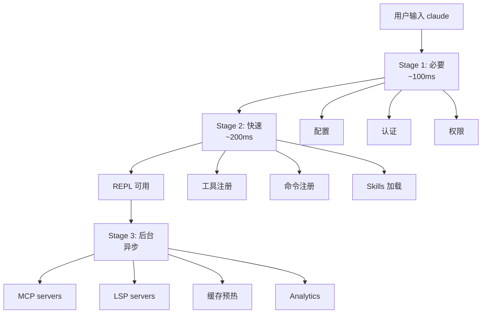

# bootstrap/ — 启动流水线

**目录：** `src/bootstrap/`

`bootstrap/` 是 **Claude Code 启动时的所有初始化步骤**——有序、可观测、可中断。

## 为什么单独一个目录？

启动涉及**十几个独立子系统**：

- 配置加载
- 认证
- 插件
- MCP servers
- LSP servers
- 权限
- 历史
- Hooks
- Analytics
- ...

不组织好会变成"祖宗级的 main 函数"——几百行啥都在。

`bootstrap/` 把每个子系统的启动**独立成文件**：

```
bootstrap/
├── index.ts              - 总入口，编排
├── loadConfig.ts
├── initAuth.ts
├── loadMCPServers.ts
├── startLSP.ts
├── loadPermissions.ts
├── loadHistory.ts
├── loadHooks.ts
├── initAnalytics.ts
├── registerTools.ts
├── loadPlugins.ts
├── loadSkills.ts
└── warmCaches.ts
```

## 启动阶段



**关键：REPL 能在 300ms 内可用**——后台继续加载。

## Stage 1: 必要（阻塞）

```typescript
// bootstrap/index.ts
async function bootstrap() {
  // 必须同步完成
  const config = await loadConfig()
  const auth = await initAuth(config)
  const perms = await loadPermissions(config)

  // 这些齐全了才能处理用户请求
  return { config, auth, perms }
}
```

### loadConfig.ts

```typescript
async function loadConfig() {
  // 优先级：命令行 > project > global > defaults
  const layers = [
    defaultConfig(),
    await loadGlobalConfig(),
    await loadProjectConfig(),
    parseCliArgs(),
  ]
  return mergeConfigs(layers)
}
```

### initAuth.ts

```typescript
async function initAuth(config: Config) {
  // 确定 API provider
  const provider = selectProvider(config)

  // 拉取 token
  const token = await resolveToken(provider)

  // 建立 client
  return createAPIClient(provider, token)
}
```

## Stage 2: 快速（并行）

```typescript
async function quickInit(ctx: BootCtx) {
  // 这些可以并行
  await Promise.all([
    registerTools(ctx),
    registerCommands(ctx),
    loadSkills(ctx),
    loadHooks(ctx),
  ])
}
```

### registerTools.ts

```typescript
async function registerTools(ctx: BootCtx) {
  const tools = [
    BashTool, ReadTool, EditTool, WriteTool,
    GrepTool, GlobTool, AgentTool,
    // ...
  ]

  for (const tool of tools) {
    toolRegistry.register(tool)
  }
}
```

工具注册在**启动时完成**——避免 LLM 响应时动态查。

## Stage 3: 后台（异步）

```typescript
function backgroundInit(ctx: BootCtx) {
  // 不等它们
  loadMCPServers(ctx).then(servers => registerMCPTools(servers))
  startLSPServers(ctx)
  warmCaches(ctx)
  initAnalytics(ctx)
}
```

### MCP servers 慢加载

MCP servers 可能 spawn 子进程、连远程——慢：

```typescript
async function loadMCPServers(ctx: BootCtx) {
  const configs = ctx.config.mcpServers
  for (const [name, cfg] of Object.entries(configs)) {
    // 启动失败不阻塞
    try {
      const client = await connectMCP(cfg)
      ctx.mcpClients.set(name, client)

      // 注册工具
      const tools = await client.listTools()
      for (const t of tools) {
        toolRegistry.register(wrapMCPTool(name, t))
      }
    } catch (e) {
      warn(`MCP server ${name} failed to start: ${e}`)
      // 继续加载其他 servers
    }
  }
}
```

**失败隔离**——一个 MCP 挂不影响其他。

## 启动性能监控

每个步骤计时：

```typescript
async function timed<T>(name: string, fn: () => Promise<T>): Promise<T> {
  const start = performance.now()
  try {
    const result = await fn()
    bootStats.record(name, performance.now() - start)
    return result
  } catch (e) {
    bootStats.recordError(name, e)
    throw e
  }
}

// 用法
await timed('loadConfig', loadConfig)
await timed('initAuth', () => initAuth(config))
```

### 启动报告

```bash
claude --boot-report
```

输出：

```
Boot time: 287ms total

Stage 1 (blocking): 98ms
  loadConfig:        23ms
  initAuth:          54ms
  loadPermissions:   21ms

Stage 2 (parallel): 145ms
  registerTools:     12ms
  registerCommands:  18ms
  loadSkills:        45ms
  loadHooks:         8ms

Stage 3 (background):
  MCP github:        234ms ✓
  MCP postgres:      1203ms ✓
  LSP typescript:    892ms ✓
  Cache warming:     156ms ✓
  Analytics:         23ms ✓
```

**让用户知道启动性能**——便于诊断慢的 MCP server。

## 启动失败处理

```typescript
async function bootstrap() {
  try {
    // Stage 1 失败 → fatal
    const ctx = await stage1()

    // Stage 2 失败 → 继续，记录
    try {
      await stage2(ctx)
    } catch (e) {
      warn('Some features unavailable')
    }

    // Stage 3 失败 → 完全忽略
    stage3Async(ctx)

    return ctx
  } catch (e) {
    // Stage 1 失败
    console.error(`Startup failed: ${e.message}`)
    process.exit(1)
  }
}
```

**分级容错** — 必要的组件挂了才退出。

## 启动缓存

某些慢启动**可以缓存**：

```typescript
// bootstrap/warmCaches.ts
async function warmCaches() {
  const cachePath = '~/.claude/bootCache.json'
  const cached = await loadCache(cachePath)

  if (cached && !isStale(cached)) {
    return cached
  }

  // 重新计算
  const fresh = {
    tools: await scanTools(),
    commands: await scanCommands(),
    skills: await scanSkills(),
  }
  await saveCache(cachePath, fresh)
  return fresh
}
```

**发现发现工具**不用每次扫文件系统。

## 优雅关闭

```typescript
// bootstrap/shutdown.ts
async function shutdown() {
  await Promise.all([
    analytics.flush(),        // 刷埋点
    sessionService.save(),    // 存会话
    mcpClients.closeAll(),    // 关 MCP
    lspClients.shutdown(),    // 关 LSP
  ])
}

process.on('SIGINT', async () => {
  await shutdown()
  process.exit(0)
})
```

**清理资源** — 别让子进程变僵尸。

## 值得学习的点

1. **启动分阶段** — 必要/快速/后台
2. **300ms REPL 可用** — UX 目标
3. **失败隔离** — 一个子系统挂不挂全部
4. **启动报告** — 可观测性
5. **启动缓存** — 重用慢计算
6. **优雅关闭** — 清理资源
7. **独立文件** — 每个子系统一个文件，便于维护

## 相关文档

- [main-entry](../root-files/main-entry.md)
- [setup-and-cost](../root-files/setup-and-cost.md)
- [services/ - 服务层](../services/api.md)
