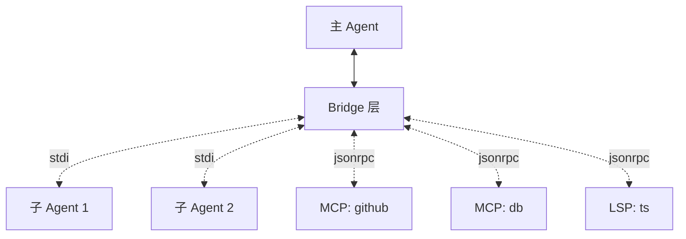

# bridge/ — 进程间桥接

**目录：** `src/bridge/`

`bridge/` 是 Claude Code 中**所有跨进程通信的统一抽象**——主 Agent、子 Agent、MCP server、LSP server 之间的消息传递。

## 为什么需要 Bridge？

Claude Code 的各种进程：

- **主 Agent** — 用户对话的主进程
- **子 Agent** — AgentTool 启动的 fork
- **Task 进程** — TaskCreate 启动的后台任务
- **MCP servers** — 独立工具服务器
- **LSP servers** — 语言服务器

**通信渠道混杂：**

- stdio (pipe)
- Unix socket
- TCP
- SSE
- Streamable HTTP

Bridge 把它们**统一成同一个接口**：

```typescript
interface Bridge {
  send(msg: Message): void
  onMessage(handler: (msg: Message) => void): void
  close(): void
}
```

## 架构



## 消息格式

```typescript
interface BridgeMessage {
  id: string              // 唯一 ID（请求-响应配对）
  type: MessageType
  payload: any
  timestamp: number
}

type MessageType =
  | 'request'           // 需要响应
  | 'response'
  | 'notification'      // 单向
  | 'error'
  | 'streaming_chunk'
```

## 请求-响应模式

```typescript
class Bridge {
  private pending = new Map<string, { resolve: (r: any) => void, reject: (e: Error) => void }>()

  async request<T>(payload: any): Promise<T> {
    const id = crypto.randomUUID()
    return new Promise((resolve, reject) => {
      this.pending.set(id, { resolve, reject })
      this.send({ id, type: 'request', payload, timestamp: Date.now() })

      // 超时
      setTimeout(() => {
        if (this.pending.has(id)) {
          this.pending.delete(id)
          reject(new TimeoutError())
        }
      }, 30_000)
    })
  }

  private onResponse(msg: BridgeMessage) {
    const p = this.pending.get(msg.id)
    if (!p) return  // 超时已删除
    this.pending.delete(msg.id)

    if (msg.type === 'error') p.reject(new Error(msg.payload))
    else p.resolve(msg.payload)
  }
}
```

## 流式响应

LLM 的 SSE 流需要流式**转发**：

```typescript
async function* streamRequest<T>(payload: any): AsyncGenerator<T> {
  const id = crypto.randomUUID()
  const queue = new AsyncQueue<T>()

  this.streaming.set(id, {
    onChunk: (chunk: T) => queue.push(chunk),
    onEnd: () => queue.close(),
  })

  this.send({ id, type: 'request', payload })

  for await (const chunk of queue) {
    yield chunk
  }
}
```

## 消息路由

```typescript
// bridge/router.ts
class MessageRouter {
  private handlers = new Map<string, Handler>()

  route(msg: BridgeMessage) {
    const handler = this.handlers.get(msg.payload.method)
    if (!handler) {
      this.sendError(msg.id, 'method_not_found')
      return
    }
    handler(msg)
  }
}
```

## 子 Agent Bridge

```typescript
// 主进程 fork 子 Agent
async function spawnSubAgent(task: string): Promise<SubAgentBridge> {
  const child = spawn('node', ['agent-worker.js'], {
    stdio: ['pipe', 'pipe', 'pipe', 'ipc']
  })

  const bridge = new StdioBridge(child.stdin, child.stdout)

  // 发送初始化消息
  await bridge.request({ type: 'init', task })

  return new SubAgentBridge(bridge, child)
}
```

## MCP Bridge

包装 MCP client 成 Bridge 接口：

```typescript
class MCPBridge implements Bridge {
  constructor(private client: MCPClient) {}

  async request(payload: { method: string, params: any }) {
    return this.client.request(payload.method, payload.params)
  }
}
```

## 连接管理

```typescript
class BridgeManager {
  private bridges = new Map<string, Bridge>()

  async connect(id: string, config: BridgeConfig): Promise<Bridge> {
    const bridge = await this.createBridge(config)

    // 监控健康
    bridge.onClose(() => this.bridges.delete(id))
    bridge.onError(e => this.handleError(id, e))

    this.bridges.set(id, bridge)
    return bridge
  }

  async reconnect(id: string) {
    const old = this.bridges.get(id)
    await old?.close()
    return this.connect(id, this.configs.get(id)!)
  }
}
```

## 自动重连

```typescript
class ResilientBridge implements Bridge {
  private bridge: Bridge | null = null
  private reconnectCount = 0

  async request(payload: any): Promise<any> {
    try {
      return await this.getBridge().request(payload)
    } catch (e) {
      if (isConnectionError(e) && this.reconnectCount < 3) {
        this.reconnectCount++
        this.bridge = null
        return this.request(payload)  // retry
      }
      throw e
    }
  }

  private async getBridge(): Promise<Bridge> {
    if (!this.bridge) {
      this.bridge = await this.connect()
      this.reconnectCount = 0
    }
    return this.bridge
  }
}
```

## 消息队列

如果 Bridge 临时不可用：

```typescript
class QueuedBridge implements Bridge {
  private queue: Message[] = []
  private ready = false

  send(msg: Message) {
    if (this.ready) {
      this.inner.send(msg)
    } else {
      this.queue.push(msg)
    }
  }

  onReady() {
    this.ready = true
    for (const msg of this.queue) {
      this.inner.send(msg)
    }
    this.queue = []
  }
}
```

## 序列化

```typescript
// 不是所有类型能序列化
function canSerialize(value: any): boolean {
  try {
    JSON.stringify(value)
    return true
  } catch {
    return false  // 循环引用、函数、Date...
  }
}

// 定制序列化
function serializeMessage(msg: Message): string {
  return JSON.stringify(msg, (key, value) => {
    if (value instanceof Error) return { _type: 'Error', message: value.message, stack: value.stack }
    if (value instanceof Date) return { _type: 'Date', ts: value.getTime() }
    if (value instanceof Uint8Array) return { _type: 'Binary', data: Buffer.from(value).toString('base64') }
    return value
  })
}
```

## 背压控制

```typescript
class BackpressureBridge implements Bridge {
  private outstanding = 0
  private maxOutstanding = 100

  async request(payload: any) {
    while (this.outstanding >= this.maxOutstanding) {
      await sleep(10)
    }
    this.outstanding++
    try {
      return await this.inner.request(payload)
    } finally {
      this.outstanding--
    }
  }
}
```

**限制并发请求数** — 防止压垮下游。

## 调试模式

```bash
claude --debug-bridge
```

记录所有 Bridge 消息：

```
[bridge] → sub-1: {type:"request",payload:{method:"execute",...}}
[bridge] ← sub-1: {type:"response",payload:{...}}
```

## 值得学习的点

1. **多协议统一抽象** — stdio/socket/http 同接口
2. **请求-响应配对** — UUID 映射
3. **流式消息** — AsyncGenerator
4. **自动重连** — 透明恢复
5. **消息队列** — 临时离线缓冲
6. **背压控制** — 防止过载
7. **可定制序列化** — Error/Date/Binary

## 相关文档

- [coordinator/ - 多 Agent 协调](../coordinator/index.md)
- [services/mcp - MCP 协议](../services/mcp.md)
- [tools/agent-tool](../tools/agent-tool.md)
