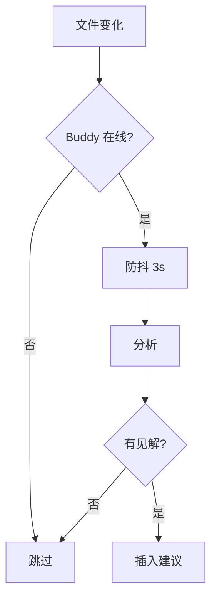
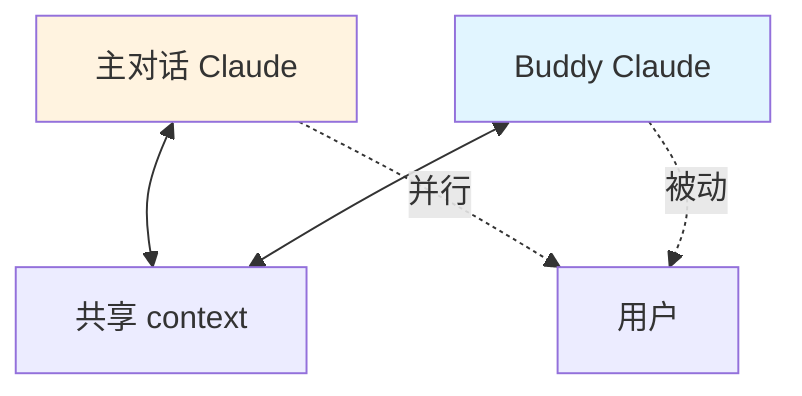

# buddy/ — Pair Programming Buddy

**目录：** `src/buddy/`

`buddy/` 实现 Claude Code 的 **Pair Programming 模式**——Claude 不再只是执行者，而是**编程伙伴**，主动观察、建议、挑战。

## 普通模式 vs Buddy 模式

| | 普通模式 | Buddy 模式 |
|--|----------|-----------|
| 角色 | 执行者 | 伙伴 |
| 主动性 | 被动回答 | 主动建议 |
| 文件监控 | 不监控 | 实时观察 |
| 建议时机 | 被问 | 看到问题 |
| 干扰 | 零 | 可能打断 |

## 启用 Buddy

```bash
claude --buddy
# 或
claude /buddy on
```

## 核心能力

### 1. 文件监控

```typescript
// buddy/watcher.ts
class FileWatcher {
  watch(dir: string) {
    chokidar.watch(dir).on('change', async (path) => {
      const content = await readFile(path)
      await buddy.analyzeChange(path, content)
    })
  }
}
```

Claude **持续观察**用户编辑，不等被问。

### 2. 主动建议

```typescript
async function analyzeChange(path: string, content: string) {
  const analysis = await claude.complete({
    system: 'You are reviewing code changes. Only interject if you see issues.',
    messages: [{ role: 'user', content: `Changed ${path}:\n${content}` }]
  })

  if (analysis.hasIssue) {
    showSuggestion(analysis.suggestion)
  }
}
```

### 3. 挑战设计决策

```
User: "我把 auth 逻辑放在 middleware 里"
Buddy: "考虑过放在独立的 AuthService 吗？middleware 混了
        业务逻辑之后会难以测试。"
```

**主动挑战** — 不是顺从用户。

## Buddy 的触发时机



## Buddy 提示词

```typescript
const BUDDY_SYSTEM = `
You are a pair programming buddy, not just an assistant.

Your role:
1. Observe code changes silently most of the time
2. Interject ONLY when:
   - You see a likely bug
   - The approach has a major issue
   - There's a simpler solution
   - You have a non-obvious insight
3. Be direct, not sycophantic
4. Challenge assumptions when warranted

DO NOT:
- Comment on style preferences
- Repeat user's actions back to them
- Praise every change
- Be verbose
`
```

## 非侵入式建议

建议显示在**侧边栏/状态区**，不阻塞输入：

```
┌─ 主对话 ─┐ ┌─ Buddy ──────────┐
│          │ │ 🧠 想法          │
│   ...    │ │                  │
│          │ │ middleware 里的  │
│          │ │ auth 可能难测试  │
│          │ │ [查看] [忽略]    │
└──────────┘ └──────────────────┘
```

## 用户控制

### 打开/关闭

```
/buddy on          - 启用
/buddy off         - 关闭
/buddy pause       - 暂停（不观察）
/buddy resume      - 恢复
```

### 调节敏感度

```
/buddy sensitivity low    - 只在重大问题时说话
/buddy sensitivity medium - 默认
/buddy sensitivity high   - 频繁建议
```

### 关注领域

```
/buddy focus security     - 安全问题优先
/buddy focus performance  - 性能优先
/buddy focus testing      - 测试覆盖优先
```

## Buddy 与主对话的关系



**两个独立 Claude 实例**，共享 session context。

## Token 预算

Buddy 有**独立预算**：

```typescript
const buddyBudget = {
  maxTokensPerHour: 10000,
  maxInterjectionsPerHour: 20,
}
```

防止 Buddy 过度消耗资源。

## 智能去重

不要重复提醒：

```typescript
const recentSuggestions = new Set<string>()

async function suggest(text: string) {
  const hash = hashSuggestion(text)
  if (recentSuggestions.has(hash)) return  // 已说过
  recentSuggestions.add(hash)

  showSuggestion(text)
}
```

## 历史对话学习

```typescript
// Buddy 学习用户偏好
if (user.ignored.includes('style-suggestions')) {
  buddy.focus = buddy.focus.filter(f => f !== 'style')
}
```

## Buddy vs 自动化 linter

| | Buddy | ESLint |
|--|-------|--------|
| 规则 | 动态，基于 context | 静态规则 |
| 范围 | 架构/设计 | 语法 |
| 个性化 | 是 | 否 |
| 主动性 | 基于观察 | 触发式 |

**互补**——Buddy 不替代 linter。

## 值得学习的点

1. **Agent 作为伙伴**而非仆人
2. **主动挑战** 而非顺从
3. **非侵入式 UI** — 侧边建议
4. **独立 token 预算** — 防过度消耗
5. **敏感度调节** — 用户控制
6. **智能去重** — 不重复唠叨
7. **学习用户偏好** — 动态调整

## 相关文档

- [coordinator/](../coordinator/index.md)
- [tools/agent-tool](../tools/agent-tool.md)
- [memdir/](../memdir/index.md)
