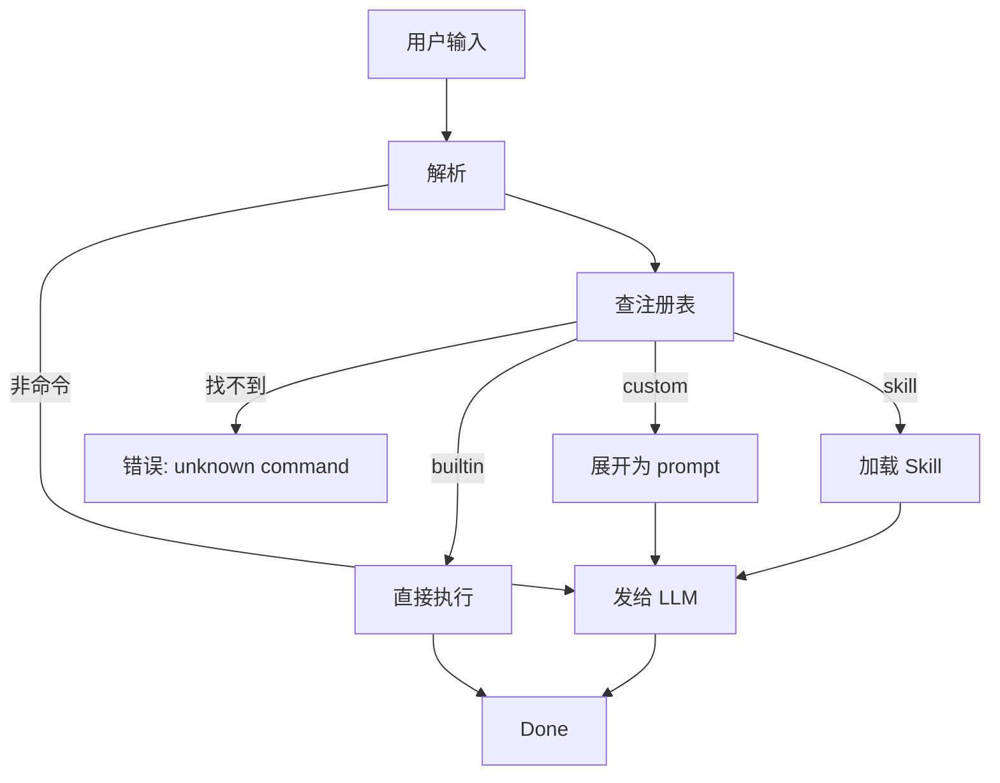

# commands/ — Slash 命令

**目录：** `src/commands/`

**Slash 命令**（`/help`、`/commit`、`/compact`）是 Claude Code 与 CLI 交互的**主要方式**。`commands/` 目录管理所有命令。

## 命令的两种形态

### 1. 内置 CLI 命令

```
/help       - 帮助
/clear      - 清屏
/cost       - 显示成本
/compact    - 压缩对话
/model      - 切换模型
/exit       - 退出
```

**特点：** 不经过 LLM，**直接执行 JS 函数**。

### 2. 用户自定义命令（Skill-based）

```
/commit     - 生成 commit message
/review-pr  - review PR
/loop       - 循环执行
```

**特点：** **展开成 prompt**，发给 LLM。

## 命令结构

### 内置命令

```typescript
interface BuiltinCommand {
  name: string              // "help"
  description: string
  handler: (args: string) => Promise<void>
  hidden?: boolean
}

const helpCommand: BuiltinCommand = {
  name: 'help',
  description: 'Show help',
  handler: async () => {
    console.log(HELP_TEXT)
  }
}
```

### 自定义命令

```markdown
---
name: commit
description: Generate a conventional commit message
argumentHint: optional message hint
---

Based on staged git changes, generate a conventional commit message.
If user provided hint: "$ARGUMENTS", incorporate it.

Steps:
1. Run `git diff --cached`
2. Analyze the changes
3. Generate commit message
4. Show to user for approval
```

**Frontmatter + markdown body** — 和 Skill 相似但用途不同。

## 注册流程

```typescript
// commands/registry.ts
class CommandRegistry {
  private commands = new Map<string, Command>()

  register(cmd: Command) {
    this.commands.set(cmd.name, cmd)
  }

  lookup(name: string): Command | null {
    return this.commands.get(name) ?? null
  }

  list(): Command[] {
    return [...this.commands.values()]
  }
}
```

## 发现来源

命令来自 5 个地方（按优先级）：

```
1. CLI flags              (--help, --version)
2. Built-in commands      (/help, /clear, ...)
3. Project commands       (.claude/commands/*.md)
4. User commands          (~/.claude/commands/*.md)
5. Skills                 (dynamic, based on description)
```

详见 [commands-registry](../root-files/commands-registry.md)。

## 解析用户输入

```typescript
function parseCommand(input: string): { cmd: string; args: string } | null {
  if (!input.startsWith('/')) return null

  const match = input.match(/^\/([\w-]+)(?:\s+(.*))?$/)
  if (!match) return null

  return { cmd: match[1], args: match[2] ?? '' }
}

// 用法
const parsed = parseCommand('/commit add new feature')
// { cmd: 'commit', args: 'add new feature' }
```

## 执行流程



## 命令展开

自定义命令的 body 是 prompt 模板：

```typescript
function expandCommand(cmd: CustomCommand, args: string): string {
  let expanded = cmd.body
  expanded = expanded.replace(/\$ARGUMENTS/g, args)
  expanded = expanded.replace(/\$CWD/g, process.cwd())
  expanded = expanded.replace(/\$DATE/g, new Date().toISOString())
  return expanded
}
```

## 参数提示

```markdown
---
name: review-pr
argumentHint: PR number (e.g., 123)
---
```

Tab 补全时：

```
> /review-pr <PR number (e.g., 123)>
```

## Autocomplete

```typescript
function autocomplete(prefix: string): string[] {
  const all = registry.list()
  return all
    .filter(c => c.name.startsWith(prefix))
    .map(c => `/${c.name}`)
}

// 用户输入 "/co" → 返回 ["/commit", "/compact", "/cost"]
```

## 内置命令详解

### /help

```typescript
async function helpHandler(args: string) {
  if (!args) {
    // 显示所有命令
    printCommandList()
  } else {
    // 特定命令详情
    printCommandDetail(args)
  }
}
```

### /clear

```typescript
async function clearHandler() {
  messageStore.set({ messages: [] })
  process.stdout.write('\x1b[2J\x1b[H')  // ANSI clear
}
```

### /compact

```typescript
async function compactHandler(args: string) {
  const level = args as 'micro' | 'auto' | 'dream' ?? 'auto'
  await compactService.compact(level)
}
```

### /model

```typescript
async function modelHandler(args: string) {
  const available = ['claude-opus-4-6', 'claude-sonnet-4-6', 'claude-haiku-4-5-20251001']
  if (!args) {
    console.log('Available models:', available)
    return
  }
  if (!available.includes(args)) {
    console.error('Unknown model')
    return
  }
  sessionStore.set({ model: args })
}
```

### /cost

```typescript
async function costHandler() {
  const usage = costStore.get().usage
  console.log(`
Input tokens: ${usage.input}
Output tokens: ${usage.output}
Cached: ${usage.cached}
Total cost: $${costService.calculate(usage).toFixed(4)}
  `)
}
```

### /exit

```typescript
async function exitHandler() {
  await shutdown()
  process.exit(0)
}
```

## 命令分组

```typescript
const groups = {
  'Session': ['help', 'clear', 'exit', 'model'],
  'Context': ['compact', 'memory', 'cost'],
  'Git': ['commit', 'diff', 'review-pr'],
  'Custom': loadUserCommands(),
}
```

`/help` 按组显示。

## 禁用命令

```json
// settings.json
{
  "commands": {
    "disabled": ["cost"]
  }
}
```

## 命令链

用户命令可以**调用其他命令**：

```markdown
---
name: deploy
---

Run tests, if pass then deploy:
1. /test all
2. If tests pass, run deployment
3. /notify team "Deployed"
```

## 值得学习的点

1. **命令 vs prompt 二元性** — 直接执行 vs LLM 展开
2. **5 层发现** — CLI/builtin/project/user/skill
3. **Markdown 作为 prompt 模板** — 人类可编辑
4. **参数替换** — $ARGUMENTS / $CWD / $DATE
5. **argumentHint 辅助补全** — UX 细节
6. **命令分组** — /help 易读
7. **命令可调用命令** — 组合性

## 相关文档

- [commands-registry](../root-files/commands-registry.md)
- [skills/](../skills/index.md)
- [keybindings/](../keybindings/index.md)
