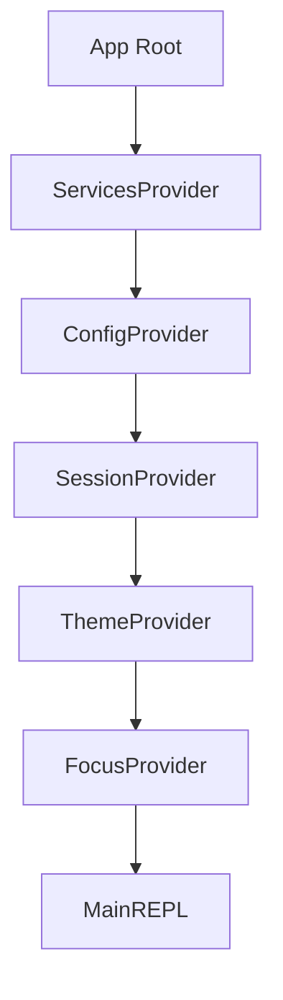

# context/ — React Context

**目录：** `src/context/`

`context/` 是 **React Context 的使用场**——把某些**全局依赖**（Service、Config）注入到组件树。

## Context 的定位

|| Store | Context |
|--|-------|---------|
| 目的 | 状态管理 | 依赖注入 |
| 变化 | 频繁 | 很少 |
| 粒度 | 数据 | 服务/配置 |
| 订阅 | 细粒度 | 组件树级 |

**Store** 管理变化的数据，**Context** 传递不变的依赖。

## 核心 Context

### ServicesContext

```tsx
interface Services {
  api: APIClient
  mcp: MCPManager
  tools: ToolRegistry
  permissions: PermissionService
  analytics: AnalyticsService
  sessions: SessionService
}

const ServicesContext = createContext<Services | null>(null)

export function ServicesProvider({ services, children }) {
  return (
    <ServicesContext.Provider value={services}>
      {children}
    </ServicesContext.Provider>
  )
}

export function useServices(): Services {
  const s = useContext(ServicesContext)
  if (!s) throw new Error('ServicesProvider missing')
  return s
}
```

**用法：**

```tsx
function SomeComponent() {
  const { api, tools } = useServices()

  const handleSubmit = async () => {
    const result = await api.createMessage(...)
  }
}
```

### ConfigContext

```tsx
interface Config {
  theme: 'light' | 'dark'
  model: string
  mode: 'normal' | 'plan' | 'bypass'
  keybindings: KeybindingMap
}

const ConfigContext = createContext<Config | null>(null)
```

### SessionContext

```tsx
interface Session {
  id: string
  model: string
  startedAt: number
  cwd: string
}

const SessionContext = createContext<Session | null>(null)
```

## Provider 结构

```tsx
// App.tsx
function App() {
  const services = initServices()
  const config = loadConfig()
  const session = createSession()

  return (
    <ServicesProvider services={services}>
      <ConfigProvider config={config}>
        <SessionProvider session={session}>
          <MainREPL />
        </SessionProvider>
      </ConfigProvider>
    </ServicesProvider>
  )
}
```

**层次化** — 每个 Context 独立 provider。

## 为什么不塞一个 Context？

```tsx
// ❌ 任何变化都重渲染所有订阅组件
<AppContext value={{ services, config, session, tasks, messages }}>

// ✅ 粒度细分
<ServicesProvider>  // 永远不变
<ConfigProvider>    // 偶尔变
<SessionProvider>   // session 内不变
```

## 测试替身

```tsx
// tests/mockServices.tsx
const mockServices: Services = {
  api: { createMessage: jest.fn(), ... },
  tools: { call: jest.fn(), ... },
  // ...
}

function renderWithMocks(ui: React.ReactElement) {
  return render(
    <ServicesProvider services={mockServices}>
      {ui}
    </ServicesProvider>
  )
}
```

**测试友好** — 依赖注入让单测容易。

## Context 与 Store 的配合

```tsx
function useMessages() {
  // Store 订阅数据
  const messages = useStore(messageStore, s => s.messages)

  // Context 拿服务
  const { sessions } = useServices()

  // 组合使用
  const addMessage = (msg: Message) => {
    messageStore.set(s => ({ messages: [...s.messages, msg] }))
    sessions.save(msg)
  }

  return { messages, addMessage }
}
```

**Store = 数据，Context = 服务，Hook = 组合两者。**

## Theme Context

```tsx
const ThemeContext = createContext(defaultTheme)

function useTheme() {
  return useContext(ThemeContext)
}

// 组件用
function Button({ children }) {
  const theme = useTheme()
  return <Text color={theme.colors.primary}>{children}</Text>
}
```

## Focus Context

```tsx
const FocusContext = createContext<{
  activeId: string | null
  setActive: (id: string) => void
} | null>(null)

function useFocus(id: string) {
  const ctx = useContext(FocusContext)!
  const isFocused = ctx.activeId === id
  const focus = () => ctx.setActive(id)
  return { isFocused, focus }
}
```

**管理键盘 focus** — 哪个组件响应输入。

## 动态 Provider 替换

```tsx
function App() {
  const [theme, setTheme] = useState(defaultTheme)

  return (
    <ThemeContext.Provider value={theme}>
      {/* ... */}
    </ThemeContext.Provider>
  )
}

// 用户切换主题
function ThemeSwitcher() {
  const { setTheme } = useThemeControls()
  return (
    <Button onPress={() => setTheme(darkTheme)}>Dark</Button>
  )
}
```

## Context 类型安全

```tsx
// 强制非 null
function useServices(): Services {
  const s = useContext(ServicesContext)
  if (!s) throw new Error('ServicesProvider is missing in the tree')
  return s
}

// 可选
function useMaybeTheme(): Theme | null {
  return useContext(ThemeContext)
}
```

## 依赖关系



**顺序重要** — 内层能用外层的 Context。

## 避免的陷阱

### 1. 不要频繁更新 Context

```tsx
// ❌ 每秒都触发所有订阅组件重渲染
const [now, setNow] = useState(Date.now())
useInterval(() => setNow(Date.now()), 1000)
return <TimeContext.Provider value={now}>...

// ✅ 用 Store
timeStore.set({ now: Date.now() })
```

### 2. 不要把方法放 value 里

```tsx
// ❌ 每次渲染都新对象 → 所有订阅重渲染
return <Ctx.Provider value={{ foo, setFoo, update }}>

// ✅ useMemo 稳定引用
const value = useMemo(() => ({ foo, setFoo, update }), [foo])
```

### 3. Context 不是状态管理

```tsx
// Context 是依赖注入，不是 Redux
// 频繁变化的状态应该在 Store 里
```

## 值得学习的点

1. **Context = 依赖注入**，不是状态管理
2. **细粒度 Provider** — 避免不必要重渲染
3. **类型安全的 useXxx** — 非 null 断言
4. **测试友好** — 注入 mock 服务
5. **Store + Context 分工** — 数据 vs 服务
6. **useMemo 稳定 value** — 避免 ref 漂移
7. **Provider 顺序** — 内层能用外层

## 相关文档

- [state/](../state/index.md)
- [hooks/](../hooks/index.md)
- [services/ - 服务层](../services/api.md)
