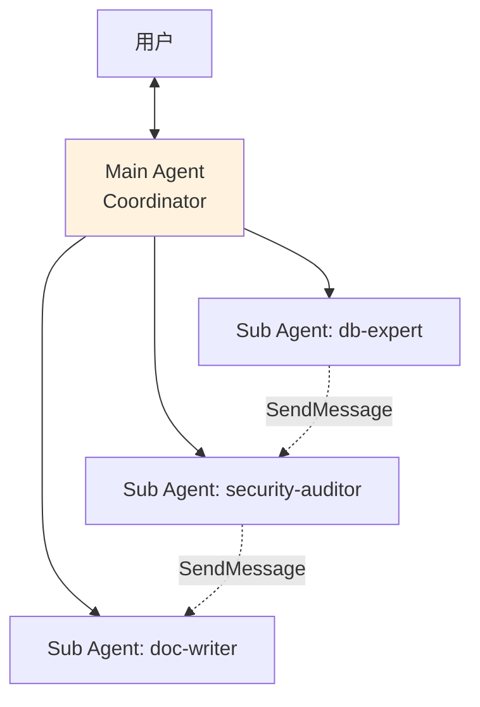
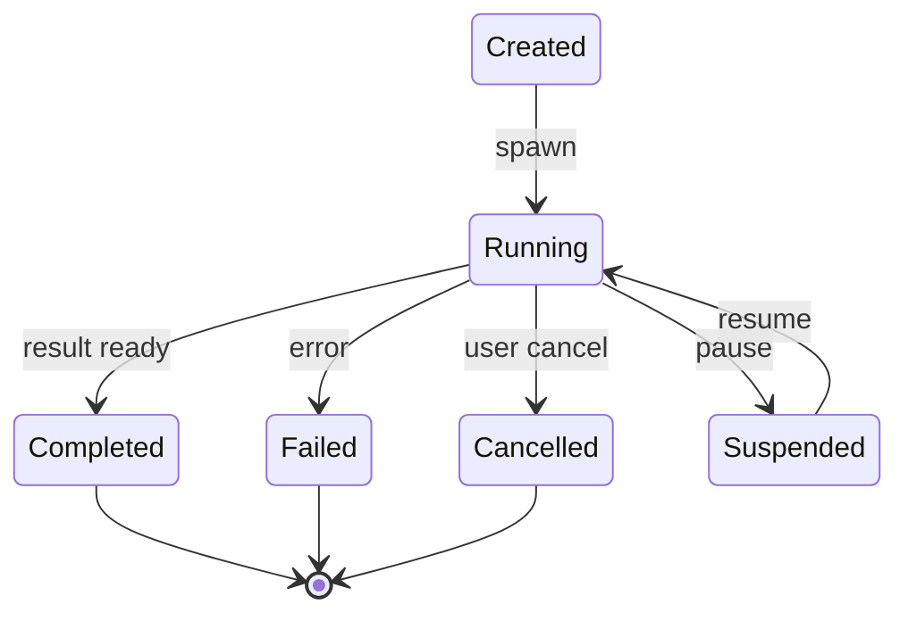

# coordinator/ — 多 Agent 协调

**目录：** `src/coordinator/`

`coordinator/` 是 Claude Code **多 Agent 架构的大脑**——它决定**何时**、**如何**启动子 Agent，管理它们的**生命周期**和**通信**。

## 为什么需要 Coordinator？

随着任务变复杂，单 Agent 不够：

- **专业化** — 子 Agent 专精某个领域（db、security、frontend）
- **并行** — 多个搜索同时做
- **隔离** — 独立 context 不污染主对话
- **权限分治** — 子 Agent 的权限可以收窄

但**多 Agent 协调本身很难**：

- 谁负责什么？
- 如何合并结果？
- 子 Agent 之间如何通信？
- 失败了谁负责？

## 架构



## Coordinator 的职责

### 1. 任务分解

```typescript
// coordinator/planner.ts
async function decomposeTask(task: string): Promise<SubTask[]> {
  // Claude 自己决定要不要分解
  const plan = await claude.complete({
    system: 'You decide which parts need specialized agents',
    messages: [{ role: 'user', content: task }]
  })

  return parsePlan(plan)
}
```

### 2. Agent 选择

```typescript
function selectAgent(subTask: SubTask): AgentDef | null {
  // 先看 project agents
  const projectAgents = loadProjectAgents()
  const match = projectAgents.find(a => matchesDescription(a.description, subTask))
  if (match) return match

  // 再看 built-in agents
  const builtIn = BUILT_IN_AGENTS.find(a => matchesCapability(a, subTask))
  return builtIn
}
```

### 3. 生命周期管理



```typescript
class AgentSession {
  id: string
  agent: AgentDef
  status: 'created' | 'running' | 'completed' | 'failed'
  bridge: Bridge
  startedAt: number
  messages: Message[]
}
```

## 启动子 Agent

```typescript
async function spawnAgent(def: AgentDef, task: string): Promise<AgentSession> {
  const session: AgentSession = {
    id: `agent-${crypto.randomUUID()}`,
    agent: def,
    status: 'created',
    bridge: await createBridge(def),
    startedAt: Date.now(),
    messages: [],
  }

  // 初始化
  await session.bridge.request({
    type: 'init',
    systemPrompt: def.systemPrompt,
    tools: def.tools,
    permissions: restrictPermissions(parentPermissions, def),
  })

  // 发送任务
  await session.bridge.request({
    type: 'task',
    content: task
  })

  session.status = 'running'
  return session
}
```

## 权限收窄

**子 Agent 的权限 ≤ 父 Agent**：

```typescript
function restrictPermissions(parent: Permissions, def: AgentDef): Permissions {
  const allowedTools = def.tools ?? parent.allowedTools

  return {
    ...parent,
    allowedTools: intersect(parent.allowedTools, allowedTools),
    disabledTools: union(parent.disabledTools, def.disabledTools ?? []),
    mode: 'normal',  // 不继承 bypass
  }
}
```

## 并行 Agent 管理

```typescript
class AgentPool {
  private max = 5
  private active = new Map<string, AgentSession>()
  private queue: Array<() => Promise<void>> = []

  async submit(def: AgentDef, task: string): Promise<AgentSession> {
    while (this.active.size >= this.max) {
      await sleep(100)
    }

    const session = await spawnAgent(def, task)
    this.active.set(session.id, session)

    session.bridge.onClose(() => {
      this.active.delete(session.id)
    })

    return session
  }
}
```

## Agent 之间通信（SendMessage）

```typescript
// coordinator/messaging.ts
async function sendMessage(
  fromId: string,
  toId: string,
  message: string
) {
  const to = pool.active.get(toId)
  if (!to) throw new Error('Target agent not found')

  // 通过 coordinator 转发
  await to.bridge.request({
    type: 'incoming_message',
    from: fromId,
    content: message
  })
}
```

**消息都经过 Coordinator** — 便于监控和日志。

## 结果合并

```typescript
async function mergeResults(sessions: AgentSession[]): Promise<string> {
  const results = await Promise.all(
    sessions.map(s => s.getResult())
  )

  // 让主 Agent 决定怎么合
  return await claude.complete({
    system: 'Synthesize these agent results',
    messages: [{
      role: 'user',
      content: results.map((r, i) =>
        `<agent-${i} role="${sessions[i].agent.name}">${r}</agent-${i}>`
      ).join('\n\n')
    }]
  })
}
```

## Agent 类型

Claude Code 内置三种模式：

### 1. Parallel Agents（并行）

```typescript
// 3 个 agent 并行搜索
const sessions = await Promise.all([
  spawnAgent(searchAgent, 'find auth.ts'),
  spawnAgent(searchAgent, 'find login.ts'),
  spawnAgent(searchAgent, 'find middleware.ts'),
])
const results = await Promise.all(sessions.map(s => s.await()))
```

### 2. Sequential Agents（顺序）

```typescript
const explorer = await spawnAgent(exploreAgent, 'find auth code')
const result1 = await explorer.await()

const refactorer = await spawnAgent(refactorAgent, `Refactor: ${result1}`)
const result2 = await refactorer.await()
```

### 3. Conversational Agents（对话）

```typescript
const expert = await spawnAgent(dbExpert, 'help me optimize this query')
// 保持打开，多轮对话
await expert.message('try adding an index')
await expert.message('what about composite index?')
await expert.close()
```

## 失败处理

```typescript
async function handleAgentFailure(session: AgentSession, error: Error) {
  // 记录失败
  logger.error(`Agent ${session.agent.name} failed`, error)

  // 决定怎么办
  if (isRetryable(error)) {
    return retry(session)
  }

  if (session.agent.critical) {
    // 关键 Agent 失败 → 上报到主 Agent
    throw error
  }

  // 非关键：降级继续
  return { partial: true, error: error.message }
}
```

## Token 预算管理

防止子 Agent 挥霍 token：

```typescript
interface AgentBudget {
  maxTokens: number
  maxDurationMs: number
  maxSubAgents: number
}

class BudgetEnforcer {
  check(session: AgentSession) {
    if (session.tokensUsed > session.budget.maxTokens) {
      session.terminate('budget_exceeded')
    }
    if (Date.now() - session.startedAt > session.budget.maxDurationMs) {
      session.terminate('timeout')
    }
  }
}
```

## 监控与调试

```bash
claude agents list
# 列出活跃 agent

claude agents show <id>
# 查看某个 agent 的状态、消息、token 用量

claude agents kill <id>
# 强制终止
```

## 值得学习的点

1. **任务分解是 Claude 决定的** — 不是硬编码规则
2. **Agent 选择基于 description 匹配** — 语义路由
3. **权限自动收窄** — 子 Agent 权限 ≤ 父
4. **池化管理** — 并发数受控
5. **消息经 Coordinator 转发** — 便于监控
6. **Budget enforcement** — token/时间/子 agent 数限制
7. **三种 Agent 模式** — 并行/顺序/对话

## 相关文档

- [tools/agent-tool](../tools/agent-tool.md)
- [bridge/ - 进程间桥接](../bridge/index.md)
- [tasks/ - Agent 任务系统](../tasks/index.md)
