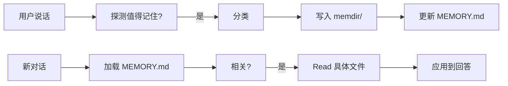

# memdir/ — 长期记忆系统

**目录：** `src/memdir/`

`memdir/` 实现 Claude Code 的**跨会话记忆**——让 Agent 在不同对话之间**记住**用户和项目的关键事实。

## 为什么需要长期记忆？

**没有记忆：**

```
Day 1: User: "I prefer TypeScript"
       Claude: "Noted."

Day 2: User: "Add a new module"
       Claude: "In JavaScript or TypeScript?"  ← 忘了
```

**有记忆：**

```
Day 1: [saves memory: user prefers TypeScript]

Day 2: User: "Add a new module"
       Claude: [reads memory]
              *writes TypeScript*
```

## 四种记忆类型

```typescript
type MemoryType =
  | 'user'        // 用户信息
  | 'feedback'    // 工作方式偏好
  | 'project'     // 项目上下文
  | 'reference'   // 外部系统指针
```

详细分类见 `CLAUDE.md`（顶层系统提示词）。

## 存储结构

```
~/.claude/projects/<project-id>/memory/
├── MEMORY.md              ← 索引（总是加载）
├── user_role.md           ← user 类型
├── user_preferences.md    ← user 类型
├── feedback_testing.md    ← feedback 类型
├── project_deadline.md    ← project 类型
└── reference_linear.md    ← reference 类型
```

### MEMORY.md（索引）

```markdown
- [User role](user_role.md) — 前端架构师，10年React经验
- [Testing preference](feedback_testing.md) — 集成测试必须用真DB
- [Merge freeze](project_deadline.md) — 2026-03-05 移动发布冻结
- [Linear INGEST](reference_linear.md) — 管道bug追踪位置
```

**每行 < 150 字符**——Index 总是加载到 context，不能太长。

### 单条记忆文件

```markdown
---
name: Testing with real DB
description: Integration tests must hit real database
type: feedback
---

Integration tests must hit a real database, not mocks.

**Why:** Prior incident where mock/prod divergence masked a broken migration.

**How to apply:** When writing any test that touches DB layer, never use
database mocks. Use testcontainers or a dedicated test DB instead.
```

**frontmatter + markdown body** — 结构化但人类可读。

## 记忆生命周期



## 何时保存

### 用户明确要求

```
User: "Remember that I use tabs, not spaces"
Claude: [saves memory]
```

### 自动检测

```
User: "I'm a data scientist looking at logs"
Claude: [saves user memory: data scientist, current focus: logging]
```

### 从失败中学习

```
User: "no, don't mock DB in tests"
Claude: [saves feedback memory: don't mock DB]
```

## 何时读取

1. **对话开始** — 索引自动加载
2. **用户提及相关话题** — Claude Read 具体文件
3. **做决策前** — 查相关规则
4. **用户明确要求** — "记不记得..."

## 写入流程

```typescript
// 两步
// 1. 写单个文件
await writeFile(`memdir/${name}.md`, `
---
name: ${name}
description: ${description}
type: ${type}
---

${content}
`)

// 2. 更新索引
await updateIndex(`- [${title}](${name}.md) — ${hook}`)
```

## 读取流程

```typescript
// 启动时
const index = await readFile('memdir/MEMORY.md')
systemPrompt += `\n\n<memory-index>\n${index}\n</memory-index>`

// 按需读
async function recallMemory(topic: string) {
  // Claude 用 Read 工具读具体文件
  const content = await readFile(`memdir/${name}.md`)
  return content
}
```

## 记忆去重

```typescript
function findSimilarMemory(content: string): Memory | null {
  for (const m of allMemories) {
    if (semanticSimilarity(m.content, content) > 0.8) {
      return m
    }
  }
  return null
}

// 写入时先查
async function saveMemory(content: string, type: MemoryType) {
  const existing = findSimilarMemory(content)
  if (existing) {
    // 更新而非创建
    return updateMemory(existing.id, merge(existing.content, content))
  }
  return createMemory(content, type)
}
```

## 记忆过期

有些记忆会**过时**：

```markdown
---
name: merge freeze
type: project
validUntil: 2026-03-05
---

Merge freeze for mobile release
```

**项目类型记忆**容易过期——用 `validUntil` 字段标记。

```typescript
async function cleanupExpired() {
  const now = new Date()
  for (const m of allMemories) {
    if (m.validUntil && new Date(m.validUntil) < now) {
      archiveMemory(m)
    }
  }
}
```

## 记忆冲突

多个记忆冲突怎么办？

```markdown
# feedback_style.md (old)
User prefers terse responses

# feedback_style.md (new)
User wants detailed explanations when refactoring
```

**不要删旧的，合并**：

```markdown
# feedback_style.md
User prefers terse responses generally,
but wants detailed explanations during refactoring tasks.
```

## 记忆可信度

**不是所有记忆都同样可信：**

```typescript
interface Memory {
  content: string
  confidence: number  // 0-1
  sources: string[]    // 哪些对话提到过
  lastConfirmed: number
}
```

多次确认 → 提升 confidence。

## 隐私

记忆**完全本地存储**：

```
~/.claude/projects/<project>/memory/   ← 仅本地
```

**不上传 Anthropic**——用户完全控制。

## 用户接口

```bash
claude memory list
# 列出所有记忆

claude memory show <name>
# 查看某条

claude memory delete <name>
# 删除

claude memory export > mem.tar.gz
# 导出
```

## 记忆 vs 会话历史

|| Memory | Session |
|--|--------|---------|
| 范围 | 跨会话 | 单会话 |
| 大小 | 有限（精选） | 无限 |
| 格式 | 结构化 MD | JSONL |
| 目标 | 长期事实 | 完整对话 |

## 记忆的提示词工程

**读取记忆时的 system prompt：**

```
You have access to persistent memory from prior conversations.

Before answering, consider whether any memory is relevant.

A memory may be outdated - if it conflicts with the current state
of the code or user's current request, trust what you see now.

Never cite stale memory as fact without verifying.
```

**引导 Claude 谨慎使用记忆**——不盲信过期信息。

## 值得学习的点

1. **文件式存储** — 人类可读可编辑
2. **两级结构** — 索引 + 文件
3. **四种类型** — user/feedback/project/reference
4. **frontmatter metadata** — 元数据与内容分离
5. **过期管理** — validUntil 字段
6. **去重合并** — 避免冗余
7. **本地存储** — 隐私优先
8. **提示 Claude 谨慎** — 不盲信记忆

## 相关文档

- [services/other-services - Session Memory](../services/other-services.md)
- [Agent 核心](../coordinator/index.md)
- 顶层 [CLAUDE.md](../overview/intro.md) — 完整记忆系统说明
