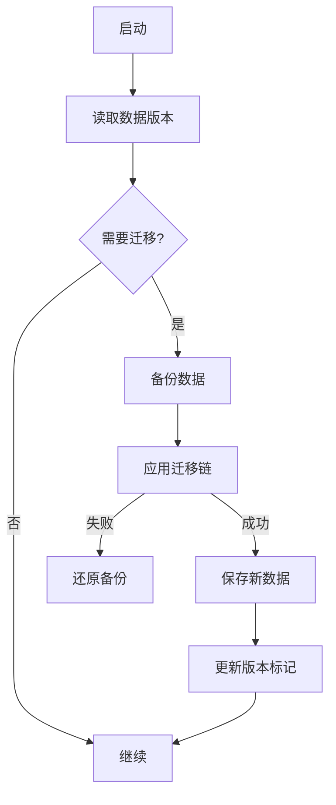

# migrations/ — 配置迁移

**目录：** `src/migrations/`

Claude Code 演进很快——数据格式也在变。`migrations/` 确保**老版本数据能升级到新版本**。

## 为什么需要迁移？

```
v1.0: ~/.claude/config.json { "apiKey": "..." }
v1.5: ~/.claude/config.json { "credentials": { "anthropic": "..." } }
v2.0: ~/.claude/credentials.json (分离出来)
```

用户升级 Claude Code 不能**手动迁移数据**——程序自动处理。

## 迁移架构

```typescript
interface Migration {
  from: string   // "1.5.0"
  to: string     // "2.0.0"
  apply(data: any): Promise<any>
}

const MIGRATIONS: Migration[] = [
  migration_1_0_to_1_5,
  migration_1_5_to_2_0,
  migration_2_0_to_2_1,
]
```

## 迁移流程



## 示例迁移

### config 1.0 → 1.5

```typescript
const migration_1_0_to_1_5: Migration = {
  from: '1.0.0',
  to: '1.5.0',
  async apply(data) {
    return {
      ...data,
      credentials: {
        anthropic: data.apiKey  // 重命名
      },
      apiKey: undefined,  // 删除老字段
      version: '1.5.0'
    }
  }
}
```

### credentials 分离

```typescript
const migration_1_5_to_2_0: Migration = {
  from: '1.5.0',
  to: '2.0.0',
  async apply(data) {
    // 把 credentials 挪到独立文件
    if (data.credentials) {
      await writeFile(
        '~/.claude/credentials.json',
        JSON.stringify(data.credentials, null, 2),
        { mode: 0o600 }
      )
    }

    delete data.credentials
    return { ...data, version: '2.0.0' }
  }
}
```

## 备份策略

迁移前**总是备份**：

```typescript
async function backupBeforeMigration(path: string) {
  const backup = `${path}.backup-${Date.now()}`
  await fs.copyFile(path, backup)

  // 保留最近 5 个备份
  await cleanupOldBackups(path, 5)
  return backup
}
```

## 回滚

迁移失败自动回滚：

```typescript
async function runMigrations(data: any, from: string, to: string) {
  const backup = await backupBeforeMigration(configPath)

  try {
    const chain = findChain(from, to)
    for (const migration of chain) {
      data = await migration.apply(data)
    }
    return data
  } catch (e) {
    // 还原
    await fs.copyFile(backup, configPath)
    throw new MigrationError(`Failed, restored backup`, e)
  }
}
```

## 跨版本链

```typescript
// 用户从 1.0 升到 2.0
findChain('1.0.0', '2.0.0')
// => [migration_1_0_to_1_5, migration_1_5_to_2_0]

function findChain(from: string, to: string): Migration[] {
  const chain: Migration[] = []
  let current = from
  while (current !== to) {
    const next = MIGRATIONS.find(m => m.from === current)
    if (!next) throw new Error(`No migration path from ${current}`)
    chain.push(next)
    current = next.to
  }
  return chain
}
```

## 幂等性

```typescript
async function migrateIfNeeded(path: string) {
  const data = JSON.parse(await fs.readFile(path, 'utf8'))

  if (data.version === CURRENT_VERSION) {
    return data  // 已经是最新，跳过
  }

  return runMigrations(data, data.version ?? '1.0.0', CURRENT_VERSION)
}
```

**可反复执行**——无版本差异时 noop。

## 迁移文件

除了 config，还有其他文件要迁移：

```
credentials.json
config.json
permissions.json
memory/*.md         ← 有时 frontmatter 字段要改
sessions/*.jsonl    ← 有时消息格式要改
tasks/tasks.json
plugins/*/plugin.json
```

每种有独立迁移链。

## 测试

```typescript
test('migrates 1.0 config to 2.0', async () => {
  const old = { apiKey: 'sk-...', version: '1.0.0' }
  const migrated = await migrate(old, '1.0.0', '2.0.0')

  expect(migrated.version).toBe('2.0.0')
  expect(migrated.apiKey).toBeUndefined()

  // credentials 被分离到单独文件
  const creds = JSON.parse(await readFile('credentials.json'))
  expect(creds.anthropic).toBe('sk-...')
})
```

## 迁移日志

```typescript
async function migrate(data, from, to) {
  log(`Migrating config from ${from} to ${to}`)
  const chain = findChain(from, to)
  for (const m of chain) {
    log(`  Applying ${m.from} → ${m.to}`)
    data = await m.apply(data)
  }
  log(`Migration complete`)
  return data
}
```

## 用户手动迁移

```bash
claude migrate --dry-run
# 打印要做什么但不执行

claude migrate --backup-only
# 只备份

claude migrate --rollback <backup-id>
# 回滚
```

## Breaking Change 处理

某些迁移**不可自动**：

```typescript
const migration_2_0_to_3_0: Migration = {
  from: '2.0.0',
  to: '3.0.0',
  async apply(data) {
    if (data.plugins && data.plugins.length > 0) {
      throw new ManualMigrationRequired(
        'Plugin API changed in 3.0. Please reinstall all plugins.'
      )
    }
    return { ...data, version: '3.0.0' }
  }
}
```

**告诉用户要做什么**——不自动破坏数据。

## 值得学习的点

1. **自动迁移** — 用户无感升级
2. **备份优先** — 任何迁移都先备份
3. **自动回滚** — 失败安全
4. **跨版本链** — 1.0 → 2.0 经过 1.5
5. **幂等** — 重复运行无副作用
6. **有日志** — 可 debug
7. **Manual migration 信号** — 不默默破坏

## 相关文档

- [constants/ - VERSION](../constants/index.md)
- [services/other-services](../services/other-services.md)
- [main-entry](../root-files/main-entry.md)
