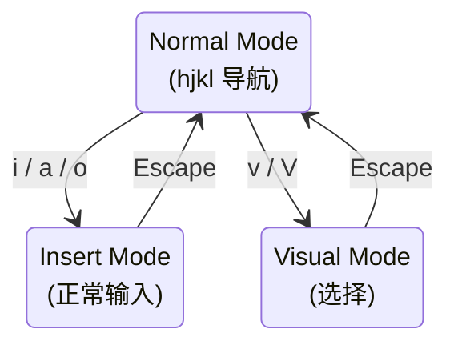

# Vim 模式与 Voice 输入

**目录：** `src/vim/`、`src/voice/`

这两个目录是 Claude Code 的**可选输入方式**——Vim 模式和语音输入。

## Vim 模式

### 动机

**大量用户习惯 Vim**——让他们在 Claude Code 中也能高效输入。

```bash
claude config set input-mode vim
```

### 模态编辑

Vim 的核心：**三种模式**。



### Normal Mode 绑定

```typescript
const normalBindings = {
  // 移动
  'h': 'cursor-left',
  'j': 'cursor-down',
  'k': 'cursor-up',
  'l': 'cursor-right',
  'w': 'word-forward',
  'b': 'word-backward',
  '0': 'line-start',
  '$': 'line-end',
  'gg': 'doc-start',
  'G': 'doc-end',

  // 编辑
  'x': 'delete-char',
  'dd': 'delete-line',
  'yy': 'yank-line',
  'p': 'paste',
  'u': 'undo',

  // 模式切换
  'i': 'enter-insert',
  'a': 'enter-insert-after',
  'o': 'enter-insert-new-line',
  'v': 'enter-visual',
}
```

### 命令模式

`:` 进入命令模式：

```
:w              - 保存会话
:q              - 退出
:wq             - 保存并退出
:set <option>   - 配置
:help           - 帮助
```

### Count + Motion

Vim 的精髓：**数字 + 动作**。

```
3j    - 下移 3 行
10w   - 前进 10 词
d2w   - 删除 2 词
5dd   - 删除 5 行
```

```typescript
// 解析 "3j"
function parseCommand(input: string) {
  const match = input.match(/^(\d*)(.+)$/)
  const count = parseInt(match[1] || '1')
  const motion = match[2]
  return { count, motion }
}
```

### 寄存器

```typescript
const registers = new Map<string, string>()

// "ayy → 复制到寄存器 a
function yankToRegister(reg: string, content: string) {
  registers.set(reg, content)
}

// "ap → 从寄存器 a 粘贴
function pasteFromRegister(reg: string): string {
  return registers.get(reg) ?? ''
}
```

### 实现

```typescript
// vim/mode.ts
class VimMode {
  private mode: 'normal' | 'insert' | 'visual' = 'normal'
  private buffer: string = ''
  private cursor: number = 0

  handleKey(key: string) {
    if (this.mode === 'normal') this.handleNormal(key)
    else if (this.mode === 'insert') this.handleInsert(key)
    else this.handleVisual(key)
  }
}
```

### Vim 插件

高级用户还想要 `.vimrc` 式自定义：

```
// ~/.claude/vimrc
map jj <Esc>
set number
```

## Voice 输入

### 动机

**语音输入比打字快**（某些场景）——尤其是"说清楚需求然后让 Claude 做"。

```bash
claude --voice
```

### 架构


### VAD（Voice Activity Detection）

检测用户**什么时候开始/结束说话**：

```typescript
// voice/vad.ts
class VAD {
  private threshold = 0.3
  private silenceMs = 1500

  onAudioChunk(chunk: AudioChunk) {
    const energy = computeEnergy(chunk)

    if (energy > this.threshold) {
      this.isSpeaking = true
      this.lastSpeechTime = Date.now()
    } else if (this.isSpeaking && Date.now() - this.lastSpeechTime > this.silenceMs) {
      this.isSpeaking = false
      this.emit('speech-end')
    }
  }
}
```

### Whisper 集成

```typescript
async function transcribe(audio: Buffer): Promise<string> {
  const response = await fetch('https://api.openai.com/v1/audio/transcriptions', {
    method: 'POST',
    headers: { 'Authorization': `Bearer ${apiKey}` },
    body: formDataWithAudio(audio)
  })
  const result = await response.json()
  return result.text
}
```

### Push-to-Talk

```typescript
useInput((input, key) => {
  if (key.ctrl && input === ' ') {  // Ctrl+Space
    if (!isRecording) startRecording()
    else stopRecording()
  }
})
```

### 持续监听模式

```bash
claude --voice --continuous
```

**持续监听** + **VAD 分段** + **自动发送**。

### 快捷命令

语音特殊命令：

```
"Claude, stop"          - 中断
"Claude, clear"         - 清屏
"Claude, undo"          - 撤销
"Claude, show tasks"    - 显示任务
```

**关键词**比打字慢——但说"停止"比按 Ctrl+C 直观。

### 隐私

```typescript
// 本地 VAD 决定是否上传
if (vad.hasSpeech()) {
  const audio = vad.extractSpeech()
  const text = await whisper.transcribe(audio)
}
// 静音部分不上传
```

**只有检测到语音才上传**——省流量 + 省成本。

### 选择性上传

```typescript
// 配置：本地 whisper vs API
if (config.voice.useLocal) {
  text = await localWhisper.transcribe(audio)  // whisper.cpp
} else {
  text = await apiWhisper.transcribe(audio)
}
```

本地 Whisper 可选——对隐私敏感用户。

### 噪音抑制

```typescript
function reduceNoise(audio: Buffer): Buffer {
  // 用 webrtc-noise-suppression
  return noiseSuppressor.process(audio)
}
```

### 多语言

```typescript
// 自动检测
const result = await whisper.transcribe(audio, { language: 'auto' })

// 或指定
const result = await whisper.transcribe(audio, { language: 'zh' })
```

## 值得学习的点

**Vim 模式：**

1. **模态编辑** — Normal/Insert/Visual
2. **Count + Motion** — 强大组合
3. **寄存器系统** — 高级复制粘贴
4. **vimrc 支持** — 用户自定义
5. **选择性启用** — 不强制所有人

**Voice 输入：**

1. **VAD 本地检测** — 省带宽
2. **Push-to-talk vs continuous** — 两种模式
3. **关键词命令** — 口语化控制
4. **本地 vs API Whisper** — 隐私选项
5. **多语言支持** — 国际化
6. **噪音抑制** — 实用细节

## 相关文档

- [keybindings/](../keybindings/index.md)
- [commands/](../commands/index.md)
- [components/](../components/index.md)
