# 分层架构

Claude Code 的 `src/` 下有 35 个子目录，上千个文件，要理解它的架构，需要从**分层视角**切入。

## 五层架构总览

```mermaid
graph TD
    subgraph App[应用层 Application]
        CLI[cli/]
        TUI[components/ + ink/]
        ENTRY[entrypoints/]
        BRIDGE[bridge/]
    end

    subgraph Feature[功能层 Features]
        TOOLS[tools/]
        CMDS[commands/]
        AGENTS[coordinator/ + tasks/]
        SKILLS[skills/]
        MEMDIR[memdir/]
    end

    subgraph Service[服务层 Services]
        API[services/api]
        MCP[services/mcp]
        OAUTH[services/oauth]
        COMPACT[services/compact]
        ANALYTICS[services/analytics]
        LSP[services/lsp]
    end

    subgraph Infra[基础设施层 Infrastructure]
        QUERY[QueryEngine.ts + query.ts]
        TOOL[Tool.ts]
        HOOKS[hooks/ + utils/hooks]
        STATE[state/ + context/]
        PERMS[utils/permissions]
        BASH[utils/bash]
    end

    subgraph Types[类型层 Types]
        TYPE_DEFS[types/]
        CONSTANTS[constants/]
        SCHEMAS[schemas/]
    end

    App --> Feature
    Feature --> Service
    Service --> Infra
    Infra --> Types

    style Types fill:#f9f9f9,stroke:#999
    style Infra fill:#e1f5fe,stroke:#0288d1
    style Service fill:#f3e5f5,stroke:#7b1fa2
    style Feature fill:#fff3e0,stroke:#f57c00
    style App fill:#e8f5e9,stroke:#388e3c
```

### 每层的职责

| 层 | 职责 | 关键模块 |
|----|------|----------|
| **类型层** | 定义所有数据契约，无依赖 | `types/`、`constants/`、`schemas/` |
| **基础设施层** | 核心抽象：查询引擎、工具框架、权限、hook 系统 | `QueryEngine.ts`、`Tool.ts`、`utils/permissions`、`utils/bash` |
| **服务层** | 外部集成和业务服务 | `services/api`、`services/mcp`、`services/compact` |
| **功能层** | 产品功能：工具、命令、Agent、技能 | `tools/`、`commands/`、`coordinator/`、`tasks/`、`skills/` |
| **应用层** | 用户交互入口：CLI、TUI、Bridge、SDK | `components/`、`ink/`、`cli/`、`entrypoints/`、`bridge/` |

## 依赖方向

**严格从上往下依赖**：
- 应用层可以调用功能层、服务层
- 功能层可以调用服务层、基础设施层
- 服务层可以调用基础设施层、类型层
- 基础设施层只依赖类型层
- 类型层零依赖

**关键约束：** `services/analytics/` 被设计为**零依赖**（index.ts 不导入任何其他模块），这是为了避免循环依赖，因为几乎所有模块都要调用 `logEvent()`。

## 目录地图

### 按源码目录组织（35 个目录）

以下是所有 `src/` 下的目录和它们对应的层：

#### 应用层（用户入口）
- **`cli/`** — CLI 传输层（WebSocket/SSE/Hybrid）、结构化 IO
- **`components/`** — React 终端 UI 组件（100+ 个）
- **`ink/`** — 自研 Ink 终端渲染框架（85+ 文件）
- **`bridge/`** — IDE ↔ CLI 远程执行桥接（31 文件）
- **`entrypoints/`** — 多形态产品入口（CLI/MCP/SDK）
- **`screens/`** — 全屏模式（REPL/Doctor/Resume）
- **`server/`** — IDE 直连服务器
- **`remote/`** — 远程会话管理

#### 功能层（产品功能）
- **`tools/`** — 40+ 工具实现
- **`commands/`** — 66+ 斜杠命令
- **`coordinator/`** — 多 Agent 协调器
- **`tasks/`** — Agent 任务执行系统
- **`skills/`** — Agent 技能库
- **`memdir/`** — 持久化记忆系统

#### 服务层（集成服务）
- **`services/api/`** — 多云 API 客户端
- **`services/mcp/`** — MCP 协议实现
- **`services/oauth/`** — OAuth2 认证
- **`services/compact/`** — 上下文压缩
- **`services/analytics/`** — 零依赖分析
- **`services/lsp/`** — Language Server
- **`services/plugins/`** — 插件市场
- **其他 10+ services** — Session Memory、Policy Limits 等

#### 基础设施层
- **`hooks/`** — 90+ 自定义 React hooks
- **`state/`** — 全局状态存储
- **`context/`** — 9 个 React Context Providers
- **`utils/`** — 150+ 工具函数
  - `utils/bash/` — Tree-sitter Bash 解析
  - `utils/permissions/` — 权限系统
  - `utils/hooks/` — Hook 基础设施
  - `utils/messages/` — 消息规范化
- **`keybindings/`** — 快捷键系统
- **`plugins/`** — 插件加载器
- **`query/`** — 查询子系统配置
- **`bootstrap/`** — 全局初始化状态

#### 类型层
- **`types/`** — TypeScript 类型定义
- **`constants/`** — 21 个常量模块
- **`schemas/`** — Zod schemas
- **`migrations/`** — 配置迁移脚本

#### 边缘目录
- **`assistant/`** — 会话历史
- **`buddy/`** — AI 伴侣精灵
- **`vim/`** — Vim 模式模拟
- **`voice/`** — 语音模式
- **`upstreamproxy/`** — 企业代理
- **`native-ts/`** — 原生绑定
- **`outputStyles/`** — 输出样式
- **`moreright/`** — UI 工具

## 根文件（顶层组织者）

除目录外，`src/` 根下还有核心文件：

| 文件 | 大小 | 职责 |
|------|------|------|
| `main.tsx` | 808 KB | CLI 主入口、Commander.js 解析、并行预取 |
| `QueryEngine.ts` | 48 KB | 核心 LLM 查询循环 |
| `query.ts` | 70 KB | 查询处理器、消息规范化、auto-compact |
| `Tool.ts` | 30 KB | 工具基础类型和 buildTool 工厂 |
| `commands.ts` | 26 KB | 命令注册中心 |
| `context.ts` | 7 KB | 系统上下文收集 |
| `cost-tracker.ts` | 11 KB | Token 费用追踪 |
| `history.ts` | 15 KB | 会话历史 |
| `setup.ts` | 21 KB | 会话初始化 |
| `interactiveHelpers.tsx` | 58 KB | 交互模式辅助 |

这些根文件充当**跨目录的协调者**，而子目录则是**功能内聚的模块**。

## 模块命名约定

读代码时会注意到一些命名模式：

- **`Tool.ts` vs `tools/`** — 大写单数文件定义**类型和工厂**，小写复数目录存放**实例**
- **`commands.ts` vs `commands/`** — 同上
- **`hooks/` vs `utils/hooks/`** — 前者是 React hooks，后者是 Hook 基础设施
- **`types/` vs `schemas/`** — 前者是 TypeScript 类型，后者是 Zod 运行时校验
- **`bundled/` 子目录** — 常见于 `skills/`、`plugins/`，表示内置（vs 用户自定义）

## 下一步

- 阅读 [请求生命周期](./data-flow.md) 了解一次请求如何穿越这些层
- 阅读 [设计亮点](./design-highlights.md) 了解关键的工程模式
