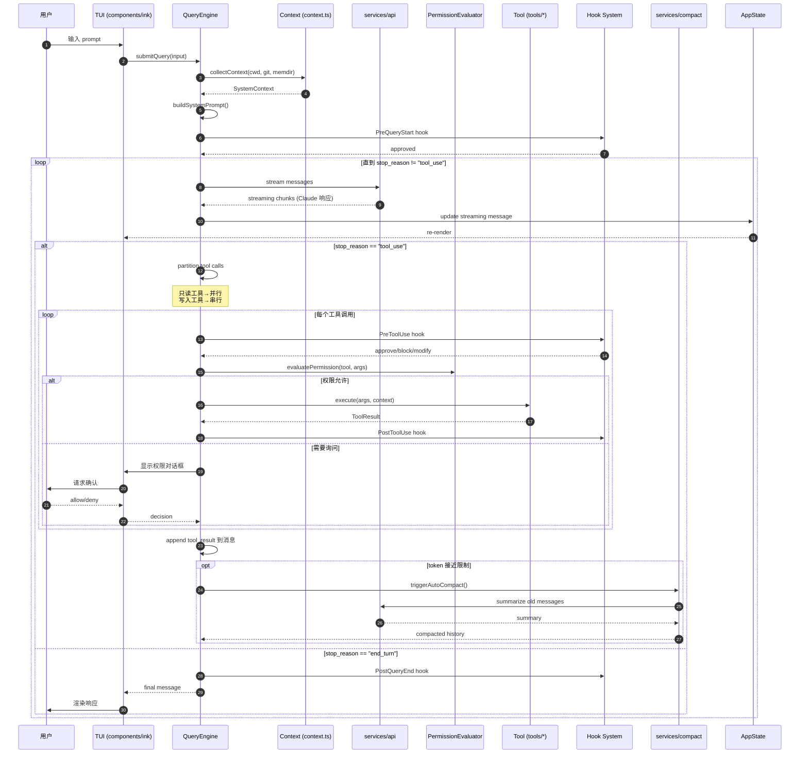
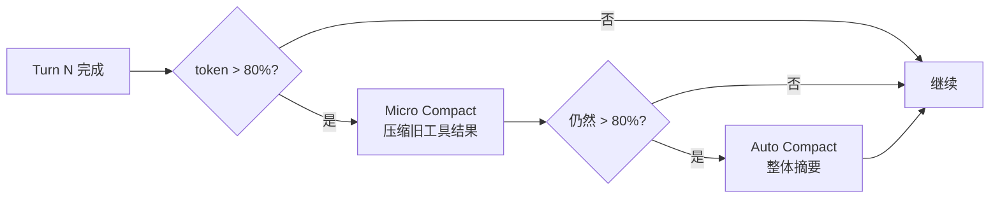
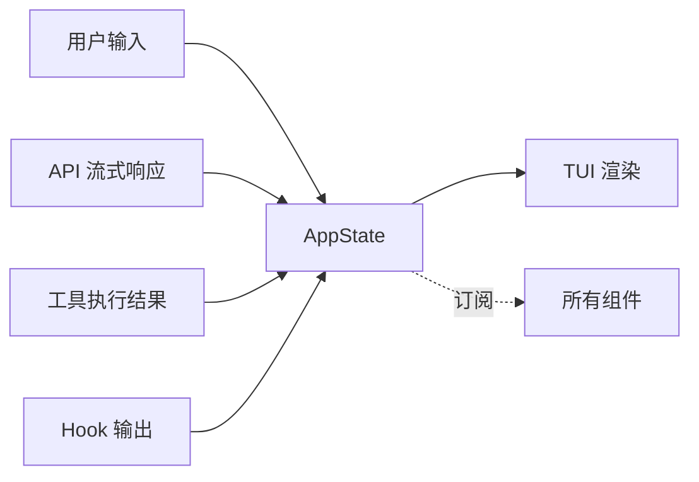
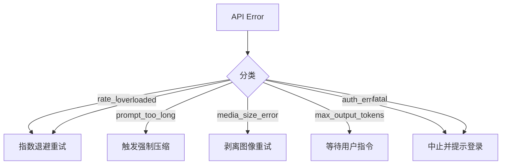

# 请求生命周期

理解一个系统的最快方式是**跟踪一次请求**从进入到返回的完整路径。这篇文档以"用户输入一个需要工具调用的 prompt"为例，展示 Claude Code 内部的完整数据流。

## 完整时序图



## 关键阶段详解

### Stage 1: 输入接收（TUI 层）

用户在终端输入 prompt 后：

1. **Ink 框架的键盘事件**：`ink/parse-keypress.ts` 解析原始键盘序列
2. **输入缓冲**：`hooks/useTextInput.ts` 管理多行输入、Vim 模式、历史
3. **提交触发**：回车时调用 `submitQuery(input)`

输入此时是一个普通 string，可能包含 `@file` 附件引用或 `/command` 前缀。

### Stage 2: 上下文收集（Context）

QueryEngine 在调用 API 前会**收集系统上下文**，这不是每次都重新收集，而是**增量更新**：

```typescript
// context.ts 收集的内容
const systemContext = {
  cwd: process.cwd(),
  gitStatus: await getGitStatus(),
  platform: os.platform(),
  shellVersion: detectShell(),
  claudeMdFiles: await loadClaudeMd(),  // 树遍历找 CLAUDE.md
  memdirEntries: await findRelevantMemories(query),  // 检索记忆
  installedTools: listActiveTools(),
}
```

**注意：**`memdir` 检索发生在**查询前**，基于 prompt 相关性返回最相关的记忆条目。

### Stage 3: 系统提示词组装

系统提示词是分段构造的（见 `constants/systemPromptSections.ts`）：

```
<system-role>       # 固定角色描述
<tool-policies>     # 工具使用策略
<safety-rules>      # 安全规则
<env-context>       # 动态：cwd、git、platform
<memory>            # 动态：CLAUDE.md + memdir
<custom-system>     # 用户自定义
```

### Stage 4: API 流式调用

调用 `services/api/client.ts`：

1. **选择 provider**：Anthropic / AWS / Azure / GCP 四选一
2. **重试策略**：`withRetry.ts` 处理 429/500/网络错误
3. **流式读取**：通过 Server-Sent Events 逐 chunk 接收
4. **token 计数**：每个 chunk 实时累加

### Stage 5: 工具调用分派（核心）

当 Claude 返回 `stop_reason: "tool_use"`，QueryEngine 进入**工具执行循环**：

#### 分区（Partition）

```typescript
// 将工具调用分成两组
const readOnly = toolCalls.filter(t => isReadOnly(t.name))  // Grep, Glob, Read
const mutations = toolCalls.filter(t => !isReadOnly(t.name))  // Edit, Write, Bash
```

#### 并行/串行执行

- **只读工具并行**：`Promise.all(readOnly.map(exec))`
- **写入工具串行**：`for (const t of mutations) await exec(t)`
- **原因**：避免并发写冲突，但最大化只读工具的吞吐

#### 权限检查链

每个工具执行前走完整的权限栈：

```
PreToolUse Hook → PermissionEvaluator → (可能)用户对话框 → 执行
```

详见 [permissions 文档](../utils/permissions.md)。

### Stage 6: Auto-Compact（上下文压缩）

如果 token 使用量接近 context window 上限，触发**自动压缩**：



压缩后的消息带有**边界标记**（`compact_boundary`），未来的 snip 工具可以引用这些边界。

### Stage 7: 响应渲染

最终消息流回 TUI：

1. `QueryEngine` 更新 `AppState.messages`
2. `AppState` 通过 `useSyncExternalStore` 通知订阅者
3. 相关组件重渲染
4. Markdown 渲染、代码高亮、工具结果展开等

## 状态流动图

整个过程中，**AppState 作为单一真相源**被反复更新：



这种架构使得**任何组件都可以通过订阅 AppState 获取最新状态**，而不需要 prop drilling。

## 消息的三种形态

消息在系统中有三种不同的表示（详见 [utils/messages](../utils/messages.md)）：

| 形态 | 用途 | 特点 |
|------|------|------|
| **Internal** | UI 展示 | 包含 UUID、metadata、附件引用 |
| **API** | 发给 Claude | 去除 metadata、保留 prompt cache 标记 |
| **SDK** | 给 SDK 消费者 | 含 session_id、synthetic 标记、结构化工具结果 |

在 API 调用前会做 Internal → API 的投影；在返回给外部 SDK 时做 Internal → SDK 的映射。

## 错误处理分支

如果 API 调用失败，进入 `services/api/errors.ts` 的错误分类：



这种**分类-响应**的错误处理是工业系统的标准做法。

## 下一步

- 阅读 [设计亮点](./design-highlights.md) 了解流程中的十大工程模式
- 阅读 [QueryEngine 源码解析](../root-files/query-engine.md) 深入核心循环
