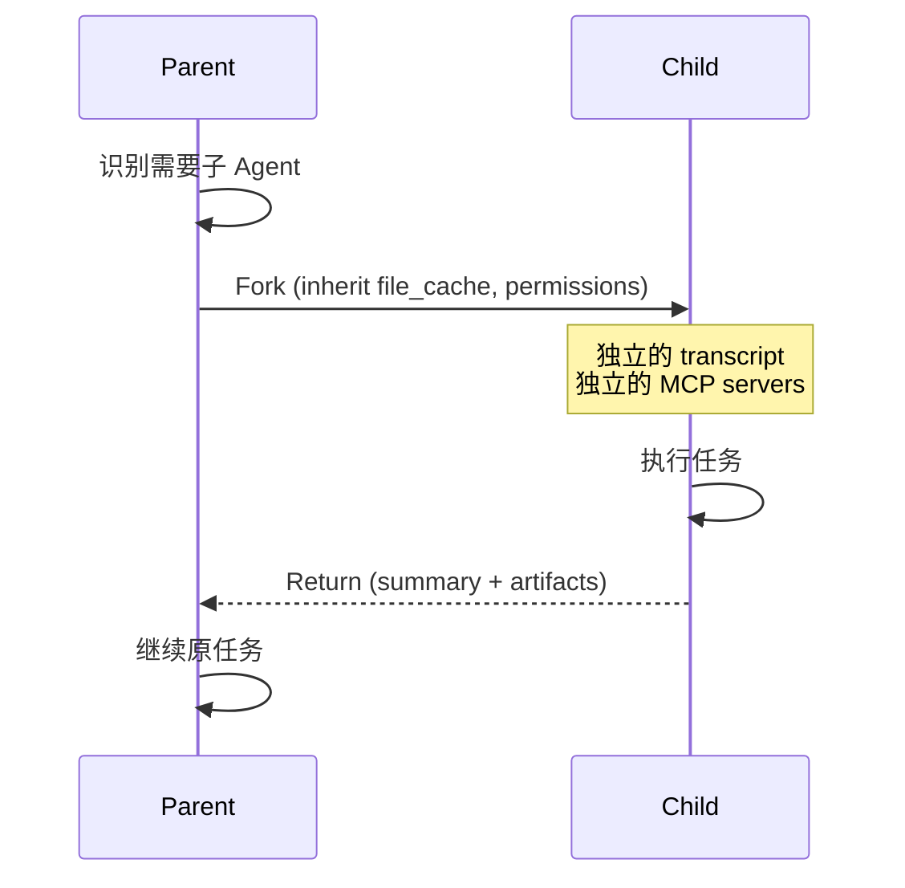

# 设计亮点

这篇文档汇总 Claude Code 源码中**最值得学习的十个设计模式**，每个都是工业级系统或 AI Agent 先行者的典型方案。每个亮点都链接到了更详细的文档。

## 1. Type-Safe Tool Builder 泛型工厂

**文件：** `src/Tool.ts`

Claude Code 有 40+ 工具，每个都需要 schema 校验、权限检查、进度报告、UI 渲染。如何在 TypeScript 里做到**编译期类型安全**？

答案是**泛型工厂函数**：

```typescript
export function buildTool<D extends AnyToolDef>(def: D): BuiltTool<D> {
  // 通过类型推导，call()、progress、render 的类型都能精确到每个工具
}
```

这种模式的威力在于：
- 工具定义者只写 `ToolDef`，类型系统自动推导所有派生类型
- 编译器强制所有工具都实现必需的方法
- 跨 40+ 工具**零类型错误**

详见 [Tool 工具框架](../root-files/tool-framework.md)。

## 2. 并行预取启动优化

**文件：** `src/main.tsx`、`src/bootstrap/state.ts`

冷启动时，macOS Keychain 的同步读取要 ~65ms。Claude Code 的做法是**在模块加载前异步启动这些操作**：

```typescript
// main.tsx 顶部
startMdmRawRead()         // 启动 MDM 子进程
startKeychainPrefetch()   // 启动 Keychain 异步读取

// ... 然后才 import 重型模块（~135ms）
```

当后续代码需要这些值时，结果已经就绪。这是 **CPU/IO 并行化**的经典应用。

详见 [bootstrap 文档](../bootstrap/index.md)。

## 3. Feature Flags 死代码消除

**文件：** 全局的 `feature('FLAG')` 调用

```typescript
const voiceCommand = feature('VOICE_MODE')
  ? require('./commands/voice/index.js').default
  : null
```

Bun 的 bundler 在构建时**将 `feature('X')` 求值为常量**，然后死代码消除剥离未启用的分支。

优势：
- 不同环境（内部/外部、mobile/desktop）用**同一份代码库**
- 未启用功能的代码**完全不在最终 bundle 里**（减少体积、降低攻击面）
- 比运行时条件判断**零成本**

管理的 flags：`PROACTIVE`、`KAIROS`、`BRIDGE_MODE`、`DAEMON`、`VOICE_MODE`、`AGENT_TRIGGERS`、`HISTORY_SNIP` 等。

## 4. 声明式权限规则（Allow/Deny/Ask DSL）

**文件：** `src/utils/permissions/`、`src/types/permissions.ts`

权限不是写死在代码里，而是**数据驱动**：

```typescript
type ToolPermissionRulesBySource = {
  [source: 'cliArg' | 'command' | 'session' | 'settings.json']: {
    [tool: string]: PermissionBehavior[]  // allow | deny | ask
  }
}
```

规则来源有优先级（CLI 参数 > 命令 > 会话 > 设置文件），评估器按顺序检查：

```
always-allow rules → deny rules → mode check → ask user → deny by default
```

这使得权限系统**可测试、可持久化、可分享**。

详见 [utils/permissions 文档](../utils/permissions.md)。

## 5. FAIL-CLOSED Tree-sitter Bash 解析

**文件：** `src/utils/bash/ast.ts`、`src/tools/BashTool/bashSecurity.ts`

Bash 是图灵完备的——简单的字符串匹配无法安全判断 `rm -rf /` 和 `echo "rm -rf /"` 的区别。Claude Code 用 **Tree-sitter 解析 AST**，然后基于白名单判断安全性：

```typescript
// 未在白名单的 AST 节点 → 自动拒绝
function isCommandSafe(ast: SyntaxNode): boolean {
  if (!ALLOWED_NODE_TYPES.includes(ast.type)) return false
  // ... 递归检查所有子节点
}
```

**FAIL-CLOSED** 意味着：**不认识的就拒绝**。这比 FAIL-OPEN（不认识的就允许）安全得多。

这种安全模型是**工业级命令执行必须的工程投入**。

详见 [utils/bash-security 文档](../utils/bash-security.md)。

## 6. Hook 生命周期扩展系统

**文件：** `src/schemas/hooks.ts`、`src/utils/hooks/`

Claude Code 在关键执行点抛出**生命周期事件**，插件可以监听：

```typescript
type HookEvent =
  | 'PreToolUse'     // 工具执行前（可阻止）
  | 'PostToolUse'    // 工具执行后
  | 'UserPromptSubmit'
  | 'SessionStart' | 'SessionEnd'
  | 'SubagentStart' | 'SubagentStop'
  | 'FileChanged'
  | 'PermissionRequest'
  // ... 20+ 事件
```

每个 Hook 可以：
- **approve/block/modify** — 批准、阻止或修改操作
- 注入上下文到模型
- 发送通知
- 写入日志

Hook 可以是 Shell 命令、JavaScript、HTTP 端点——**任何能返回 JSON 的东西**。

这是**插件系统的核心扩展点**，让外部可以在不修改 core 的情况下深度集成。

详见 [utils/hooks 文档](../utils/hooks-utils.md)。

## 7. PII 安全分析架构

**文件：** `src/services/analytics/`

分析数据最容易泄漏 PII（用户代码、文件路径）。Claude Code 的做法是**类型强制验证**：

```typescript
// 任何进入分析的 metadata 必须带这个前缀，显式声明已验证
type AnalyticsMetadata_I_VERIFIED_THIS_IS_NOT_CODE_OR_FILEPATHS = {
  // ...
}

// 或者用 _PROTO_* 前缀标记，只走 1P 通道
{
  _PROTO_file_path: '...'   // 不会发到 Datadog
  duration_ms: 100          // 可以发到所有 sink
}
```

**零依赖设计**：`services/analytics/index.ts` 不 import 任何其他模块，避免循环依赖（因为所有模块都要调用 `logEvent()`）。

事件队列在 sink 绑定前不丢失，sink 就绪后批量冲刷。

详见 [services/analytics 文档](../services/analytics.md)。

## 8. 多云 API 抽象

**文件：** `src/services/api/`

Claude 可以通过 Anthropic Direct、AWS Bedrock、Azure Foundry、Google Vertex AI 访问。Claude Code 把这四种**全部作为一等公民**抽象：

```typescript
function createClient(config: ApiConfig): ApiClient {
  switch (config.provider) {
    case 'anthropic': return createAnthropicClient(config)
    case 'bedrock': return createBedrockClient(config)
    case 'azure': return createAzureClient(config)
    case 'vertex': return createVertexClient(config)
  }
}
```

每个 provider 的认证、URL、错误格式都不同，但上层代码只看到统一的 `ApiClient` 接口。

**工业级产品必须这样做**——不同企业有不同的云合约，锁定一家就失去大客户。

详见 [services/api 文档](../services/api.md)。

## 9. 渐进式上下文压缩

**文件：** `src/services/compact/`、`src/services/autoDream/`

LLM 有 context window 限制（Claude 200K、1M）。长会话必然会撞上。Claude Code 的方案是**三阶段渐进压缩**：

```
Level 1 — Micro Compact
  触发：每 N 条消息 或 工具结果过大
  动作：压缩旧工具结果（保留摘要）

Level 2 — Auto Compact
  触发：token 使用率 > 80%
  动作：用 Claude 摘要较旧的对话段

Level 3 — Dream (Consolidation)
  触发：会话很长（>M turns）
  动作：深度整合，重写叙事
```

每次压缩都会**插入边界标记**（`compact_boundary`），未来可以通过 `snip` 工具指定回滚到哪个边界。

这种**可逆、渐进、分层**的压缩策略是长对话 Agent 的必要设计。

详见 [services/compact 文档](../services/compact.md)。

## 10. 子 Agent 递归分叉模型

**文件：** `src/tools/AgentTool/`、`src/coordinator/`

Claude Code 的核心 Agent 能力：**Agent 可以派生子 Agent**。每次调用 `AgentTool` 都会：

1. **分叉**父 Agent 的状态（文件缓存、权限上下文继承）
2. **隔离** MCP 服务器和命令/技能缓存（子 Agent 可能有不同的工具集）
3. **独立的 transcript**（子目录记录对话）
4. **受控返回**（子 Agent 执行结束后，结果汇总返回父级）



内置 Agent（`explore`、`plan`、`verify`）**不加载 CLAUDE.md** 以节省 token（每周可省 5-15G tokens over 34M+ spawns）。

**coordinator 模式**进一步支持**多 Agent 并行协作**，通过共享 scratchpad 和消息路由。

详见 [tools/agent-tool 文档](../tools/agent-tool.md) 和 [coordinator 文档](../coordinator/index.md)。

## 横向模式总结

从这十个亮点可以提炼出一些**横向的设计原则**：

| 原则 | 体现 |
|------|------|
| **数据驱动** | 权限规则、命令注册、工具定义都是数据而非代码 |
| **编译期强制** | 类型系统、Feature Flags、PII 类型标记 |
| **分层失效** | Bash 安全栈、权限链、错误分类 |
| **渐进式** | 压缩、启动、工具发现都是增量的 |
| **零依赖核心** | analytics、types 层不依赖外部 |
| **可观测默认** | 每个关键点都有 hook、日志、metrics |

这些原则在自己的项目中都值得复刻。

## 下一步

接下来按源码目录深入每个子系统：

- [根文件：main, QueryEngine, Tool, commands](../root-files/main-entry.md)
- [tools/ 工具系统](../tools/bash-tool.md)
- [services/ 服务层](../services/api.md)
- [utils/ 工具函数](../utils/bash-security.md)
