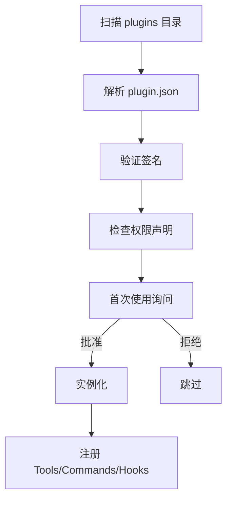

# plugins/ — 插件系统实现

**目录：** `src/plugins/`

`plugins/` 是**插件系统的实现细节**。概念和 API 见 [services/oauth-and-plugins](../services/oauth-and-plugins.md)，这里讲内部实现。

## 插件加载流水线



## 插件扫描

```typescript
const PLUGIN_DIRS = [
  path.join(CLAUDE_HOME, 'plugins'),         // 用户
  path.join(cwd, '.claude', 'plugins'),      // 项目
  ...process.env.CLAUDE_PLUGINS?.split(':') ?? [],
]

async function scanPlugins(): Promise<PluginDef[]> {
  const plugins: PluginDef[] = []
  for (const dir of PLUGIN_DIRS) {
    if (!await exists(dir)) continue
    for (const entry of await readdir(dir)) {
      const manifest = path.join(dir, entry, 'plugin.json')
      if (await exists(manifest)) {
        plugins.push(await parsePlugin(manifest))
      }
    }
  }
  return plugins
}
```

## 插件清单 Schema

```typescript
const PluginManifestSchema = z.object({
  name: z.string(),
  version: z.string(),
  description: z.string(),
  author: z.string().optional(),

  // 扩展点
  tools: z.array(z.string()).optional(),
  commands: z.array(z.string()).optional(),
  hooks: z.array(HookSchema).optional(),
  agents: z.array(AgentSchema).optional(),

  // 权限
  permissions: z.array(PermissionSchema),

  // 依赖
  dependencies: z.record(z.string()).optional(),
  requires: z.object({
    claudeCode: z.string(),  // semver
    node: z.string().optional(),
  }).optional(),
})
```

## 签名验证

Anthropic Registry 的插件**有签名**：

```typescript
async function verifySignature(pluginDir: string): Promise<boolean> {
  const manifest = await readFile(`${pluginDir}/plugin.json`)
  const signature = await readFile(`${pluginDir}/plugin.sig`)
  const publicKey = ANTHROPIC_PLUGIN_PUBKEY

  return crypto.verify('sha256', manifest, publicKey, signature)
}
```

用户安装第三方插件时被警告：

```
⚠ Plugin "my-plugin" is not signed by Anthropic.
Install anyway? [y/N]
```

## 沙盒

```typescript
class PluginSandbox {
  constructor(
    private plugin: PluginDef,
    private grantedPermissions: Permission[]
  ) {}

  // 包装每个 API 调用
  async call(method: string, args: any): Promise<any> {
    this.checkPermission(method, args)
    return this.plugin.methods[method](args)
  }

  private checkPermission(method: string, args: any) {
    const required = getRequiredPermission(method, args)
    if (!this.grantedPermissions.includes(required)) {
      throw new PermissionError(`Plugin missing: ${required}`)
    }
  }
}
```

## 插件 API

插件能访问的 API：

```typescript
interface PluginAPI {
  // 文件系统（受权限限制）
  fs: {
    read(path: string): Promise<string>
    write(path: string, content: string): Promise<void>
    exists(path: string): Promise<boolean>
  }

  // Shell（受命令白名单限制）
  exec(command: string): Promise<ExecResult>

  // Claude
  claude: {
    complete(messages: Message[]): Promise<string>
  }

  // UI
  ui: {
    notify(message: string): void
    prompt(question: string): Promise<string>
  }

  // 日志
  log: Logger
}
```

## Hook 注册

```typescript
// 插件提供 hook
export default {
  hooks: {
    'PostToolUse': async (ctx) => {
      if (ctx.tool === 'Edit') {
        await lintFile(ctx.filePath)
      }
    }
  }
}
```

Plugin manager 注册到全局 hook registry：

```typescript
for (const [event, handler] of Object.entries(plugin.hooks ?? {})) {
  hookRegistry.register(event, sandbox.wrap(handler))
}
```

## Tool 注册

```typescript
// 插件提供 tool
export default {
  tools: {
    'my-tool': buildTool({
      name: 'my_tool',
      description: '...',
      schema: z.object({...}),
      async call(args) { ... }
    })
  }
}
```

注册到 ToolRegistry（带命名空间）：

```typescript
for (const [name, tool] of Object.entries(plugin.tools ?? {})) {
  toolRegistry.register({
    ...tool,
    name: `plugin__${plugin.name}__${name}`
  })
}
```

## 插件之间隔离

```typescript
class PluginIsolator {
  private sandboxes = new Map<string, PluginSandbox>()

  register(plugin: PluginDef) {
    const sandbox = new PluginSandbox(plugin, plugin.permissions)
    this.sandboxes.set(plugin.name, sandbox)
  }

  // 插件之间不能直接调用
  call(fromPlugin: string, toPlugin: string, method: string, args: any) {
    // 需要显式声明依赖
    const deps = this.sandboxes.get(fromPlugin)?.plugin.dependencies ?? {}
    if (!deps[toPlugin]) {
      throw new Error(`${fromPlugin} didn't declare dependency on ${toPlugin}`)
    }

    return this.sandboxes.get(toPlugin)!.call(method, args)
  }
}
```

## 热加载

```typescript
// 开发插件时
claude plugin dev ./my-plugin

// 内部实现
fs.watch('./my-plugin', async () => {
  await unregisterPlugin('my-plugin')
  await loadPlugin('./my-plugin')
})
```

## 版本兼容

```typescript
async function checkCompatibility(plugin: PluginDef) {
  const required = plugin.requires?.claudeCode
  if (required && !semver.satisfies(VERSION, required)) {
    throw new IncompatiblePlugin(
      `Plugin ${plugin.name} requires Claude Code ${required}, you have ${VERSION}`
    )
  }
}
```

## 插件管理命令

```bash
claude plugin list            # 列出安装的插件
claude plugin install <name>  # 从 registry 安装
claude plugin remove <name>
claude plugin enable <name>
claude plugin disable <name>
claude plugin update          # 更新所有
claude plugin search <query>  # 搜索 registry
```

## 插件错误隔离

```typescript
async function runPluginHook(plugin: string, event: string, ctx: any) {
  try {
    await sandboxes.get(plugin)!.call('hook', { event, ctx })
  } catch (e) {
    logger.error(`Plugin ${plugin} hook failed`, e)
    // 不让插件错误影响主流程
  }
}
```

**一个插件挂不影响其他插件**。

## 插件遥测

```typescript
analytics.record({
  type: 'plugin_used',
  pluginName: plugin.name,
  pluginVersion: plugin.version,
  // 不包含用户数据
})
```

## 值得学习的点

1. **声明式扩展点** — manifest 声明 tools/commands/hooks
2. **签名验证** — 官方插件可信
3. **沙盒 API** — 权限受限的 API
4. **命名空间隔离** — `plugin__name__tool`
5. **插件之间依赖声明** — 不能任意互调
6. **错误隔离** — 一个挂不影响其他
7. **热加载** — 开发友好

## 相关文档

- [services/oauth-and-plugins](../services/oauth-and-plugins.md)
- [utils/hooks-utils](../utils/hooks-utils.md)
- [Tool 工具框架](../root-files/tool-framework.md)
