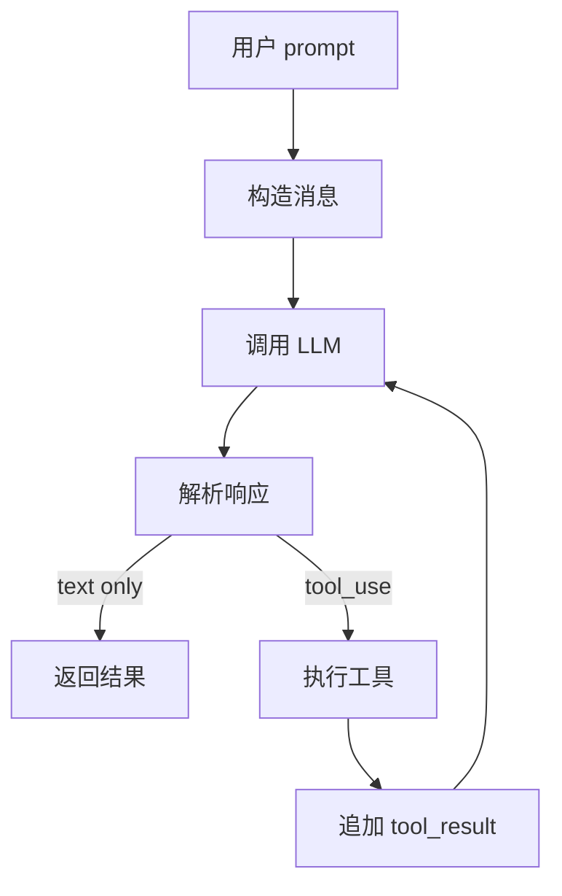

# query/ — 查询编排层

**目录：** `src/query/`

`query/` 是 Claude Code 的 **Agent 循环核心**——协调 LLM 推理与工具调用。和 `assistant/` 互补（who/when vs how）。

## 核心概念

### Query

一次**用户请求的完整处理**：

```typescript
interface Query {
  id: string
  prompt: string
  startedAt: number
  messages: Message[]
  toolUses: ToolCall[]
  result: string
  tokensUsed: number
  cost: number
}
```

## Agent Loop



## 循环实现

```typescript
// query/loop.ts
async function* runQuery(prompt: string): AsyncGenerator<QueryEvent> {
  let messages: Message[] = [{ role: 'user', content: prompt }]

  while (true) {
    // 1. 调 LLM
    yield { type: 'thinking' }
    const response = await assistant.complete({ messages })
    yield { type: 'response', content: response }

    // 2. 有 tool_use 吗？
    const toolUses = extractToolUses(response)
    if (toolUses.length === 0) {
      return response  // 终止
    }

    // 3. 执行工具
    const results = await executeTools(toolUses)
    yield { type: 'tool_results', results }

    // 4. 追加到消息
    messages.push({ role: 'assistant', content: response.content })
    messages.push({ role: 'user', content: results })
  }
}
```

## 工具执行

```typescript
async function executeTools(uses: ToolCall[]): Promise<ToolResult[]> {
  // 分类：read-only 可并行，write 必须串行
  const { parallel, serial } = partitionTools(uses)

  // 并行的 read-only
  const parallelResults = await Promise.all(
    parallel.map(exec => executeOne(exec))
  )

  // 串行的 write
  const serialResults = []
  for (const exec of serial) {
    serialResults.push(await executeOne(exec))
  }

  return mergeResults(uses, parallelResults, serialResults)
}
```

详见 [tool-framework](../root-files/tool-framework.md) 的执行章节。

## 中断机制

```typescript
class QueryController {
  private aborted = false

  abort() {
    this.aborted = true
  }

  check() {
    if (this.aborted) throw new AbortError()
  }
}

async function runQuery(prompt: string, ctrl: QueryController) {
  while (true) {
    ctrl.check()  // 每次循环检查
    const response = await assistant.complete({...})

    ctrl.check()
    const results = await executeTools(response)
  }
}
```

用户按 Ctrl+C → `ctrl.abort()` → 循环在下次 check 时退出。

## 最大轮次限制

```typescript
const MAX_TOOL_USE_ITERATIONS = 50

async function runQuery(prompt: string) {
  let iterations = 0
  while (iterations++ < MAX_TOOL_USE_ITERATIONS) {
    // ...
  }
  throw new MaxIterationsExceeded()
}
```

**防止死循环**——Agent 不停调工具永不停止。

## 流式输出

```typescript
async function* streamQuery(prompt: string): AsyncGenerator<StreamEvent> {
  while (true) {
    const stream = assistant.stream({ messages })
    const fullResponse: Content[] = []
    let currentText = ''

    for await (const event of stream) {
      yield event

      if (event.type === 'text_delta') {
        currentText += event.delta
      }

      if (event.type === 'content_block_stop') {
        fullResponse.push(event.block)
      }
    }

    // 解析完整响应
    const toolUses = fullResponse.filter(b => b.type === 'tool_use')
    if (toolUses.length === 0) return

    // 执行工具...
  }
}
```

## Turn 计数

```typescript
interface QueryState {
  turn: number
  toolCalls: number
  tokensUsed: number
}

function recordTurn(state: QueryState, response: Response) {
  state.turn++
  state.toolCalls += countToolUses(response)
  state.tokensUsed += response.usage.total
}
```

**turn** 用于：
- 统计
- 限制
- UI 显示

## 错误处理

```typescript
async function runQuery(prompt: string) {
  try {
    return await loop(prompt)
  } catch (e) {
    if (e instanceof AbortError) {
      return { type: 'aborted', partialResult: lastResponse }
    }
    if (e instanceof ContextExceeded) {
      await compact()
      return retry()
    }
    if (e instanceof RateLimited) {
      await sleep(e.retryAfter)
      return retry()
    }
    throw e
  }
}
```

## Context 窗口管理

```typescript
async function ensureContextFits(messages: Message[]) {
  const tokens = await countTokens(messages)
  const limit = MAX_CONTEXT_TOKENS

  if (tokens > limit * 0.9) {
    // 紧急压缩
    messages = await compactService.dreamCompact(messages)
  } else if (tokens > limit * 0.75) {
    messages = await compactService.autoCompact(messages)
  } else if (tokens > limit * 0.55) {
    messages = await compactService.microCompact(messages)
  }

  return messages
}
```

## 跨 Query 状态

每个 query 独立，但**共享会话状态**：

```typescript
// 同一会话的多个 query
session.queries.push(await runQuery('first'))
session.queries.push(await runQuery('second'))
session.queries.push(await runQuery('third'))

// 所有 messages 都在 session.messages 里累积
```

## Query 事件流

```typescript
type QueryEvent =
  | { type: 'query_start', queryId: string }
  | { type: 'thinking' }
  | { type: 'text_delta', delta: string }
  | { type: 'tool_use_start', tool: string }
  | { type: 'tool_use_complete', result: any }
  | { type: 'usage', tokens: number }
  | { type: 'query_end', result: string }
  | { type: 'error', error: Error }
```

**UI 订阅事件流**，不直接操作 messages。

## 值得学习的点

1. **Agent Loop = LLM+Tools 循环** — 核心模式
2. **Tool 分类执行** — read-only 并行，write 串行
3. **最大轮次限制** — 防死循环
4. **中断检查点** — 响应 Ctrl+C
5. **上下文主动压缩** — 避免爆窗口
6. **AsyncGenerator 流式输出** — UI 实时更新
7. **Query 事件流** — 解耦执行与显示

## 相关文档

- [query-engine](../root-files/query-engine.md)
- [assistant/](../assistant/index.md)
- [tool-framework](../root-files/tool-framework.md)
- [services/compact](../services/compact.md)
