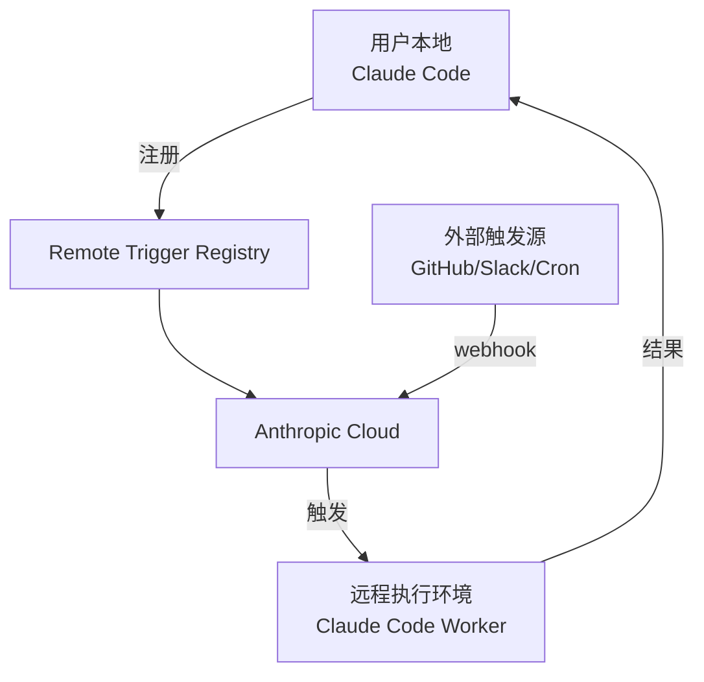
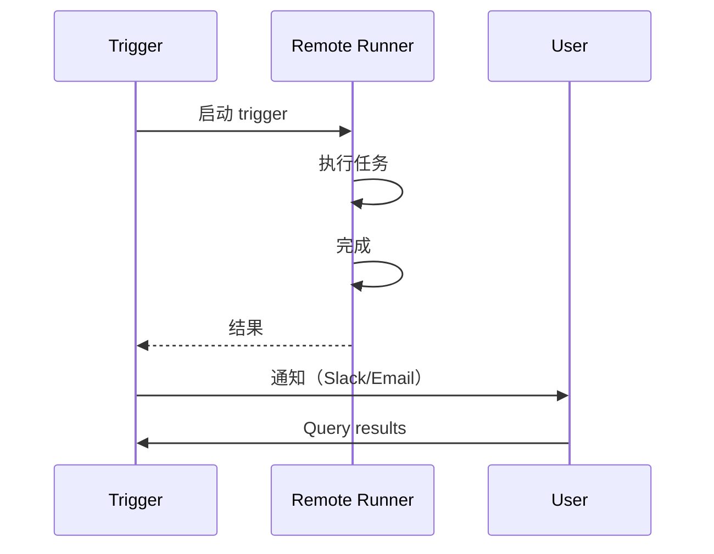

# remote/ — 远程 Agent

**目录：** `src/remote/`

`remote/` 让 Claude Code 突破**本地进程边界**——可以**远程触发**、**定时调度**、**跨设备**运行 Agent。

## 场景

### 1. 定时报告

```
每周一早 9 点：
  → 触发远程 Claude Code
  → 分析上周 git commits
  → 生成报告发到 Slack
```

### 2. CI/CD 集成

```
PR 被打开：
  → Claude Code 审查代码
  → 评论建议
  → 自动修复
```

### 3. 监控响应

```
监控告警：
  → 触发 Claude Code
  → 调试生产问题
  → 应用 hotfix
```

## 架构



## Remote Trigger 定义

```typescript
interface RemoteTrigger {
  id: string
  name: string
  prompt: string              // 执行什么
  schedule?: string           // cron 表达式
  eventTriggers?: string[]    // webhook 事件
  tools?: string[]            // 允许的工具
  environment: {
    repository?: string
    branch?: string
    envVars?: Record<string, string>
  }
}
```

## 创建 Trigger

### CLI

```bash
claude remote create \
  --name "weekly-report" \
  --schedule "0 9 * * MON" \
  --prompt "Analyze this week's commits and write a report"
```

### Schedule Skill

```bash
claude /schedule "每周一 9 点分析 commits 写报告"
```

Claude 自动生成 trigger 配置。

## Scheduled Tasks Skill

Anthropic 官方 skill：`anthropic-skills:schedule`

```markdown
# schedule skill
Create scheduled task that runs on demand or automatically on an interval.
```

用户说"每天检查一次部署"，Claude 调用 `create_scheduled_task` MCP 工具：

```typescript
mcp__scheduled-tasks__create_scheduled_task({
  name: 'daily-deploy-check',
  schedule: '0 10 * * *',
  prompt: 'Check deployment status and report any issues'
})
```

## 远程执行环境

远程 Claude Code 跑在**沙盒容器**里：

```yaml
# remote-env.yaml
image: anthropic/claude-code-runner:latest
resources:
  memory: 2GB
  cpu: 1
  disk: 10GB
networking:
  allowed_hosts:
    - github.com
    - api.anthropic.com
timeout: 1800s
```

**资源限制 + 网络白名单** 保证安全。

## 触发源

### Webhook 触发

```
POST https://trigger.anthropic.com/t/abc123
{
  "event": "pr_opened",
  "data": { "pr": 123, "title": "Fix auth bug" }
}
```

触发对应的 trigger。

### Cron 触发

```typescript
const cronTrigger = {
  schedule: '0 9 * * MON',  // 每周一 9 点
  timezone: 'Asia/Shanghai'
}
```

服务端 cron 定期触发。

### 手动触发

```bash
claude remote trigger weekly-report
# 立即运行
```

## 结果返回



结果可以：

- **推送到 Slack**
- **发邮件**
- **存本地供查阅**
- **创建 GitHub Issue**

## Trigger 认证

每个 trigger 有**独立 token**：

```bash
claude remote create ...
# 输出：
# Trigger created: weekly-report
# Webhook URL: https://trigger.anthropic.com/t/abc123
# Secret: <copy this, only shown once>
```

Webhook 请求需**签名验证**：

```
POST /t/abc123
X-Claude-Signature: sha256=...
```

## Trigger 权限

```typescript
interface TriggerPermissions {
  tools: string[]              // 白名单
  network: string[]            // 允许的域名
  filesystem: 'none' | 'readonly' | 'isolated'
  maxDurationMs: number
}
```

**默认收窄** — 远程触发不能使用 `Write` 或 `Bash` 除非显式开启。

## 本地查看远程结果

```bash
claude remote list
# 列出所有 triggers

claude remote history weekly-report
# 查看某个 trigger 的历史执行

claude remote logs <execution-id>
# 查看某次执行的日志
```

## Git 集成

远程 runner 可以 **clone repo + 分支**：

```typescript
environment: {
  repository: 'github.com/user/repo',
  branch: 'main',
  credentials: 'oauth-token'
}
```

Runner 启动后：

```bash
cd /tmp/work
git clone https://... .
git checkout main
claude --prompt "..."
```

## Trigger 与 MCP

通过 MCP 管理 trigger：

```typescript
mcp__scheduled-tasks__list_scheduled_tasks()
mcp__scheduled-tasks__update_scheduled_task(id, { schedule: '...' })
mcp__scheduled-tasks__create_scheduled_task({...})
```

## 安全考虑

### 1. 凭证隔离

远程 runner **不能访问用户本地的**：

- OAuth tokens
- API keys
- `.ssh/`
- `.aws/`

**必须显式声明 env vars** 供 runner 使用。

### 2. 输出过滤

```typescript
function sanitizeOutput(output: string): string {
  // 移除可能的 secrets
  return output
    .replace(/sk-ant-[a-zA-Z0-9]+/g, '[REDACTED]')
    .replace(/ghp_[a-zA-Z0-9]+/g, '[REDACTED]')
}
```

### 3. 执行日志

所有 trigger 执行有**完整审计日志** — 谁、什么时候、做了什么。

## 值得学习的点

1. **突破本地边界** — Agent 不只能在本地跑
2. **Webhook + Cron 双触发** — 覆盖多种场景
3. **Skill + Trigger 结合** — `/schedule` 自然语言创建
4. **默认收窄权限** — 远程不能全权
5. **独立沙盒 + 网络白名单** — 安全执行
6. **凭证隔离** — 不暴露用户本地密钥
7. **结果多渠道推送** — Slack/Email/GitHub

## 相关文档

- [coordinator/ - 多 Agent 协调](../coordinator/index.md)
- [services/mcp - MCP 协议](../services/mcp.md)
- [tools/other-tools - Cron 工具](../tools/other-tools.md)
