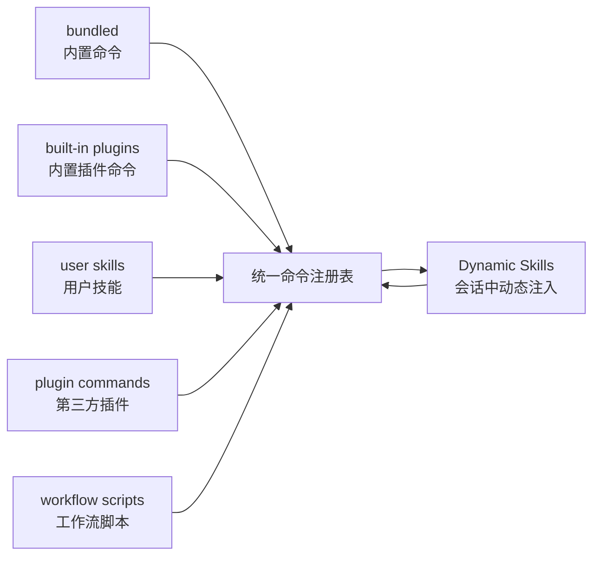
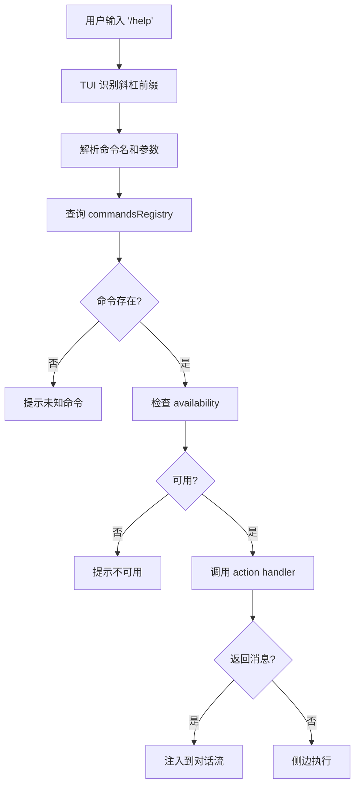

# commands.ts — 命令注册中心

**文件：** `src/commands.ts`（26 KB）

Claude Code 有 **66+ 斜杠命令**，它们来自 5 个不同的源。这个文件是所有命令的**统一注册中心**。

## 命令的 5 个来源



| 来源 | 目录/位置 | 示例 |
|------|----------|------|
| Bundled | `src/commands/` | `/help`、`/clear`、`/login`、`/config` |
| Built-in Plugins | `src/plugins/bundled/` | `/mcp`、`/skills` |
| User Skills | `~/.claude/skills/` | 用户自己写的 `.md` 文件 |
| Plugin Commands | installed plugins | 第三方插件的命令 |
| Workflows | `.claude/workflows/` | YAML 定义的工作流 |
| Dynamic Skills | 会话中通过工具操作产生 | 文件系统发现的新 skill |

## Lazy Loading 模式

所有命令都**懒加载**，即使 bundled 命令也不在启动时全部 import：

```typescript
import memoize from 'lodash-es/memoize.js'

export const getBundledCommands = memoize(() => {
  return [
    feature('VOICE_MODE') ? require('./commands/voice/index.js').default : null,
    require('./commands/help/index.js').default,
    require('./commands/clear/index.js').default,
    // ... 用 require 而非 import，实现懒加载
  ].filter(Boolean)
})
```

**memoize** 保证只加载一次，然后缓存结果。

## 按 cwd 缓存

命令发现是**按工作目录缓存**的：

```typescript
export const getAllCommands = memoize(
  async (cwd: string, availability: ...) => {
    const bundled = getBundledCommands()
    const plugins = await loadPluginCommands(cwd)
    const skills = await loadUserSkills(cwd)
    const workflows = await loadWorkflows(cwd)

    return dedupe([
      ...bundled,
      ...plugins,
      ...skills,
      ...workflows,
    ])
  },
  (cwd, avail) => `${cwd}:${avail}`  // cache key
)
```

切换 cwd 时，重新扫描该目录的 `.claude/` 子目录。

## 动态 Skill 注入

当工具操作（如 `FileWriteTool`）创建了新的 skill 文件，**当前会话立即能用**：

```typescript
export function injectDynamicSkill(skill: Skill) {
  const baseNames = new Set(cachedCommands.map(c => c.name))
  if (!baseNames.has(skill.name)) {
    cachedCommands.push(skill)
    notifyCommandListChanged()
  }
}
```

不需要重启 session——**开发者边写 skill 边用**的体验关键。

## 命令的 Availability 声明

每个命令声明自己的可用条件：

```typescript
type Command = {
  name: string
  availability?: 'claude-ai' | 'console' | 'both'
  description: string
  action: (args: string) => Promise<void>
  // ...
}
```

| availability | 含义 |
|--------------|------|
| `'claude-ai'` | 仅 claude.ai 订阅用户 |
| `'console'` | 仅 Anthropic Console API key 用户 |
| `'both'` | 所有用户 |

命令注册中心在构建最终列表时**根据当前认证方式过滤**。这避免用户看到他们无法使用的命令。

## 远程安全命令白名单

当通过 Bridge 连接到远程（比如手机 app），部分命令**不能跑**（比如 `/doctor` 依赖本地文件系统）。有一个**白名单**：

```typescript
const REMOTE_SAFE_COMMANDS = new Set([
  'help', 'clear', 'cost', 'model', 'compact', 'resume', ...
])

function filterForRemote(commands: Command[]): Command[] {
  return commands.filter(c => REMOTE_SAFE_COMMANDS.has(c.name))
}
```

这避免了**CCR（Claude Code Remote）初始化竞态**——移动客户端在远程 session 启动时立刻能拿到安全的命令列表。

## 命令分类

66+ 命令粗略分类：

| 类别 | 命令示例 |
|------|---------|
| **信息与帮助** | `/help`、`/version`、`/status` |
| **成本与使用** | `/cost`、`/usage`、`/stats` |
| **配置** | `/config`、`/keybindings`、`/theme`、`/color` |
| **代码审查** | `/diff`、`/review`、`/summary` |
| **Agent 管理** | `/agents`、`/skills`、`/tasks` |
| **认证** | `/login`、`/logout`、`/mcp` |
| **会话管理** | `/resume`、`/share`、`/teleport`、`/session` |
| **功能切换** | `/vim`、`/voice`、`/mobile` |
| **诊断** | `/doctor`、`/debug-tool-call`、`/heapdump` |
| **进阶** | `/effort`、`/passes`、`/memory`、`/compact` |

## 命令执行路径

用户输入 `/help` 时：



## 值得学习的点

1. **memoize + cwd 键** — 目录感知的缓存
2. **多来源统一注册** — 扩展性的标准做法
3. **availability 过滤** — 产品形态差异的处理
4. **动态注入** — 运行时扩展能力
5. **远程白名单** — 分布式执行的安全边界

## 相关文档

- [commands/ - 命令实现](../commands/index.md)
- [skills/ - 技能系统](../skills/index.md)
- [plugins/ - 插件系统](../plugins/index.md)
