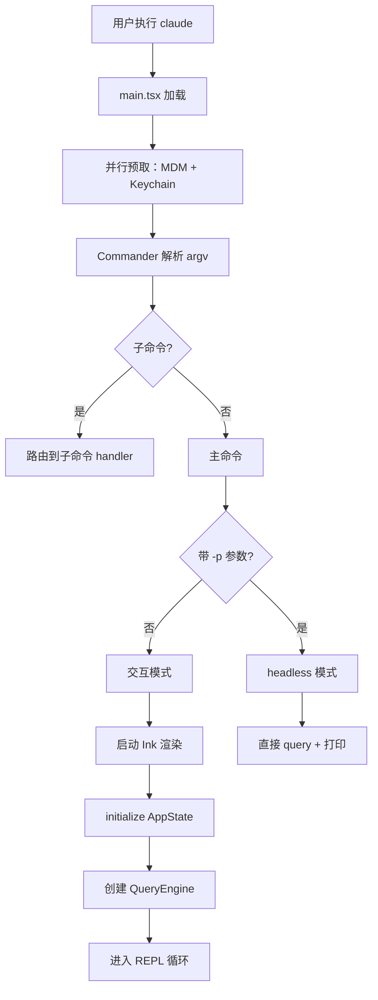

# main.tsx — CLI 主入口

**文件：** `src/main.tsx`（808 KB）

这是整个 Claude Code 的入口文件。它很大（808KB），但职责明确：**CLI 参数解析 + 启动流程编排**。

## 为什么 main.tsx 这么大？

它并不是逻辑复杂，而是**合并了所有 Commander.js 子命令的定义**。构建时 Bun 会通过死代码消除剥离未启用的子命令。

主要由三部分组成：

```
main.tsx
├── 并行预取启动器（顶部，~50 行）
├── Commander.js 命令定义（~60% 的体积）
│   ├── 主命令（交互/headless）
│   ├── 子命令（login、logout、mcp、config、skill、...）
│   └── 每个子命令的 action handler
└── 路由与 dispatch
```

## 关键设计：并行预取

在任何重型 import 前，main.tsx **优先启动异步 IO 操作**：

```typescript
// src/main.tsx 顶部
import { startMdmRawRead } from './utils/settings/mdm/...'
import { startKeychainPrefetch } from './utils/keychain'

// 关键：这两个调用不 await，让它们在后台跑
startMdmRawRead()        // 启动 MDM 配置子进程
startKeychainPrefetch()  // 启动 Keychain 异步读取

// 之后才 import 重型模块（React、Ink、tools...）
// 这些重型 import 在本地 CPU 上耗时 ~135ms
// 等 CPU 忙完 import，Keychain/MDM 的结果已就绪
```

### 效果

| 平台 | 传统方案 | 预取方案 | 节省 |
|------|----------|----------|------|
| macOS | ~200ms | ~135ms | **~65ms** |
| Windows | ~170ms | ~135ms | ~35ms |
| Linux | ~135ms | ~135ms | 0ms（无 Keychain）|

节省 65ms 看起来不多，但**乘以每天百万次启动就是大量的用户体验改进**。这是工业级 CLI 的标准优化。

### 为什么是这个顺序？

关键在于**CPU-bound 任务和 IO-bound 任务应该并行**：

```mermaid
gantt
    title 传统顺序 vs 并行预取
    dateFormat X
    axisFormat %s
    section 传统
    Keychain 读取 :done, 0, 65
    import React   :done, 65, 30
    import Ink     :done, 95, 40
    import tools   :done, 135, 65
    section 并行预取
    Keychain 读取 :done, 0, 65
    import React   :done, 0, 30
    import Ink     :done, 30, 40
    import tools   :done, 70, 65
```



在并行方案里，Keychain 读取**完全被 CPU 的 import 时间吸收**，不再是关键路径。

## Commander.js 集成

main.tsx 使用 `commander` + `@commander-js/extra-typings` 定义 CLI：

```typescript
const program = new Command()
  .name('claude')
  .description('Claude Code CLI')
  .version(VERSION)
  .argument('[prompt...]', 'Prompt to send')
  .option('-p, --print', 'Print and exit')
  .option('--model <model>', 'Model to use')
  .option('--resume <sessionId>', 'Resume session')
  // ... 几十个选项
  .action(async (prompt, options) => {
    // dispatch 到交互模式或 headless 模式
  })

// 子命令
program.command('mcp').description('MCP management').action(...)
program.command('login').description('Authenticate').action(...)
program.command('config').description('Config management').action(...)
// ... 更多子命令
```

## Feature Flags 条件编译

main.tsx 大量使用 `feature()` 做条件编译：

```typescript
const voiceCommand = feature('VOICE_MODE')
  ? require('./commands/voice/index.js').default
  : null

if (feature('BRIDGE_MODE')) {
  program.command('bridge').description('Bridge mode').action(...)
}
```

**构建时 Bun 把 `feature('VOICE_MODE')` 求值为布尔常量**，然后三元运算符的死分支被剥离。未启用的特性**在最终 bundle 里完全不存在**。

## 启动序列

完整的启动路径：



## 值得学习的点

1. **异步预取放在最前面** — 占用等待时间做有用工作
2. **大型入口文件不是反模式** — 只要职责清晰（CLI dispatch）且靠 bundler 剪裁
3. **Feature Flags 走编译期** — 避免运行时 if/else 开销和代码体积
4. **Commander 的 action handler 模式** — 每个子命令一个函数，易于懒加载

## 相关文档

- [bootstrap/ - 全局初始化状态](../bootstrap/index.md)
- [QueryEngine - 核心查询循环](./query-engine.md)
