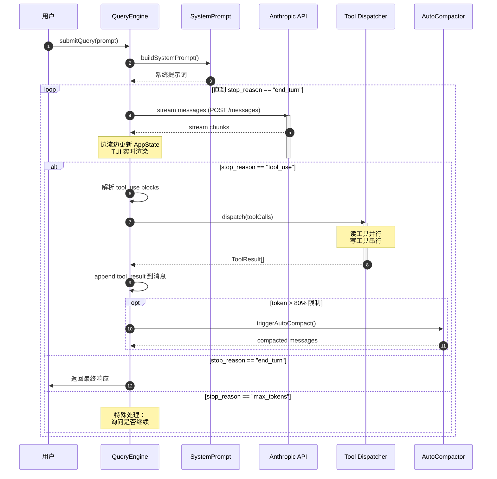

# QueryEngine — 核心查询循环

**文件：** `src/QueryEngine.ts`（48 KB）+ `src/query.ts`（70 KB）

如果把 Claude Code 比作生物，QueryEngine 就是它的**心脏和大脑**——所有的用户请求都通过它，它负责**与 Claude 对话、编排工具、管理消息、追踪状态**。

## 职责

QueryEngine 的单一职责：**把用户输入变成 Claude 响应，中间可能需要调用工具任意多次。**

它承担的子职责包括：

- 构造系统提示词（包含 cwd、git、memdir、CLAUDE.md）
- 调用 Anthropic API（流式）
- 解析 Claude 的响应（文本/思考/工具调用）
- 分派工具调用（并发/串行决策）
- 处理工具结果并继续循环
- 触发 auto-compact 和 dream
- 管理 token 使用和成本
- 错误分类与重试
- 生成 SDK 消息供外部消费

## 核心循环



## QueryEngineConfig

QueryEngine 实例化时需要**完整的运行时配置**：

```typescript
export type QueryEngineConfig = {
  cwd: string                    // 工作目录
  tools: Tools                   // 可用工具集
  commands: Command[]            // 可用命令
  mcpClients: MCPServerConnection[]  // MCP 连接
  agents: AgentDefinition[]      // Agent 定义
  canUseTool: CanUseToolFn       // 权限检查回调
  getAppState: () => AppState    // 读状态
  setAppState: (f) => void       // 改状态
  initialMessages?: Message[]    // 恢复会话
  readFileCache: FileStateCache  // 文件缓存（父 Agent 传入）
  customSystemPrompt?: string    // 用户自定义 prompt
  thinkingConfig?: ThinkingConfig
  maxTurns?: number              // turn 上限
  maxBudgetUsd?: number          // 预算上限
}
```

所有依赖**显式注入**，不用全局状态。这让 QueryEngine **可测试**、**可在子 Agent 中复用**。

## 消息规范化

Claude Code 的消息有**三种不同的表示**：

| 形态 | 用途 | 示例字段 |
|------|------|----------|
| **Message (Internal)** | UI 和状态 | `uuid`、`type`、`content`、`sourceToolAssistantUUID` |
| **ContentBlockParam (API)** | 发给 Claude | 去除 metadata、cache_control 标记 |
| **SDKMessage (External)** | SDK 消费者 | `session_id`、`is_synthetic`、结构化 tool_use_result |

QueryEngine 在不同边界做投影：

```typescript
// Internal → API（准备调用 Claude）
function toApiMessages(messages: Message[]): ContentBlockParam[] {
  return messages.flatMap(m => stripMetadata(m))
}

// Internal → SDK（发给外部监听者）
function toSdkMessage(m: Message): SDKMessage {
  return {
    session_id: sessionId,
    ...m,
    is_synthetic: isSynthetic(m)
  }
}
```

## 工具调用编排

这是 QueryEngine 最复杂的部分。当 Claude 返回工具调用时：

### 步骤 1：分区

```typescript
function partitionToolCalls(calls: ToolUseBlockParam[]) {
  const readOnly: ToolUseBlockParam[] = []
  const mutations: ToolUseBlockParam[] = []

  for (const call of calls) {
    const tool = findTool(call.name)
    if (tool.isReadOnly()) {
      readOnly.push(call)
    } else {
      mutations.push(call)
    }
  }

  return { readOnly, mutations }
}
```

### 步骤 2：并发执行

```typescript
// 只读工具全部并行
const readOnlyResults = await Promise.all(
  readOnly.map(call => executeTool(call))
)

// 写工具一个接一个
const mutationResults: ToolResult[] = []
for (const call of mutations) {
  mutationResults.push(await executeTool(call))
}
```

### 步骤 3：保持原顺序

```typescript
// 结果要按 Claude 输出的原顺序返回
const orderedResults = originalOrder.map(call => {
  return findResultById(call.id, readOnlyResults, mutationResults)
})
```

### 为什么这样做？

- **只读并行** → 信息收集（Grep、Read、Glob）能极大加速，5 个并行 ~= 5x 吞吐
- **写入串行** → 避免 Edit 和 Edit 竞争同一个文件，或者 Bash 的副作用被打乱
- **保持顺序** → Claude 的推理依赖工具结果顺序，顺序乱了会影响后续生成

## Auto-Compact 触发

每个 turn 结束后，QueryEngine 检查 token 使用：

```typescript
async function maybeAutoCompact(messages: Message[]) {
  const tokens = countTokens(messages)
  const limit = getContextWindow()

  if (tokens / limit > 0.8) {
    // 分级压缩
    if (await tryMicroCompact(messages)) return
    if (await tryAutoCompact(messages)) return
    if (await tryDream(messages)) return
    // 压缩失败 → 警告用户
  }
}
```

详见 [services/compact 文档](../services/compact.md)。

## 重试逻辑

`services/api/errors.ts` 对 API 错误分类：

```typescript
function categorizeRetryableAPIError(err: APIError) {
  if (err.status === 429) return 'rate_limit'
  if (err.status === 529) return 'overloaded'
  if (err.message.includes('prompt is too long')) return 'prompt_too_long'
  if (err.message.includes('image')) return 'media_size_error'
  // ...
}
```

QueryEngine 对每类错误有**专属响应**：

| 错误类型 | 响应 |
|---------|------|
| `rate_limit` | 指数退避重试（最多 5 次） |
| `overloaded` | 重试 + 切换备用 region |
| `prompt_too_long` | **触发强制压缩**后重试 |
| `media_size_error` | **剥离图像**后重试 |
| `max_output_tokens` | 向用户提问是否继续 |
| `auth_error` | 中止并提示重新登录 |

特别是 `prompt_too_long`，会解析错误消息里的 token 数字，**计算应该跳几级压缩**：

```typescript
// 如果限制 200K 但请求 280K，需要砍掉 40%
const overflowRatio = actualTokens / limitTokens - 1
if (overflowRatio > 0.4) triggerDream()
else if (overflowRatio > 0.2) triggerAutoCompact()
else triggerMicroCompact()
```

## Thinking Mode 支持

Claude 3.7+ 支持 extended thinking。QueryEngine 透明支持：

```typescript
if (thinkingConfig?.enabled) {
  apiRequest.thinking = {
    type: 'enabled',
    budget_tokens: thinkingConfig.budget
  }
}

// 响应中的 thinking blocks 单独渲染
for (const block of response.content) {
  if (block.type === 'thinking') {
    // 显示为灰色/折叠的思考过程
  }
}
```

## Cost Tracking

每次 API 响应都累加 token 使用：

```typescript
const usage = accumulateUsage(prevUsage, response.usage)
const cost = calculateCost(usage, model)
updateAppState(s => ({ ...s, totalCost: s.totalCost + cost }))
```

这些数据通过 `/cost` 命令展示，也会通过 analytics 上报（不含内容）。

## 值得学习的点

1. **依赖注入的 Config** — 整个 QueryEngine 无全局状态，测试和复用都容易
2. **三种消息表示的分离** — Internal/API/SDK 各司其职
3. **分区+并发的工具编排** — 读并行、写串行、保顺序
4. **分级错误响应** — 每类 API 错误有专属恢复策略
5. **token 感知的压缩** — overflow 量决定压缩级别

## 相关文档

- [Tool 工具框架](./tool-framework.md)
- [services/compact - 上下文压缩](../services/compact.md)
- [utils/messages - 消息规范化](../utils/messages.md)
- [services/api - API 客户端](../services/api.md)
