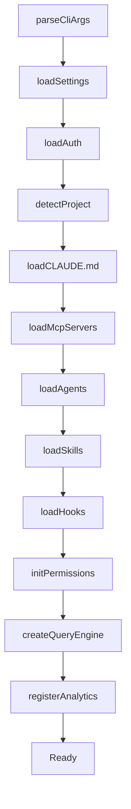

# setup / cost-tracker / context

**文件：** `src/setup.ts`（21 KB）、`src/cost-tracker.ts`（11 KB）、`src/context.ts`（7 KB）

这三个根文件处理**会话初始化、成本追踪和系统上下文收集**。它们不是最吸引眼球的模块，但是工业级 CLI 必备的基础组件。

## setup.ts — 会话初始化

`setup.ts` 负责**从 CLI 参数到可运行 QueryEngine 的完整初始化流程**。

### 初始化序列



每一步都有可能失败（配置格式错误、认证过期、权限问题），setup.ts 的重要职责是**清晰的错误报告**：

```typescript
try {
  const auth = await loadAuth()
} catch (e) {
  if (e.code === 'AUTH_EXPIRED') {
    showMessage('Your session expired. Run /login to re-authenticate.')
    exit(0)
  }
  throw e
}
```

### 权限初始化

setup.ts 会合并多个来源的权限规则：

```typescript
const permContext = {
  alwaysAllowRules: mergeRules(
    parseCliPermissionArgs(args),
    settings.alwaysAllowRules,
    projectSettings.alwaysAllowRules,
  ),
  alwaysDenyRules: mergeRules(
    settings.alwaysDenyRules,
    projectSettings.alwaysDenyRules,
  ),
  mode: args.permissionMode ?? settings.defaultMode ?? 'default',
  // ...
}
```

优先级：**CLI 参数 > 项目设置 > 用户设置 > 默认值**。

### 项目信任对话框

第一次在新目录运行 Claude Code，会弹出**信任对话框**：

```
⚠️  You're about to run Claude Code in an untrusted directory.
   This directory may contain malicious .claude/ configuration.
   Trust this directory? [y/N]
```

这阻止了恶意项目通过 `.claude/settings.json` 或 `.claude/agents/` 注入恶意配置。

## cost-tracker.ts — Token 成本追踪

`cost-tracker.ts` 持有当前会话的**累计 token 使用量和成本**。

### 数据结构

```typescript
type ModelUsage = {
  input_tokens: number
  output_tokens: number
  cache_creation_input_tokens: number
  cache_read_input_tokens: number
  cache_1h_input_tokens?: number
  cache_5m_input_tokens?: number
}

type TotalCost = {
  model: string
  usage: ModelUsage
  cost_usd: number
  duration_ms: number
}
```

**重要**：分别追踪 cache_creation 和 cache_read，因为它们的定价不同（cache_read 通常便宜 10x）。

### 成本计算

```typescript
function calculateCost(usage: ModelUsage, model: string): number {
  const pricing = getModelPricing(model)
  return (
    usage.input_tokens * pricing.input +
    usage.output_tokens * pricing.output +
    usage.cache_creation_input_tokens * pricing.cache_write +
    usage.cache_read_input_tokens * pricing.cache_read
  ) / 1_000_000  // per million tokens
}
```

每个模型的定价硬编码在 `constants/apiLimits.ts`。

### `/cost` 命令展示

```
 Total cost: $0.42
 Total duration: 2m 15s

 Claude 3.5 Sonnet (claude-3-5-sonnet-20241022)
   Input: 15,234 tokens
   Output: 2,109 tokens
   Cache write: 8,432 tokens
   Cache read: 124,551 tokens

 Claude 3.5 Haiku (claude-3-5-haiku-20241022)
   Input: 512 tokens
   Output: 142 tokens
```

### 预算上限

可以通过 `--max-budget-usd 5` 设置上限：

```typescript
if (totalCost > maxBudgetUsd) {
  showWarning('Budget exceeded, stopping.')
  abortController.abort()
}
```

这在 CI 环境尤其重要——**防止失控的 Agent 烧钱**。

## context.ts — 系统上下文收集

`context.ts` 负责收集会注入到系统提示词里的**环境信息**。

### 收集的内容

```typescript
async function collectSystemContext(cwd: string): Promise<SystemContext> {
  return {
    cwd: cwd,
    platform: os.platform(),
    osVersion: await getOsVersion(),
    isGitRepo: await checkGitRepo(cwd),
    gitStatus: await getGitStatus(cwd),
    shellVersion: await detectShell(),
    claudeMdFiles: await findClaudeMd(cwd),
    memdirFindings: await findRelevantMemories(query, cwd),
    dateStr: new Date().toISOString().split('T')[0],
    userTimezone: Intl.DateTimeFormat().resolvedOptions().timeZone,
  }
}
```

### 为什么这些信息重要？

| 信息 | 为什么需要 |
|------|-----------|
| `cwd` | Claude 需要知道工作在哪里 |
| `platform` | 建议命令时区分 `ls` vs `dir` |
| `gitStatus` | 知道哪些文件被修改过 |
| `shellVersion` | bash 4+ 和 3.x 的语法差异 |
| `claudeMdFiles` | 项目级别的指导 |
| `memdirFindings` | 跨会话的用户偏好 |
| `dateStr` | Claude 知识截止日期 vs 今天 |

### Git Status 增强

```typescript
async function getGitStatus(cwd: string) {
  const [status, branch, remoteUrl] = await Promise.all([
    exec('git status --porcelain'),
    exec('git branch --show-current'),
    exec('git config --get remote.origin.url'),
  ])

  return {
    branch,
    remoteUrl,
    modified: parseModifiedFiles(status),
    untracked: parseUntracked(status),
    isDirty: status.trim().length > 0,
  }
}
```

这些数据让 Claude **不用每次都调用 Bash 工具**来查询 git 状态。

### 缓存策略

系统上下文**不是每个 turn 都重新收集**——只在以下情况刷新：

- cwd 改变
- 主动调用 `/refresh` 命令
- 每 N turn 强制刷新（防止状态陈旧）

### memdir 集成

```typescript
const memdirFindings = await findRelevantMemories({
  query: currentPrompt,
  cwd: cwd,
  limit: 5,
  recencyWeight: 0.3,
  relevanceWeight: 0.7,
})
```

按**相关性和时效性**加权返回最相关的记忆条目。详见 [memdir 文档](../memdir/index.md)。

## 值得学习的点

1. **初始化流水线可视化** — 清晰的步骤和错误边界
2. **权限合并优先级** — 多来源配置的标准模式
3. **项目信任对话框** — 防止恶意配置注入
4. **分类 token 追踪** — cache write/read 分开计价
5. **预算上限保护** — Agent 自动化的安全网
6. **上下文缓存** — 避免每次 turn 都做 git/fs IO

## 相关文档

- [bootstrap/ - 启动状态](../bootstrap/index.md)
- [memdir/ - 记忆系统](../memdir/index.md)
- [utils/permissions - 权限系统](../utils/permissions.md)
