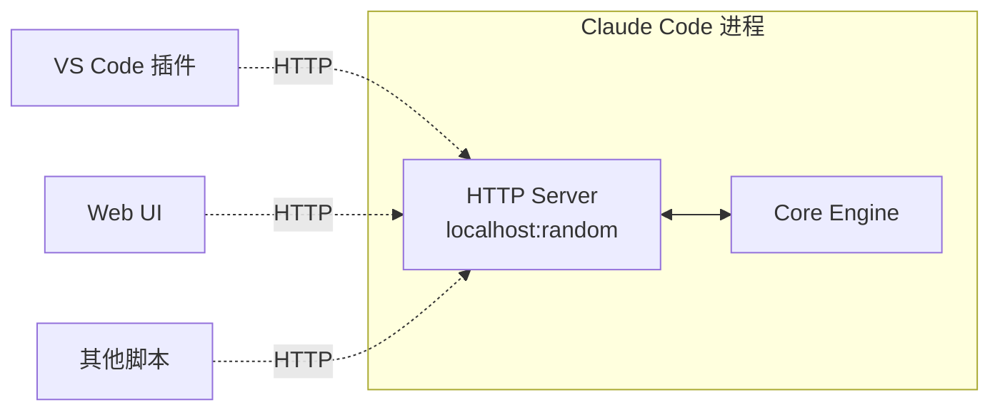

# server/ — 本地 HTTP 服务

**目录：** `src/server/`

`server/` 在 Claude Code 启动时**顺便跑一个 HTTP 服务器**——让 IDE 插件、Web UI、其他工具能**控制**正在运行的 Claude Code。

## 为什么要本地 HTTP 服务？

Claude Code 是 CLI，但不止 CLI：

- **VS Code 插件** 要和 CLI 通信
- **Web UI** (claude.ai/code) 要连本地 Claude Code
- **脚本** 要自动化 Claude Code

如果走 stdin/stdout **太难集成**——用 HTTP API 更直接。

## 架构



## 启动时间

本地服务**随 Claude Code 启动**：

```typescript
// server/index.ts
async function startServer() {
  const port = await findFreePort()
  const server = http.createServer(handler)
  server.listen(port, '127.0.0.1')

  // 写入 lock 文件告诉其他进程
  await fs.writeFile('~/.claude/server.lock', JSON.stringify({
    port,
    pid: process.pid,
    startedAt: Date.now()
  }))

  return server
}
```

## Endpoint 设计

```
GET  /status              → 服务状态
GET  /session             → 当前会话信息
POST /prompt              → 发送消息
GET  /messages            → 获取消息历史
POST /interrupt           → 中断当前任务
GET  /tools               → 列出工具
POST /tools/:name         → 调用工具
GET  /tasks               → 列出任务
POST /tasks               → 创建任务
DELETE /tasks/:id         → 终止任务
GET  /permissions         → 当前权限规则
GET  /mcp/servers         → MCP 服务器
GET  /sse                 → Server-Sent Events 流
```

## API 示例

### 发送消息

```http
POST /prompt HTTP/1.1
Content-Type: application/json

{ "content": "Write a hello world in Rust" }
```

响应是**流式 SSE**：

```
data: {"type":"text","content":"Sure, here's"}
data: {"type":"text","content":" a hello world"}
data: {"type":"tool_use","name":"Write","args":{...}}
data: {"type":"end"}
```

### 获取状态

```http
GET /status HTTP/1.1
```

```json
{
  "status": "idle",
  "version": "2.0.0",
  "model": "claude-opus-4-6",
  "session_id": "sess-abc",
  "tokens_used": 12345,
  "cost_usd": 0.234
}
```

## 认证

**只绑定 localhost** 降低风险，但仍有 CSRF / 其他本地恶意软件：

```typescript
function authenticate(req: Request): boolean {
  // 1. 检查 token
  const token = req.headers['x-claude-token']
  if (token !== sessionToken) return false

  // 2. 检查 origin
  const origin = req.headers['origin']
  if (origin && !ALLOWED_ORIGINS.includes(origin)) return false

  return true
}
```

### Session Token

启动时生成随机 token：

```typescript
const sessionToken = crypto.randomBytes(32).toString('hex')

// 写入 lock file（只有当前用户能读）
await fs.writeFile('~/.claude/server.lock', JSON.stringify({
  port, token: sessionToken
}), { mode: 0o600 })
```

IDE 插件读 lock file 获取 token。

## CORS

```typescript
res.setHeader('Access-Control-Allow-Origin', 'https://claude.ai')
res.setHeader('Access-Control-Allow-Methods', 'GET, POST, DELETE')
res.setHeader('Access-Control-Allow-Headers', 'Content-Type, X-Claude-Token')
res.setHeader('Access-Control-Allow-Credentials', 'true')
```

**只允许**：

- `https://claude.ai/code`
- `vscode-webview://*`
- `file://` (VSCode 本地)

## SSE 流

```typescript
// /sse endpoint
async function sseHandler(req: Request, res: Response) {
  res.setHeader('Content-Type', 'text/event-stream')
  res.setHeader('Cache-Control', 'no-cache')
  res.setHeader('Connection', 'keep-alive')

  const listener = (event: any) => {
    res.write(`data: ${JSON.stringify(event)}\n\n`)
  }

  eventBus.on('message', listener)
  eventBus.on('tool_use', listener)
  eventBus.on('tool_result', listener)

  req.on('close', () => {
    eventBus.off('message', listener)
  })
}
```

**客户端保持连接**，服务端推送所有事件。

## WebSocket 备选

某些场景（双向流）用 WebSocket：

```typescript
// /ws endpoint
wss.on('connection', (socket) => {
  socket.on('message', (data) => {
    const msg = JSON.parse(data)
    handleWSMessage(msg, socket)
  })
})
```

## 多进程协调

多个 Claude Code 实例同时跑：

```
~/.claude/server.lock
{
  "instances": [
    { "port": 9876, "pid": 1234, "cwd": "/project1" },
    { "port": 9877, "pid": 5678, "cwd": "/project2" }
  ]
}
```

客户端根据 `cwd` 选择连哪个实例。

## IDE 插件集成

VS Code 插件工作流：

```typescript
// plugin.ts
async function connectToClaudeCode() {
  const lock = JSON.parse(await fs.readFile('~/.claude/server.lock'))
  const url = `http://localhost:${lock.port}`

  // SSE 订阅
  const es = new EventSource(`${url}/sse`, {
    headers: { 'X-Claude-Token': lock.token }
  })
  es.onmessage = handleEvent

  // 发送消息
  await fetch(`${url}/prompt`, {
    method: 'POST',
    headers: {
      'Content-Type': 'application/json',
      'X-Claude-Token': lock.token
    },
    body: JSON.stringify({ content: message })
  })
}
```

## 健康检查

```typescript
// 心跳端点
app.get('/healthz', (req, res) => {
  res.json({
    status: 'ok',
    uptime: process.uptime(),
    memoryUsage: process.memoryUsage()
  })
})
```

IDE 插件定期 ping，发现挂了就重新启动连接。

## 端口冲突处理

```typescript
async function findFreePort(): Promise<number> {
  // 从 9876 开始往后找
  for (let p = 9876; p < 9876 + 100; p++) {
    if (await isFree(p)) return p
  }
  throw new Error('No free port')
}
```

## 优雅关闭

```typescript
process.on('SIGINT', async () => {
  // 通知所有客户端
  broadcast({ type: 'shutdown' })

  // 等待进行中的请求
  await server.close()

  // 清理 lock 文件
  await fs.unlink('~/.claude/server.lock')

  process.exit(0)
})
```

## 调试

```bash
claude --server-debug
```

记录所有 HTTP 请求/响应。

## 值得学习的点

1. **HTTP 是最通用接口** — 任何语言都能调
2. **localhost 绑定 + token** — 本地安全
3. **SSE 流** — 实时推送
4. **Lock 文件协调** — 多进程管理
5. **0600 权限** — 保护 session token
6. **CORS 白名单** — 防非信任 origin
7. **健康检查** — IDE 插件的恢复依据

## 相关文档

- [entrypoints/ - 入口](../entrypoints/index.md)
- [services/other-services](../services/other-services.md)
- [main-entry](../root-files/main-entry.md)
