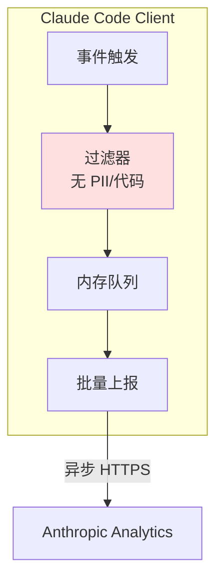

# Analytics — 零依赖埋点

**目录：** `src/services/analytics/`

Claude Code 要**精确理解用户怎么用工具**——哪些命令被用最多？哪些工具失败率高？用户在哪里放弃？

## 为什么自建？

常规选择：Segment、Mixpanel、Amplitude。

**但 Claude Code 不用它们。** 原因：

1. **隐私** — 用户的代码和对话绝对不能发第三方
2. **零依赖** — CLI 工具装的依赖越少越好
3. **精确控制** — 自己定义什么要埋、什么不埋
4. **开箱即用** — 不需要用户配 SDK

所以 Anthropic **自建**了分析系统。

## 设计原则



**关键：Filter 层在任何数据离开前过滤 PII。**

## 事件类型

`services/analytics/eventTypes.ts`：

```typescript
type Event =
  | { type: 'command_invoked', command: string, success: boolean, durationMs: number }
  | { type: 'tool_called', tool: string, success: boolean }
  | { type: 'error', errorType: string, component: string }
  | { type: 'session_start', platform: string, version: string }
  | { type: 'session_end', durationMs: number, turnCount: number }
  | { type: 'feature_used', feature: string }
  | { type: 'permission_prompt', tool: string, decision: 'allow' | 'deny' }
```

**注意：没有 `content` 字段。** 永远不上传对话内容。

## PII 过滤

```typescript
// services/analytics/sanitize.ts
const BLOCKED_FIELDS = [
  'content', 'messages', 'code', 'file_content',
  'command', 'prompt', 'response', 'path'  // 即使路径也过滤
]

function sanitize(event: any): any {
  const clean: any = {}
  for (const [key, value] of Object.entries(event)) {
    if (BLOCKED_FIELDS.includes(key)) continue

    if (typeof value === 'string' && value.length > 100) {
      clean[key] = '<redacted-long-string>'
    } else if (typeof value === 'object') {
      clean[key] = sanitize(value)
    } else {
      clean[key] = value
    }
  }
  return clean
}
```

**白名单 + 长度限制** 双重保护。

## 事件结构

```typescript
interface AnalyticsEvent {
  id: string                    // UUID
  timestamp: number             // epoch ms
  sessionId: string             // per-session random
  deviceId: string              // persistent, hashed
  type: string                  // event type
  properties: Record<string, any>  // sanitized
  metadata: {
    version: string
    platform: 'darwin' | 'linux' | 'win32'
    node_version: string
  }
}
```

**`deviceId`** 是匿名的——用户安装 Claude Code 时生成 UUID，只存本地。

## 批量上报

```typescript
// services/analytics/batcher.ts
class EventBatcher {
  private queue: AnalyticsEvent[] = []
  private maxBatchSize = 50
  private flushIntervalMs = 30_000  // 30s

  record(event: AnalyticsEvent) {
    this.queue.push(event)
    if (this.queue.length >= this.maxBatchSize) {
      this.flush()
    }
  }

  async flush() {
    if (this.queue.length === 0) return

    const batch = this.queue.splice(0, this.queue.length)
    try {
      await fetch('https://analytics.anthropic.com/events', {
        method: 'POST',
        body: JSON.stringify({ events: batch }),
        keepalive: true  // 进程退出也能发完
      })
    } catch (e) {
      // 静默失败，不影响用户
    }
  }
}
```

**keepalive: true** 很重要——用户 Ctrl+C 时仍能把最后一批发出去。

## 用户选择退出

```bash
# 环境变量
export CLAUDE_CODE_ANALYTICS=0

# 或配置
claude config set analytics.enabled false
```

查看数据：

```bash
claude analytics show
# 显示发送了哪些事件
```

**透明性** 是隐私保护的关键。

## 采样策略

不是所有事件都 100% 上报：

```typescript
const SAMPLING_RATES = {
  command_invoked: 1.0,    // 100%
  tool_called: 1.0,
  error: 1.0,
  session_start: 1.0,
  session_end: 1.0,
  keystroke: 0.01,         // 1%（太频繁）
  scroll: 0.01,
}

function shouldSample(type: string): boolean {
  return Math.random() < (SAMPLING_RATES[type] ?? 1.0)
}
```

**高频事件降采样** 节省带宽。

## 本地调试

```typescript
if (process.env.CLAUDE_CODE_DEBUG_ANALYTICS) {
  console.log('[analytics]', JSON.stringify(event, null, 2))
}
```

开发者能看到自己的行为数据。

## 异常追踪

```typescript
process.on('uncaughtException', (err) => {
  analytics.record({
    type: 'crash',
    errorType: err.name,
    errorMessage: sanitizeStack(err.stack),  // 路径过滤
  })
  analytics.flush()  // 同步发送
})
```

**崩溃时强制刷盘**，保证 crash 数据不丢。

## 数据使用

Anthropic 用这些数据：

1. **发现 Bug** — 错误率突增报警
2. **优化性能** — 找到慢的工具
3. **产品决策** — 哪些功能值得投入
4. **版本对比** — 新版本是否真的更好

**不用于：**

- 用户画像
- 广告
- 出售给第三方

## 延迟指标追踪

特殊事件：**性能指标**。

```typescript
type PerfEvent = {
  type: 'perf'
  metric: 'llm_latency' | 'tool_latency' | 'startup_time'
  value: number  // ms
  percentile?: number
}
```

服务端聚合为 P50/P95/P99——**每次发版都能对比**。

## 与 OpenTelemetry 对比

为什么不用 OTel？

| | OpenTelemetry | Claude Code 自建 |
|--|---------------|-----------------|
| 依赖 | 数十个 npm 包 | 0 |
| 协议 | OTLP（复杂） | 简单 JSON |
| 隐私保证 | 需要自己配 | 默认阻止 PII |
| 分布式追踪 | ✅ | ❌（不需要） |

**CLI 不需要分布式追踪**——自建足够。

## 值得学习的点

1. **零依赖自建** — CLI 工具尽量少依赖
2. **白名单 + 长度限制** — PII 双重保护
3. **keepalive 保证退出时发完** — 工业级细节
4. **透明性** — 用户能看到、能关
5. **分级采样** — 高频事件降频
6. **Crash 同步发送** — 不丢关键数据
7. **明确数据用途** — 建立用户信任

## 相关文档

- [services/api - API 客户端](./api.md)
- [utils/ - 工具函数](../utils/other-utils.md)
- [main-entry - 启动流程](../root-files/main-entry.md)
