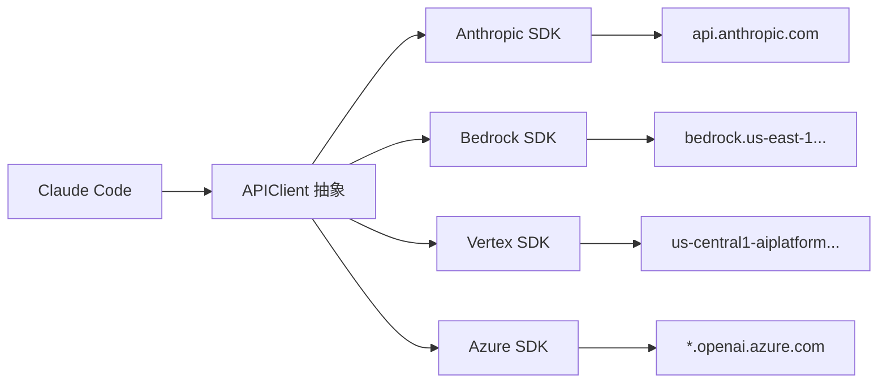

# API 客户端 — 多云供应商抽象

**目录：** `src/services/api/`

Claude Code 不只和 Anthropic API 对话。它支持**四个云服务商**：

- **Anthropic** 直连（默认）
- **AWS Bedrock**
- **Google Vertex AI**
- **Azure OpenAI**（用于非 Claude 模型）

## 为什么要多云？

**企业用户的合规要求各不相同：**

- 美国金融：必须走 AWS（合规审计）
- 欧洲医疗：数据不能出欧盟，要 Vertex EU
- 政府机构：Azure GovCloud

**Claude Code 作为工业级工具必须支持所有主流云**——不支持就失去大客户。



## 统一接口

所有供应商被包装成同一个接口：

```typescript
interface APIClient {
  createMessage(params: MessageParams): AsyncIterable<StreamEvent>
  countTokens(params: CountTokensParams): Promise<TokenCount>
  listModels(): Promise<Model[]>
}
```

上层代码（QueryEngine）**不关心**底下是哪家云。

## 供应商选择

通过环境变量或配置：

```bash
# Anthropic（默认）
export ANTHROPIC_API_KEY=sk-...

# AWS Bedrock
export CLAUDE_CODE_USE_BEDROCK=1
export AWS_REGION=us-east-1

# Vertex
export CLAUDE_CODE_USE_VERTEX=1
export CLOUD_ML_REGION=us-central1
export ANTHROPIC_VERTEX_PROJECT_ID=my-gcp-project

# Azure（非 Claude 模型）
export AZURE_OPENAI_ENDPOINT=...
export AZURE_OPENAI_API_KEY=...
```

`services/api/providerSelection.ts` 决定用哪个：

```typescript
function selectProvider(env: Env): Provider {
  if (env.CLAUDE_CODE_USE_BEDROCK) return 'bedrock'
  if (env.CLAUDE_CODE_USE_VERTEX) return 'vertex'
  if (env.AZURE_OPENAI_ENDPOINT) return 'azure'
  return 'anthropic'
}
```

## 模型名映射

不同云对同一模型**起不同名字**：

| 模型 | Anthropic | Bedrock | Vertex |
|------|-----------|---------|--------|
| Claude Opus 4.6 | `claude-opus-4-6` | `anthropic.claude-opus-4-6-v1:0` | `claude-opus-4-6@20251201` |
| Claude Sonnet 4.6 | `claude-sonnet-4-6` | `anthropic.claude-sonnet-4-6-v1:0` | `claude-sonnet-4-6@20251201` |
| Claude Haiku 4.5 | `claude-haiku-4-5-20251001` | `anthropic.claude-haiku-4-5-20251001-v1:0` | `claude-haiku-4-5@20251001` |

`services/api/modelMapping.ts` 负责转换：

```typescript
function mapModelName(model: string, provider: Provider): string {
  const mapping = MODEL_MAPPINGS[provider]
  return mapping[model] ?? model
}
```

用户写 `claude-opus-4-6`，底层自动转换为云商格式。

## 流式响应处理

Claude 的回复是**SSE 流**：

```
data: {"type":"message_start",...}
data: {"type":"content_block_start",...}
data: {"type":"content_block_delta","delta":{"text":"Hello"}}
data: {"type":"content_block_delta","delta":{"text":" world"}}
data: {"type":"content_block_stop"}
data: {"type":"message_stop"}
```

每个供应商**SSE 格式不完全一样**，包装层统一为：

```typescript
async function* streamMessage(params): AsyncIterable<StreamEvent> {
  const raw = providerClient.stream(params)
  for await (const chunk of raw) {
    yield normalizeEvent(chunk, provider)
  }
}
```

## 重试逻辑

网络不稳、限流、服务器临时挂了——都要重试：

```typescript
async function withRetry<T>(fn: () => Promise<T>, opts: RetryOpts): Promise<T> {
  let attempt = 0
  while (true) {
    try {
      return await fn()
    } catch (e) {
      if (!isRetryable(e) || attempt >= opts.maxAttempts) throw e

      const delay = exponentialBackoff(attempt) + jitter()
      await sleep(delay)
      attempt++
    }
  }
}

function isRetryable(e: Error): boolean {
  if (e.status === 429) return true       // rate limit
  if (e.status === 529) return true       // overloaded
  if (e.status >= 500) return true        // server error
  if (e.code === 'ECONNRESET') return true
  if (e.code === 'ETIMEDOUT') return true
  return false
}
```

**指数退避 + jitter** 是业界标准——但要注意：

- 4xx 错误（除 429）**不重试**
- 401（auth）不重试
- context_length_exceeded 不重试（重试也没用）

## 用量追踪

每次请求都记录 token 消耗：

```typescript
type Usage = {
  input_tokens: number
  output_tokens: number
  cache_creation_input_tokens: number
  cache_read_input_tokens: number
}
```

`services/api/usageTracker.ts` 聚合这些数据：

```typescript
class UsageTracker {
  private sessionTotal: Usage = { ... }

  record(usage: Usage, model: string) {
    this.sessionTotal = addUsage(this.sessionTotal, usage)
    this.perModel[model] = addUsage(this.perModel[model], usage)
  }

  cost(): number {
    return calculateCost(this.sessionTotal, this.perModel)
  }
}
```

## 配额与限流

不同供应商限流策略不同：

| 供应商 | 限流粒度 |
|--------|---------|
| Anthropic | tier-based（organization-wide） |
| Bedrock | per-region per-model |
| Vertex | per-project quota |
| Azure | deployment-based TPM |

Claude Code 记录限流事件，**提前警告用户**：

```typescript
if (rateLimitRemaining < 1000) {
  warn('Approaching rate limit, may slow down')
}
```

## Prompt Caching

Claude 支持 **prompt caching**（缓存系统提示词）：

```typescript
messages: [
  {
    role: 'system',
    content: [{
      type: 'text',
      text: longSystemPrompt,
      cache_control: { type: 'ephemeral' }  // 缓存标记
    }]
  },
  ...
]
```

**效果：**

- 后续请求同样的系统提示词 → **~90% 折扣**
- 延迟降低 ~50%

Claude Code 默认**给所有 system prompt 加 cache_control**——这是**工业级成本优化**。

## 错误分类

错误被分为多个类别：

```typescript
type APIError =
  | { type: 'rate_limit', retryAfter: number }
  | { type: 'overloaded' }
  | { type: 'context_length_exceeded' }
  | { type: 'auth_error' }
  | { type: 'invalid_request', message: string }
  | { type: 'network_error' }
  | { type: 'server_error', status: number }
```

每种错误有**特定的用户引导**：

```typescript
function formatError(err: APIError): string {
  switch (err.type) {
    case 'rate_limit':
      return `Rate limited, retry in ${err.retryAfter}s`
    case 'context_length_exceeded':
      return 'Context too long. Run /compact to free up space.'
    case 'auth_error':
      return 'Invalid API key. Run /login to re-authenticate.'
  }
}
```

## 值得学习的点

1. **抽象层的价值** — 上层不关心云商，只看统一接口
2. **模型名映射** — 屏蔽云商差异
3. **指数退避 + jitter** — 标准但必不可少
4. **Prompt Caching** — 工业级成本优化（90% 折扣）
5. **精确的错误分类** — 不同错误有不同的用户引导
6. **用量追踪** — 为计费和优化提供依据

## 相关文档

- [setup-and-cost - Cost Tracker](../root-files/setup-and-cost.md)
- [services/compact - 上下文压缩](./compact.md)
- [QueryEngine 查询引擎](../root-files/query-engine.md)
