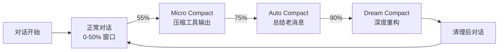

# 上下文压缩 — 渐进式 Compaction

**目录：** `src/services/compact/`

LLM 有**上下文窗口限制**（Claude 4.6 是 200K tokens）。长对话会撑爆窗口。Claude Code 用**三级渐进压缩**优雅解决。

## 问题

一个典型的 coding 对话：

```
Turn 1: Read(main.ts)           → +5K tokens
Turn 2: Edit(main.ts)           → +2K
Turn 3: Read(utils.ts)          → +8K
Turn 4: Bash(tsc)               → +12K (错误信息)
Turn 5: Edit(main.ts) 修错       → +1K
...
Turn 50: 已用 180K / 200K
Turn 55: 💥 context_length_exceeded
```

**老方案：** 要么提示用户手动清理，要么丢弃早期消息。都不理想。

**Claude Code 方案：** **渐进式压缩**——不同阶段用不同策略。

## 三级压缩



### 级别 1：Micro Compact（微压缩）

**触发：** 55% 窗口使用率

**策略：** 压缩**工具输出**，保留对话。

```typescript
// 压缩前
{
  role: 'tool',
  name: 'Read',
  content: '1|import React from "react"\n2|import ReactDOM...\n' +
           '...5000 lines...'
}

// 压缩后
{
  role: 'tool',
  name: 'Read',
  content: '[Tool output compressed: Read of main.tsx (5234 lines)]\n' +
           'Use Read again with offset/limit to get specific sections.'
}
```

**保留什么：**
- 用户消息（全部）
- Claude 的思考和回复（全部）
- 最近 10 轮的工具输出（全部）
- 早期工具输出 → 摘要

**省多少：** ~40% token。

### 级别 2：Auto Compact（自动压缩）

**触发：** 75% 窗口使用率

**策略：** 调用 **Claude 自己**生成对话摘要。

```typescript
async function autoCompact(messages: Message[]) {
  const summary = await claude.complete({
    model: 'claude-haiku-4-5-20251001',  // 用便宜的 Haiku 压缩
    system: COMPACT_SYSTEM_PROMPT,
    messages: [
      ...messages,
      { role: 'user', content: 'Summarize this conversation for future continuation.' }
    ]
  })

  return [
    { role: 'user', content: `<conversation-summary>\n${summary}\n</conversation-summary>` },
    ...messages.slice(-10)  // 保留最近 10 条
  ]
}
```

**关键细节：**

1. **用 Haiku 压缩**（成本 1/60 of Opus）
2. **结构化 summary**：目标、进度、关键决策、待办
3. **保留最近上下文** → 无缝继续

### 级别 3：Dream Compact（深度压缩）

**触发：** 90% 窗口使用率，或用户手动 `/compact dream`

**策略：** **重构整个对话**，像写报告一样。

```markdown
# Session Summary (Dream Compact)

## Primary Goal
Refactor authentication system from JWT to OAuth2

## Completed
- Audited current auth code (auth.ts, middleware.ts, ...)
- Decided on OAuth2 flow (authorization code + PKCE)
- Installed dependencies (@auth0/oauth-client)
- Implemented new AuthService class

## In Progress
- Migrating existing users (2 of 5 tests passing)

## Critical Files
- src/auth.ts (REWRITTEN)
- src/middleware/auth.ts (IN PROGRESS)
- tests/auth.test.ts (NEW)

## Open Decisions
- Whether to keep JWT fallback for 30 days
- Which OAuth provider (Auth0 vs Okta)

## Next Steps
1. Complete middleware.ts migration
2. Write integration tests
3. Deploy to staging
```

**Dream Compact 的特点：**

- 调用 **Opus**（理解最深）
- 输出**结构化文档**
- 可以**立即恢复工作状态**

## 为什么"渐进"重要？

如果直接到 95% 才压缩：

- **用户惊讶**："对话怎么突然变短了？"
- **信息丢失** — 一次压缩丢的信息多
- **恢复慢** — 要重新加载文件

渐进策略：

- **55% 开始温和清理** — 无感
- **75% 摘要** — 用户知情
- **90% 深度压缩** — 用户参与确认

## Compact 提示词设计

```typescript
const COMPACT_SYSTEM_PROMPT = `
You are summarizing a coding conversation for future continuation.

PRESERVE:
- User's stated goals and preferences
- Key decisions and their rationale
- Files that were modified (with absolute paths)
- Errors encountered and how they were fixed
- Open questions and blockers

OMIT:
- Verbose tool outputs
- Repeated content
- Routine operations

FORMAT:
<summary>
## Goal
...

## Progress
...

## Critical Context
...

## Next Steps
...
</summary>
`
```

**关键：明确的 PRESERVE/OMIT 列表**——这是 prompt engineering 的实战。

## 触发时机

```typescript
// services/compact/triggerDecision.ts
function shouldCompact(tokens: number, limit: number): CompactLevel | null {
  const ratio = tokens / limit

  if (ratio > 0.90) return 'dream'
  if (ratio > 0.75) return 'auto'
  if (ratio > 0.55) return 'micro'
  return null
}
```

每轮对话后检查，**主动触发**——不等爆窗口。

## 用户体验

```
>>> 帮我重构 auth 模块

[Claude 响应 ...]

>>> 继续修 middleware

[Claude 响应 ...]

--- Conversation compacted to save context (75% full) ---

>>> 接下来呢？

[Claude 基于 summary 继续]
```

UI 显示**非侵入式提示**——用户知道发生了但不打断工作流。

## 避免重复压缩

```typescript
interface CompactState {
  lastCompactAt: number
  lastCompactLevel: CompactLevel
  cooldownUntil: number
}

function canCompact(state: CompactState, now: number): boolean {
  if (now < state.cooldownUntil) return false
  return true
}
```

压缩后有 **cooldown**，防止连续触发。

## 失败处理

压缩可能失败（网络、超时、Haiku 限流）：

```typescript
async function safeCompact(messages: Message[]): Promise<Message[]> {
  try {
    return await autoCompact(messages)
  } catch (e) {
    warn('Auto compact failed, falling back to truncation')
    return messages.slice(-20)  // 降级到截断
  }
}
```

**永远有 fallback**——不能因为压缩失败让对话挂掉。

## 值得学习的点

1. **渐进式压缩** — 三级策略覆盖不同紧迫程度
2. **用便宜模型做压缩** — Haiku 成本 1/60，效果够用
3. **结构化 summary** — 不是自由文本，是能恢复状态的文档
4. **主动触发** — 不等用户抱怨，提前干预
5. **cooldown 机制** — 防止压缩失控
6. **降级策略** — 压缩失败也能继续对话
7. **工具输出是大头** — 优先压缩它们

## 相关文档

- [QueryEngine 查询引擎](../root-files/query-engine.md)
- [services/api - API 客户端](./api.md)
- [setup-and-cost - 成本追踪](../root-files/setup-and-cost.md)
