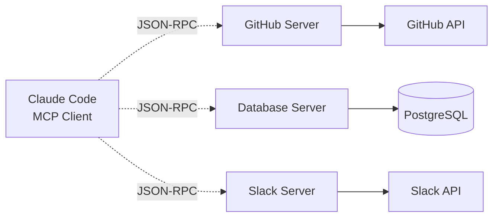
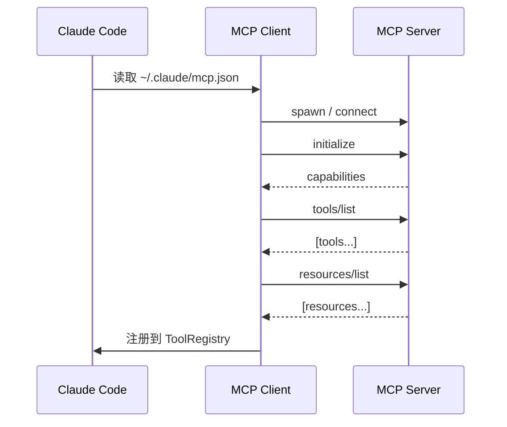

# MCP (Model Context Protocol)

**目录：** `src/services/mcp/`

MCP 是 Anthropic 定义的**开放标准**——让 Claude 和外部系统对话。Claude Code 是 MCP 的**首个工业级应用**。

## 什么是 MCP？

MCP 规定了 **Client ↔ Server** 的通信协议：



**Server 暴露三种能力：**

1. **Tools** — 可调用函数（`create_issue`、`query_db`）
2. **Resources** — 可读取资源（`file://...`、`db://...`）
3. **Prompts** — 预设提示词模板

## 协议栈

MCP 基于 **JSON-RPC 2.0**：

```json
// Request
{
  "jsonrpc": "2.0",
  "id": 1,
  "method": "tools/call",
  "params": {
    "name": "github_create_issue",
    "arguments": { "title": "Bug report" }
  }
}

// Response
{
  "jsonrpc": "2.0",
  "id": 1,
  "result": { "issueId": "#123" }
}
```

## 三种传输层

`services/mcp/transport/` 实现：

### 1. Stdio Transport

**最简单，Server 是子进程。**

```typescript
const server = spawn('my-mcp-server', ['--config', 'x.json'])
client.connect({
  stdin: server.stdin,
  stdout: server.stdout
})
```

**特点：**

- 延迟低（IPC）
- 权限继承父进程
- Server 死了，Client 也能检测

**用途：** 本地工具（文件系统、本地数据库）

### 2. SSE Transport

**Server-Sent Events，HTTP 长连接。**

```typescript
const es = new EventSource('https://mcp.example.com/sse')
es.onmessage = e => handleMessage(JSON.parse(e.data))
```

**特点：**

- 跨网络
- 单向推送（server → client）
- 发送请求另走 POST

**用途：** 远程服务（Slack、GitHub 云端）

### 3. Streamable HTTP Transport

**新标准（2025），单 HTTP 连接双向流。**

```http
POST /mcp HTTP/1.1
Transfer-Encoding: chunked
Content-Type: application/x-ndjson

{"jsonrpc":"2.0","id":1,"method":"initialize",...}\n
{"jsonrpc":"2.0","id":2,"method":"tools/call",...}\n
```

**特点：**

- 标准 HTTP，易穿透 firewall
- 双向流，低延迟
- 比 WebSocket 简单

**用途：** 新的云 MCP 服务

## Client 启动流程



## 配置格式

```json
// ~/.claude/mcp.json
{
  "mcpServers": {
    "github": {
      "command": "npx",
      "args": ["-y", "@modelcontextprotocol/server-github"],
      "env": { "GITHUB_TOKEN": "${GITHUB_TOKEN}" }
    },
    "postgres": {
      "command": "mcp-postgres",
      "args": ["--dsn", "postgres://..."]
    },
    "slack-cloud": {
      "url": "https://slack.mcp.com/sse",
      "transport": "sse",
      "auth": { "type": "oauth", "clientId": "..." }
    }
  }
}
```

## 工具名规范化

MCP 工具名**需要加前缀**，避免冲突：

```
原始名：create_issue
服务器名：github
规范化：mcp__github__create_issue
```

`services/mcp/toolNaming.ts`：

```typescript
function normalizeMCPToolName(server: string, tool: string): string {
  return `mcp__${server}__${tool}`
}

function parseMCPToolName(name: string) {
  const match = name.match(/^mcp__(.+?)__(.+)$/)
  if (!match) return null
  return { server: match[1], tool: match[2] }
}
```

## Resources 的惰性读取

MCP Resources 不像 Tools **立即返回**——它们被**注册为可读对象**：

```typescript
// Server 声明 resources
server.setRequestHandler('resources/list', async () => ({
  resources: [
    { uri: 'file:///logs/app.log', name: 'App log' },
    { uri: 'db://users/schema', name: 'Users schema' }
  ]
}))
```

Claude 用 `ReadMcpResourceTool` 按 URI 拉取。

## 权限与信任

MCP 服务器**不受信**（用户安装的第三方代码）：

```typescript
function callMCPTool(server: string, tool: string, args: any) {
  // 1. 检查权限
  if (!isAllowedMCP(server, tool)) {
    return askUser({ type: 'mcp_permission', server, tool, args })
  }

  // 2. 超时保护
  return withTimeout(
    client.callTool(server, tool, args),
    30_000
  )
}
```

每个 MCP 服务器的工具调用**默认需要用户批准**。

## 错误隔离

MCP 服务器可能**崩溃、挂起、返回垃圾**。Claude Code 必须保证**自身不挂**：

```typescript
class MCPClientWrapper {
  async callTool(name: string, args: any): Promise<ToolResult> {
    try {
      const result = await Promise.race([
        this.client.callTool(name, args),
        timeout(this.timeoutMs)
      ])
      return result
    } catch (e) {
      // 不让异常冒出去
      return { error: true, message: String(e) }
    }
  }

  async reconnectIfNeeded() {
    if (this.isDead()) {
      await this.restart()
    }
  }
}
```

## MCP Elicitation（反向请求）

**新特性：Server 可以反过来问 Client。**

```json
// Server → Client
{
  "method": "elicitation/create",
  "params": {
    "type": "input",
    "prompt": "Enter database password:"
  }
}
```

Claude Code 会**转发给用户**：

```typescript
server.on('elicitation', async (req) => {
  const response = await askUser({
    type: 'mcp_elicitation',
    server: req.server,
    prompt: req.params.prompt
  })
  return response
})
```

**用途：** 动态 auth、交互式配置。

## MCP Registry

Anthropic 维护**官方注册表** `registry.modelcontextprotocol.io`：

```typescript
// 通过 registry 搜索
mcp__mcp-registry__search_mcp_registry({
  query: 'github'
})
// → 返回可用的 GitHub MCP 服务器
```

用户可以**一键安装**：

```bash
claude mcp install github
# 自动配置 ~/.claude/mcp.json
```

## 调试支持

```bash
claude mcp debug github
```

输出 MCP 会话的**完整 JSON-RPC trace**：

```
→ initialize
← { "capabilities": { "tools": {}, "resources": {} } }
→ tools/list
← { "tools": [ ... ] }
→ tools/call { name: "create_issue", ... }
← { "result": { "issueId": "#123" } }
```

## 值得学习的点

1. **协议先行** — MCP 是标准，任何语言都能实现
2. **三种传输层** — stdio（本地）、SSE（兼容）、Streamable HTTP（现代）
3. **命名空间隔离** — `mcp__server__tool` 前缀防冲突
4. **错误隔离** — 不信任的 server 不能把 Client 搞挂
5. **Resources + Tools + Prompts** — 三位一体的上下文扩展
6. **Elicitation** — 反向通信的巧妙设计
7. **Registry** — 生态建设的关键

## 相关文档

- [MCPTool 工具](../tools/mcp-tools.md)
- [oauth-and-plugins](./oauth-and-plugins.md)
- [Tool 工具框架](../root-files/tool-framework.md)
