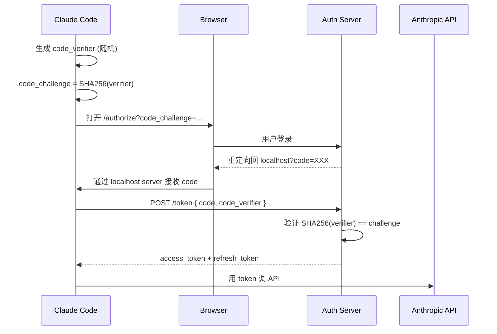
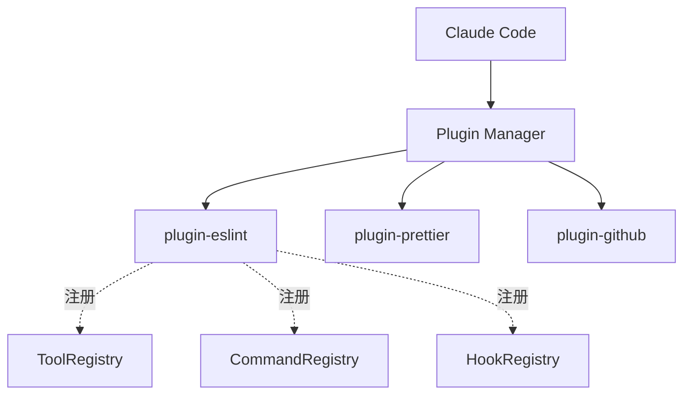

# OAuth 认证 与 插件系统

**目录：** `src/services/oauth/`、`src/services/plugins/`

两个相关服务：

- **OAuth** — 用户登录 Anthropic / 第三方服务
- **Plugins** — 可扩展的第三方功能注入

## OAuth 2.0 PKCE 流

Claude Code 用 OAuth 让用户**不用复制粘贴 API key**就能登录。

### PKCE 是什么？

**Proof Key for Code Exchange** — OAuth 2.0 的安全增强，专为**公开客户端**（CLI、SPA、移动端）设计。

**问题：** 普通 OAuth 要求 `client_secret`，但 CLI **无法安全存储**。

**PKCE 方案：** 用动态的 **code_verifier** 代替静态 secret。



### 实现要点

`services/oauth/pkce.ts`：

```typescript
function generatePKCE() {
  const verifier = crypto.randomBytes(32).toString('base64url')
  const challenge = crypto
    .createHash('sha256')
    .update(verifier)
    .digest('base64url')
  return { verifier, challenge }
}
```

### 本地回调服务器

CLI 必须**监听 localhost** 接收 redirect：

```typescript
async function startCallbackServer(port: number): Promise<string> {
  return new Promise((resolve) => {
    const server = http.createServer((req, res) => {
      const url = new URL(req.url!, `http://localhost:${port}`)
      const code = url.searchParams.get('code')
      res.end('<h1>Login successful! You can close this window.</h1>')
      server.close()
      resolve(code!)
    })
    server.listen(port)
  })
}
```

### 端口选择

动态找空闲端口：

```typescript
async function findFreePort(): Promise<number> {
  for (let port of [9876, 9877, 9878, 9879, 9880]) {
    if (await isPortFree(port)) return port
  }
  throw new Error('No free port available')
}
```

`redirect_uri` 必须**预先注册**在 Anthropic，所以 Claude Code 只能用**几个固定端口**之一。

### Token 存储

```typescript
// ~/.claude/credentials.json（仅本地）
{
  "anthropic": {
    "access_token": "ant-...",
    "refresh_token": "ant-refresh-...",
    "expires_at": 1700000000000
  }
}
```

**文件权限 0600**（仅用户可读）：

```typescript
await fs.writeFile(credPath, JSON.stringify(creds))
await fs.chmod(credPath, 0o600)
```

### 自动刷新

```typescript
async function getAccessToken(): Promise<string> {
  const creds = await loadCredentials()
  if (creds.expires_at > Date.now() + 60_000) {
    return creds.access_token  // 还有效
  }

  // 刷新
  const fresh = await refreshToken(creds.refresh_token)
  await saveCredentials(fresh)
  return fresh.access_token
}
```

**提前 1 分钟刷新**——避免 API 调用时 token 刚好过期。

## Plugins 系统

**目的：** 第三方扩展 Claude Code 的能力。

### 架构



插件可以注册：

- **Tools** — 新工具
- **Commands** — 新 slash command
- **Hooks** — 生命周期钩子
- **Agents** — 专用子 Agent

### 插件结构

```
my-plugin/
├── package.json
├── plugin.json           # 插件元信息
├── tools/
│   └── my-tool.ts
├── commands/
│   └── my-command.md
├── hooks/
│   └── post-edit.sh
└── agents/
    └── my-agent.md
```

`plugin.json`：

```json
{
  "name": "eslint-integration",
  "version": "1.0.0",
  "description": "Auto-run ESLint after edits",
  "tools": ["eslint-check", "eslint-fix"],
  "commands": ["lint"],
  "hooks": [
    { "event": "PostToolUse", "tool": "Edit", "script": "hooks/lint.sh" }
  ],
  "permissions": ["read", "exec:eslint"]
}
```

### 插件加载

```typescript
// services/plugins/loader.ts
async function loadPlugins(): Promise<Plugin[]> {
  const pluginDirs = [
    '~/.claude/plugins/',
    '.claude/plugins/',          // project-local
    ...process.env.CLAUDE_PLUGINS?.split(':') ?? []
  ]

  const plugins = []
  for (const dir of pluginDirs) {
    for (const entry of await readdir(dir)) {
      const manifest = await loadPluginManifest(path.join(dir, entry))
      plugins.push(await instantiate(manifest))
    }
  }
  return plugins
}
```

### 沙盒与权限

插件**不默认信任**：

```typescript
type PluginPermission =
  | 'read'           // 读文件
  | 'write'          // 写文件
  | 'exec:<cmd>'     // 执行特定命令
  | 'network'        // 网络访问
  | 'secrets'        // 读 credentials
```

插件在 `plugin.json` 声明，**首次使用时用户批准**：

```
Plugin "eslint-integration" requests these permissions:
  - read      (read project files)
  - exec:eslint (run eslint command)

[Allow] [Deny] [Allow always]
```

### 插件市场

```bash
claude plugin search lint
# 搜索插件市场

claude plugin install eslint-integration
# 下载、验证签名、安装
```

### 插件之间隔离

```typescript
class PluginSandbox {
  private plugin: Plugin
  private allowedFS: string[]      // 允许的文件路径
  private allowedExec: string[]    // 允许的命令

  async execTool(name: string, args: any) {
    // 检查权限
    if (!this.checkPermissions(args)) {
      throw new PermissionError()
    }
    return this.plugin.tools[name](args)
  }
}
```

**每个插件独立 sandbox**——即使一个插件有 bug，不影响其他插件。

### Hook 系统

插件最常用的扩展点：

```bash
# hooks/post-edit.sh
#!/bin/bash
# 每次 Edit 后自动 lint
eslint "$CLAUDE_FILE_PATH" --fix
```

环境变量传递上下文：

- `CLAUDE_FILE_PATH` — 被编辑的文件
- `CLAUDE_TOOL` — 工具名
- `CLAUDE_SESSION_ID` — 会话 ID

### 生态系统策略

Anthropic 的 plugins 策略：

1. **核心功能内置** — 不要靠插件跑关键路径
2. **插件是增强** — 而非必需
3. **官方审核** — 市场里的插件都经审核
4. **用户可查看代码** — 开源优先

## 插件 vs MCP

| | Plugins | MCP Server |
|--|---------|-----------|
| 语言 | TypeScript/Node | 任何语言 |
| 通信 | 进程内 | JSON-RPC |
| 部署 | npm install | 独立进程 |
| 隔离 | sandbox | 进程边界 |
| 性能 | 高 | 较低 |
| 跨 Client | 只 Claude Code | 任何 MCP Client |

**推荐：**

- 本地轻量扩展 → Plugin
- 跨工具复用 / 需要独立部署 → MCP Server

## 值得学习的点

1. **PKCE 流** — CLI/SPA 的标准 OAuth 方式
2. **动态端口选择** — 减少端口占用冲突
3. **Token 文件权限 0600** — 安全细节
4. **提前刷新 token** — 避免临期失效
5. **插件声明式权限** — 用户知情同意
6. **Hook 作为扩展点** — 简单但强大
7. **插件 vs MCP 的分工** — 架构层次清晰

## 相关文档

- [services/mcp - MCP 协议](./mcp.md)
- [utils/hooks-utils - Hook 工具](../utils/hooks-utils.md)
- [utils/permissions - 权限系统](../utils/permissions.md)
