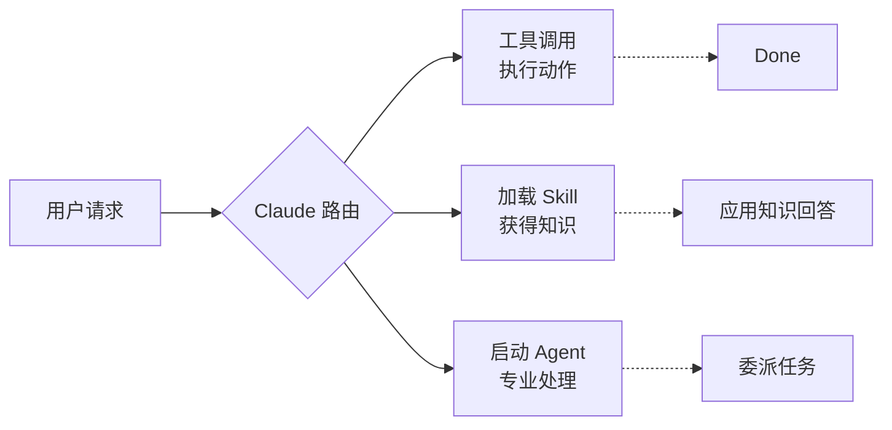
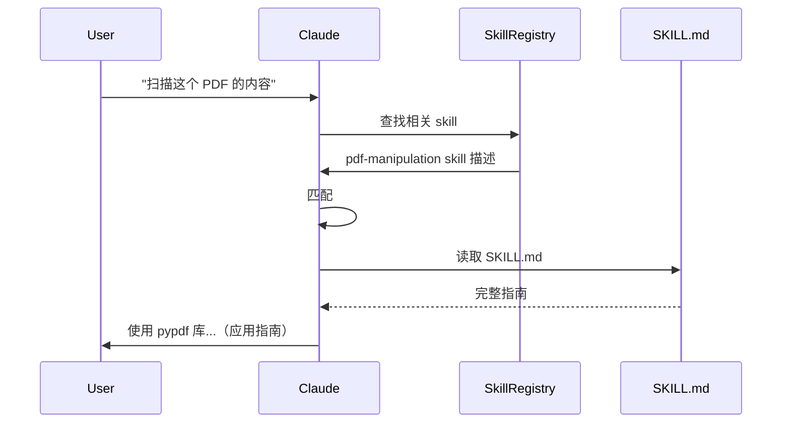

# skills/ — Skills 系统

**目录：** `src/skills/`

**Skills** 是 Anthropic 在 2025 年新推的概念——**按需激活的领域知识包**，比 Agent 更轻量，比单纯 prompt 更强。

## Skill 是什么？

**一句话：** Skill 是一份**被动触发的专业指南**，当对话涉及相关话题时自动加载到 Claude 的 context。

**类比：**

- **Tools** = Claude 主动调用的动作
- **Agents** = Claude 启动的专业子进程
- **Skills** = Claude 依赖的**领域手册**

## Skill 结构

```
my-skill/
├── SKILL.md          # 核心说明（总是加载）
├── references/
│   ├── api-ref.md
│   └── examples.md
├── scripts/
│   └── helper.py
└── metadata.yaml
```

### SKILL.md 示例

```markdown
---
name: pdf-manipulation
description: Use when user asks to create, read, edit, or manipulate PDF files.
Triggers include: mention of PDF, PDF form, PDF signing, extracting text from PDF.
DO NOT trigger for images or Word docs.
---

# PDF Manipulation

## When to use this skill
- User wants to create a new PDF
- User wants to extract text from PDF
- User wants to fill a PDF form

## How to use
1. Use `pypdf` library (preferred)
2. For complex layouts, use `reportlab`
3. Never use `pdfkit` (deprecated)

## Common patterns
...
```

## Skill vs Tool vs Agent



## Skill 触发机制

### 声明式触发

每个 SKILL.md 在 frontmatter **声明触发条件**：

```yaml
description: Triggers when user asks about X, Y, Z.
DO NOT trigger when request is about A, B.
```

### 语义匹配

```typescript
function shouldTriggerSkill(skill: Skill, userMessage: string): boolean {
  // Claude 自己决定（看 description）
  // 不是关键词匹配，是语义理解
  return claude.classify({
    prompt: `Is this skill relevant? ${skill.description}\nUser: ${userMessage}`
  })
}
```

### 按需激活



## Skill Registry

```typescript
// skills/registry.ts
class SkillRegistry {
  private skills = new Map<string, Skill>()

  async load(skillDir: string) {
    const skill = await parseSkill(skillDir)
    this.skills.set(skill.name, skill)
  }

  // 每次对话开始时注入 skill list
  getDescriptions(): string {
    return [...this.skills.values()]
      .map(s => `- ${s.name}: ${s.description}`)
      .join('\n')
  }

  // Claude 主动 load
  async activate(name: string): Promise<string> {
    const skill = this.skills.get(name)
    if (!skill) throw new Error('Skill not found')
    return skill.content
  }
}
```

## 系统提示词注入

启动时，Skill 描述被**注入 system prompt**：

```
You have access to these skills (load when relevant):

- pdf-manipulation: Use when user asks about PDFs...
- xlsx: Use when user asks about spreadsheets...
- docx: Use when user asks about Word docs...
...

Load a skill by using the Skill tool.
```

**Claude 看到这些描述，在对话中自主决定加载。**

## Skill 加载路径

```
skills/
├── built-in/          # Claude Code 自带
├── ~/.claude/skills/  # 用户安装
└── .claude/skills/    # 项目级
```

**项目级最优先**——项目特定的 skill 覆盖全局。

## 内置 Skills（2025）

Anthropic 维护的内置 skill：

| Skill | 用途 |
|-------|------|
| `pdf` | PDF 操作 |
| `docx` | Word 文档 |
| `xlsx` | 电子表格 |
| `pptx` | 幻灯片 |
| `skill-creator` | 创建新 skill |
| `claude-api` | Anthropic SDK |

## Skill 的附加资源

SKILL.md 只是入口——**更多细节在 references/ 里**：

```markdown
# SKILL.md

## Common patterns (see references/patterns.md for more)
...

## Advanced topics
See references/advanced.md
```

**渐进加载：** Claude 先读 SKILL.md，需要深入时再 Read reference 文件。

## Skill 与 MCP 的区别

|| Skill | MCP |
|--|-------|-----|
| 类型 | 知识包 | 工具提供者 |
| 激活 | 按相关性 | 显式注册 |
| 内容 | Markdown 指南 | Tool/Resource/Prompt |
| 隔离 | 文件 | 进程 |
| 开销 | 低（只有文本） | 高（IPC） |

**Skill 是轻量级的 prompt 扩展**，MCP 是**重量级的功能接入**。

## Skill 创建

用户可自己写 skill：

```bash
claude skill create my-domain
```

生成骨架：

```
my-domain/
├── SKILL.md
├── references/
└── metadata.yaml
```

## Skill 测试

```bash
claude skill test my-domain --prompts "how do I X?"
```

验证 skill 是否被正确触发。

## Skill 的 AnthropicSkills 命名空间

内置 skills 用 `anthropic-skills:` 命名空间：

```
- anthropic-skills:pdf
- anthropic-skills:xlsx
- anthropic-skills:docx
```

**防冲突** — 用户的 `my-pdf` 和官方的 `anthropic-skills:pdf` 不冲突。

## Skill 的可组合性

多个 skill 同时激活：

```
User: "从这个 PDF 提取表格，转成 Excel"
→ 触发 anthropic-skills:pdf + anthropic-skills:xlsx
→ 两个 SKILL.md 都加载
```

## 值得学习的点

1. **按需加载的领域知识** — 不占 context 直到需要
2. **声明式触发** — description 驱动路由
3. **Claude 自主路由** — 语义理解而非关键词
4. **渐进加载** — SKILL.md → references/
5. **命名空间** — 防冲突
6. **可组合** — 多个 skill 协同
7. **轻量级 prompt 扩展** — 比 MCP 简单

## 相关文档

- [services/mcp - MCP 协议](../services/mcp.md)
- [tools/agent-tool](../tools/agent-tool.md)
- [commands-registry](../root-files/commands-registry.md)
