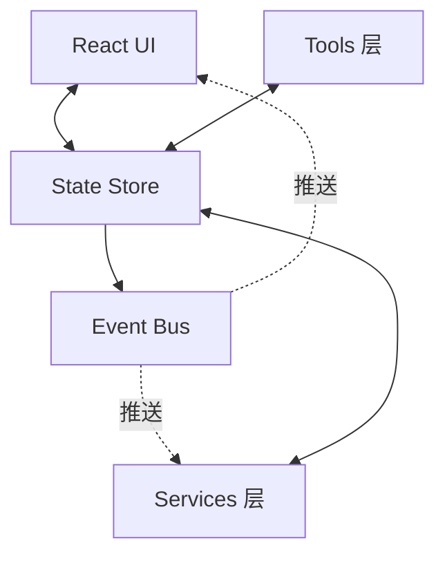

# state/ — 状态管理

**目录：** `src/state/`

Claude Code 有**几十种状态**要管理：消息、工具调用、任务、权限、UI 模式……`state/` 目录把它们**统一到可订阅的 Store**。

## 为什么自建状态系统？

**候选方案：**

- Redux — 太重，CLI 不需要 time-travel
- Zustand — 依赖 React，但服务层也要用
- MobX — observable 观念对 TypeScript 不友好

**选择：** 自建 **轻量 Event-driven Store**，React 和非 React 都能用。

## 架构



## Store 定义

```typescript
// state/store.ts
class Store<T> {
  private state: T
  private listeners = new Set<(s: T) => void>()

  constructor(initial: T) {
    this.state = initial
  }

  get(): T {
    return this.state
  }

  set(updater: Partial<T> | ((s: T) => Partial<T>)) {
    const delta = typeof updater === 'function' ? updater(this.state) : updater
    this.state = { ...this.state, ...delta }
    this.notify()
  }

  subscribe(listener: (s: T) => void): () => void {
    this.listeners.add(listener)
    return () => this.listeners.delete(listener)
  }

  private notify() {
    for (const l of this.listeners) l(this.state)
  }
}
```

## 全局 Stores

```typescript
// state/stores/index.ts
export const messageStore = new Store<MessageState>({ messages: [] })
export const taskStore = new Store<TaskState>({ tasks: [] })
export const sessionStore = new Store<SessionState>({ id: '', ... })
export const uiStore = new Store<UIState>({ mode: 'normal', panel: 'main' })
export const costStore = new Store<CostState>({ usage: { ... } })
export const permissionStore = new Store<PermState>({ pending: null })
```

**每个 store 职责单一** — 相关状态聚合。

## 与 React 集成

```typescript
// state/useStore.ts
function useStore<T, R>(store: Store<T>, selector: (s: T) => R): R {
  const [selected, setSelected] = useState(() => selector(store.get()))

  useEffect(() => {
    return store.subscribe((newState) => {
      const newSelected = selector(newState)
      if (newSelected !== selected) {
        setSelected(newSelected)
      }
    })
  }, [store, selector])

  return selected
}

// 用法
const messages = useStore(messageStore, s => s.messages)
const pendingPerm = useStore(permissionStore, s => s.pending)
```

## Event Bus

```typescript
// state/eventBus.ts
type EventMap = {
  'message:new': Message
  'tool:call': ToolCall
  'tool:result': ToolResult
  'task:created': Task
  'permission:requested': PermissionRequest
  'error': Error
}

class EventBus {
  private listeners = new Map<keyof EventMap, Set<(v: any) => void>>()

  emit<K extends keyof EventMap>(event: K, value: EventMap[K]) {
    this.listeners.get(event)?.forEach(l => l(value))
  }

  on<K extends keyof EventMap>(event: K, listener: (v: EventMap[K]) => void) {
    if (!this.listeners.has(event)) {
      this.listeners.set(event, new Set())
    }
    this.listeners.get(event)!.add(listener)
    return () => this.listeners.get(event)?.delete(listener)
  }
}

export const bus = new EventBus()
```

**Type-safe events** — K 的类型推出 value 的类型。

## Store + Event 配合

Store 更新时**emit event**：

```typescript
function addMessage(msg: Message) {
  messageStore.set(s => ({ messages: [...s.messages, msg] }))
  bus.emit('message:new', msg)
}
```

UI 订阅 store，**其他服务**订阅 event：

```typescript
// 服务层
bus.on('message:new', async (msg) => {
  await saveToSession(msg)
  await analytics.record({ type: 'message_received' })
})

// UI 层
const messages = useStore(messageStore, s => s.messages)
```

## 派生状态

```typescript
// state/derived.ts
export const runningTasksStore = derive(
  taskStore,
  s => s.tasks.filter(t => t.status === 'running')
)

function derive<T, D>(source: Store<T>, selector: (s: T) => D): Store<D> {
  const store = new Store(selector(source.get()))
  source.subscribe(s => store.set(selector(s)))
  return store
}
```

## 持久化

某些 store 需要**写盘恢复**：

```typescript
function persistStore<T>(store: Store<T>, path: string) {
  // 加载
  if (fs.existsSync(path)) {
    store.set(JSON.parse(fs.readFileSync(path, 'utf8')))
  }

  // 保存（debounced）
  const save = debounce(() => {
    fs.writeFileSync(path, JSON.stringify(store.get()))
  }, 1000)

  store.subscribe(save)
}

// 用法
persistStore(sessionStore, '~/.claude/session-state.json')
```

## 历史状态

```typescript
class HistoryStore<T> extends Store<T> {
  private history: T[] = []
  private maxHistory = 100

  set(updater: Partial<T> | ((s: T) => Partial<T>)) {
    this.history.push(this.get())
    if (this.history.length > this.maxHistory) {
      this.history.shift()
    }
    super.set(updater)
  }

  undo() {
    const prev = this.history.pop()
    if (prev) super.set(prev)
  }
}
```

用于**可撤销的操作**（虽然不是 full Redux，但够用）。

## Store 调试

```bash
claude --debug-state
```

打印每次 state 变化：

```
[store:messageStore] {messages: 5 items} -> {messages: 6 items}
[event:tool:call] {tool: 'Read', args: {...}}
[store:taskStore] {tasks: 0 items} -> {tasks: 1 items}
```

## 避免的陷阱

### 1. 不要在 store 里放方法

```typescript
// ❌ 难序列化、难测试
{ messages: [], addMessage: (m) => {...} }

// ✅ 方法与数据分离
const messageStore = new Store({ messages: [] })
function addMessage(m: Message) { ... }
```

### 2. 不要循环订阅

```typescript
// ❌ 无限循环
storeA.subscribe(() => storeB.set(...))
storeB.subscribe(() => storeA.set(...))
```

### 3. 深比较 vs 浅比较

```typescript
// 默认浅比较，深对象要手动
if (isEqual(prevSelected, newSelected)) return  // 用 lodash 或手写
```

## 值得学习的点

1. **自建轻量 Store** — 不依赖 Redux/MobX
2. **Type-safe Event Bus** — EventMap 驱动
3. **Store + Event 双模式** — 状态与事件分离
4. **派生 Store** — 自动计算的下游状态
5. **持久化 wrapper** — debounced 写盘
6. **与 React 解耦** — 服务层也能用
7. **历史状态** — 轻量 undo

## 相关文档

- [hooks/ - React Hooks](../hooks/index.md)
- [context/ - React Context](../context/index.md)
- [services/ - 服务层](../services/api.md)
