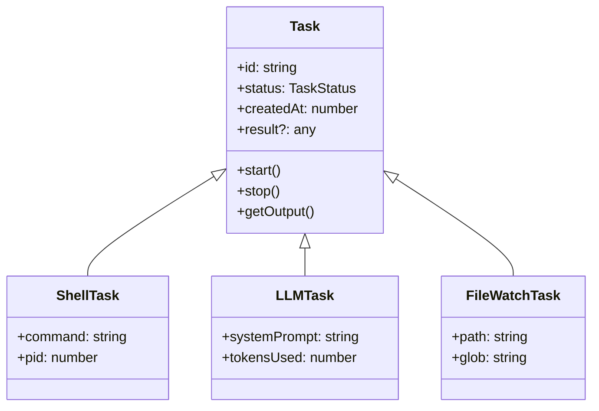

# tasks/ — Agent 任务系统

**目录：** `src/tasks/`

`tasks/` 实现 **Claude Code 的任务编排内核**——既是 `TaskCreateTool` 的底层，也是 Agent 自身长流程的载体。

## 任务 vs 会话

| | Task | Session |
|--|------|---------|
| 范围 | 单个工作单元 | 整个对话 |
| 生命期 | 短到长 | 对话期间 |
| 可并发 | 是 | 否（一个用户一个） |
| 持久化 | 可以 | 是 |
| 示例 | `npm run dev` | 用户对话 |

## 任务类型

```typescript
type Task =
  | ShellTask         // bash/pwsh 命令
  | LLMTask           // LLM 调用（Agent 推理）
  | FileWatchTask     // 文件监控
  | HttpTask          // HTTP 请求
  | CronTask          // 定时触发
```

## 任务架构



## 任务管理器

```typescript
class TaskManager {
  private tasks = new Map<string, Task>()

  async create(spec: TaskSpec): Promise<Task> {
    const task = this.makeTask(spec)
    this.tasks.set(task.id, task)
    await task.start()
    return task
  }

  list(): Task[] {
    return [...this.tasks.values()]
  }

  async stop(id: string) {
    const task = this.tasks.get(id)
    if (!task) throw new Error('Not found')
    await task.stop()
  }

  // GC 完成/失败的任务
  cleanup(olderThanMs: number) {
    const cutoff = Date.now() - olderThanMs
    for (const [id, task] of this.tasks) {
      if (task.status !== 'running' && task.createdAt < cutoff) {
        this.tasks.delete(id)
      }
    }
  }
}
```

## 任务持久化

任务元数据写到磁盘：

```
~/.claude/tasks/
├── tasks.json             # 索引
├── task-abc/
│   ├── metadata.json
│   ├── stdout.log
│   └── stderr.log
```

**作用：**

- 进程重启后恢复任务列表
- 查看历史任务
- 跨会话复用

## 任务编排

多个任务的依赖关系：

```typescript
interface TaskDAG {
  tasks: Task[]
  edges: Array<{ from: string, to: string }>  // from 完成后 to 才能跑
}

async function runDAG(dag: TaskDAG) {
  const completed = new Set<string>()
  const pending = new Set(dag.tasks.map(t => t.id))

  while (pending.size > 0) {
    // 找到所有依赖已满足的任务
    const ready = [...pending].filter(id => {
      const deps = dag.edges.filter(e => e.to === id).map(e => e.from)
      return deps.every(d => completed.has(d))
    })

    // 并行执行
    await Promise.all(ready.map(async id => {
      await runTask(findTask(dag, id))
      completed.add(id)
      pending.delete(id)
    }))
  }
}
```

**典型场景：build → test → deploy**

## 任务状态事件

```typescript
task.on('start', () => log('started'))
task.on('output', chunk => broadcast(chunk))
task.on('error', err => logger.error(err))
task.on('complete', result => saveResult(result))
task.on('stop', () => cleanup())
```

## 子任务 (Subtasks)

```typescript
interface Task {
  id: string
  parentId?: string
  children: Task[]
}

// 创建子任务
async function createSubtask(parent: Task, spec: TaskSpec) {
  const child = await tasks.create({ ...spec, parentId: parent.id })
  parent.children.push(child)

  // 父终止 → 子也终止
  parent.on('stop', () => child.stop())

  return child
}
```

## 任务与 Agent 的关系

**Agent 本身就是一个 Task：**

```typescript
interface AgentTask extends Task {
  type: 'agent'
  agentDef: AgentDef
  messages: Message[]
  tokensUsed: number
}
```

**这让 AgentTool 能用 Task 的监控、持久化、取消机制。**

## Cron 任务

```typescript
interface CronTask extends Task {
  schedule: string  // cron 表达式
  command: string
  lastRun?: number
  nextRun: number
}

// 后台 ticker
setInterval(() => {
  const now = Date.now()
  for (const task of cronTasks) {
    if (task.nextRun <= now) {
      runCronTask(task)
      task.lastRun = now
      task.nextRun = computeNextRun(task.schedule)
    }
  }
}, 60_000)
```

## 任务与权限

```typescript
async function createTask(spec: TaskSpec, perms: Permissions) {
  // 检查创建权限
  if (!perms.canCreateTask(spec.type)) {
    throw new PermissionError()
  }

  // 子任务继承收窄的权限
  const subPerms = narrowPermissions(perms, spec)

  return new Task(spec, subPerms)
}
```

## 任务日志

```typescript
class TaskLogger {
  private stream: fs.WriteStream

  constructor(taskId: string) {
    this.stream = fs.createWriteStream(`tasks/${taskId}/stdout.log`, { flags: 'a' })
  }

  write(chunk: string | Buffer) {
    this.stream.write(chunk)
  }

  // 支持 seek 读取
  async read(offset: number, limit: number): Promise<string> {
    const fd = await fs.open(`tasks/${taskId}/stdout.log`, 'r')
    const buf = Buffer.alloc(limit)
    const { bytesRead } = await fd.read(buf, 0, limit, offset)
    return buf.slice(0, bytesRead).toString('utf8')
  }
}
```

## Output 轮转

日志太大时：

```typescript
async function rotateIfNeeded(taskId: string) {
  const size = await fileSize(`tasks/${taskId}/stdout.log`)
  if (size > 50 * 1024 * 1024) {  // 50MB
    await rename(`tasks/${taskId}/stdout.log`, `tasks/${taskId}/stdout.log.1`)
    // 新日志从头开始
  }
}
```

## 任务超时

```typescript
class TimeoutTask {
  async start() {
    const timeoutId = setTimeout(() => {
      if (this.status === 'running') {
        this.stop('timeout')
      }
    }, this.timeoutMs)

    try {
      await this.inner.run()
    } finally {
      clearTimeout(timeoutId)
    }
  }
}
```

## 资源限制

```typescript
interface ResourceLimits {
  maxMemoryMB?: number
  maxCPUPercent?: number
  maxDurationMs?: number
  maxOutputBytes?: number
}
```

超限 → 主动终止。

## 值得学习的点

1. **统一 Task 抽象** — Shell/LLM/Cron/File 同 API
2. **文件式持久化** — 重启不丢任务
3. **DAG 编排** — 依赖关系自动调度
4. **子任务级联终止** — 父停子停
5. **Agent 本身是 Task** — 架构一致性
6. **可 seek 的日志** — offset 读取
7. **资源限制** — 防止失控

## 相关文档

- [tools/task-tools](../tools/task-tools.md)
- [coordinator/ - 多 Agent 协调](../coordinator/index.md)
- [tools/other-tools - Cron 工具](../tools/other-tools.md)
