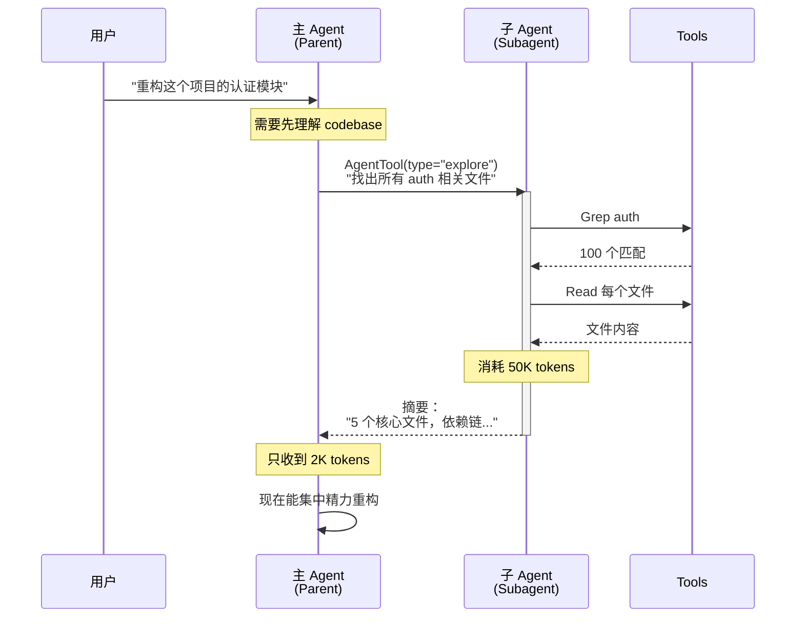
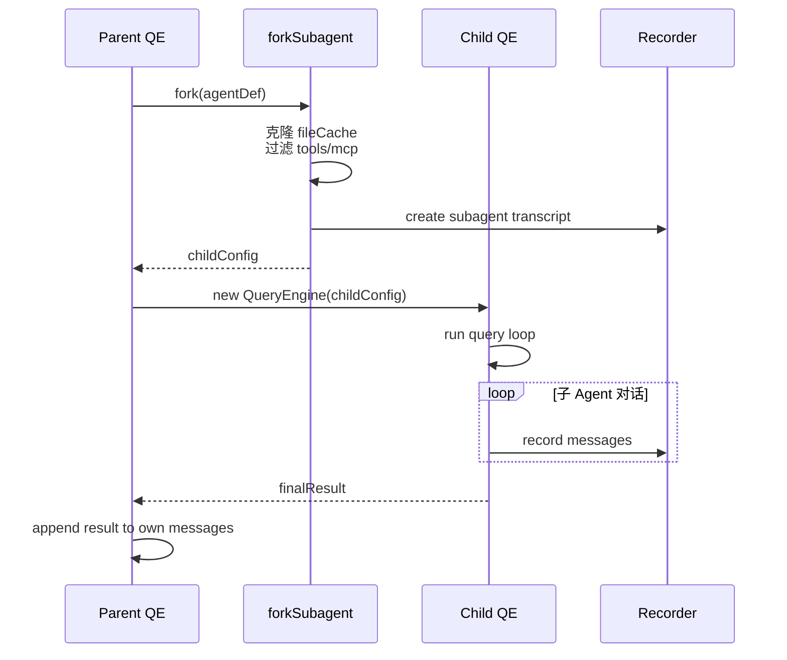

# AgentTool — 子 Agent 分叉模型

**目录：** `src/tools/AgentTool/`（15+ 个文件）

AgentTool 是 Claude Code **最强大也最能代表 Agent 设计理念**的工具。它让 Claude 派生**子 Agent** 来独立完成子任务。

## 为什么需要子 Agent？

主 Agent 的上下文窗口有限。当某个任务需要**大量探索**（比如"理解整个 codebase"），主 Agent 如果自己做完会占满 context，后续无法继续主任务。

**解决方案：派生子 Agent，让它吃掉所有探索 token，只返回精炼结果。**



主 Agent 省下 48K tokens——**这就是子 Agent 的核心价值**。

## 内置 Agent

`src/tools/AgentTool/built-in/` 下有几个**精心设计**的内置 Agent：

| Agent | 用途 | 特点 |
|-------|------|------|
| `general-purpose` | 通用子 Agent | 所有工具可用 |
| `explore` | 快速代码探索 | **不加载 CLAUDE.md**，节省 token |
| `plan` | 实现规划 | 返回结构化步骤 |
| `verify` | 代码审查 | 针对 diff 做验证 |
| `statusline-setup` | 状态栏配置助手 | 专门化的小 Agent |

### 为什么 explore/plan 不加载 CLAUDE.md？

每次子 Agent 启动都加载 CLAUDE.md，在**34M+ Agent 调用/周**的规模下，每次省 5-15KB，就是每周 **~170-500GB 的 token 节省**。

这是 **token 经济学** 的工业级优化。

## Agent 定义格式

用户自定义 Agent 是 Markdown 文件 + frontmatter：

```markdown
---
name: database-expert
description: Expert on database schema design
tools: [Read, Grep, Glob]
skills: [simplify]
mcp: [postgres-mcp]
memory:
  - type: project
    path: .claude/memories/db.md
---

You are a database expert. When given a schema design task...
```

`loadAgentsDir.ts` 负责扫描和解析：

```typescript
async function loadAgentsDir(dir: string): Promise<AgentDefinition[]> {
  const files = await glob('**/*.md', { cwd: dir })
  return Promise.all(files.map(async f => {
    const content = await readFile(f)
    const { data, content: body } = matter(content)
    return {
      name: data.name,
      description: data.description,
      allowedTools: data.tools,
      skills: data.skills,
      mcpServers: data.mcp,
      memoryScopes: data.memory,
      systemPrompt: body,
    }
  }))
}
```

## 分叉模型

`forkSubagent.ts` 实现父→子的分叉：

```typescript
export function forkSubagent(
  parent: QueryEngineConfig,
  agentDef: AgentDefinition
): QueryEngineConfig {
  return {
    ...parent,

    // 继承
    readFileCache: parent.readFileCache.clone(),  // 文件缓存继承
    permissionContext: cloneContext(parent.permissionContext),

    // 重置
    tools: filterTools(parent.tools, agentDef.allowedTools),  // 限制工具
    commands: [],        // 子 Agent 不响应 slash 命令
    mcpClients: parent.mcpClients.filter(c =>
      agentDef.mcpServers?.includes(c.name)  // 过滤 MCP 服务器
    ),

    // 新建
    customSystemPrompt: agentDef.systemPrompt,
    initialMessages: [],
  }
}
```

**关键隔离：**

| 资源 | 父 → 子 行为 |
|------|-------------|
| 文件缓存 | **克隆**（避免污染） |
| 权限上下文 | **克隆**（子 Agent 修改不影响父） |
| MCP 服务器 | **过滤**（子 Agent 可能只需要特定 MCP） |
| 工具集 | **过滤**（Agent 定义的白名单） |
| 命令 | **清空**（子 Agent 不需要 slash 命令） |
| 记忆 | **按 scope 读**（见下文） |

## 记忆隔离

`agentMemory.ts` 管理 Agent 的记忆范围：

```typescript
type MemoryScope = 'user' | 'project' | 'local'

// user scope: 跨项目共享
// project scope: 当前项目
// local scope: 此 Agent 实例独占
```

父 Agent 可以通过 `user` 和 `project` 传递知识，但每个子 Agent 有自己的 `local` 记忆——**不污染父级**。

## Transcript 记录

每个子 Agent 有**独立的 transcript 目录**：

```
~/.claude/transcripts/
├── session-abc123/
│   ├── main.ndjson          # 父 Agent
│   └── subagents/
│       ├── sub-xyz789.ndjson  # 子 Agent 1
│       └── sub-pqr456.ndjson  # 子 Agent 2
```

这方便**调试和审计**——用户能看到每个子 Agent 的完整对话。

## runAgent 执行流程



## Agent 颜色区分

`agentColorManager.ts` 给每个 Agent 分配 UI 颜色：

```typescript
const AGENT_COLORS = ['cyan', 'magenta', 'yellow', 'green', 'blue']

function assignColor(agentId: string): string {
  const hash = simpleHash(agentId)
  return AGENT_COLORS[hash % AGENT_COLORS.length]
}
```

在终端 UI 里，不同颜色的 Agent 消息清晰区分。

## Agent 最大深度

避免无限递归：

```typescript
if (queryChain.depth >= MAX_AGENT_DEPTH) {
  throw new Error('Max agent depth exceeded')
}
```

默认 `MAX_AGENT_DEPTH = 10`——足够深但防止爆栈。

## 值得学习的点

1. **token 预算分摊** — 子 Agent 消耗自己的 context，不污染主 Agent
2. **继承 + 隔离** — 共享只读资源，隔离可写状态
3. **Agent 是数据** — Markdown + frontmatter 声明式定义
4. **内置 vs 用户** — 内置 Agent 为常见场景特化（如 explore 不加载 CLAUDE.md）
5. **深度限制** — 防止递归爆炸
6. **transcript 隔离** — 可审计、可调试

## 实际案例

用户问："帮我优化这个 SQL 查询"，主 Agent 可能这样分派：

1. `AgentTool(type="explore")` → 理解 schema 和索引
2. `AgentTool(type="plan")` → 规划优化步骤
3. 主 Agent 应用优化
4. `AgentTool(type="verify")` → 验证修改前后的执行计划

每个子 Agent 有自己的上下文窗口，主 Agent 只看到**摘要**——这就是 **Agent swarm 的基础**。

## 相关文档

- [coordinator/ - 多 Agent 协调](../coordinator/index.md)
- [tasks/ - Agent 任务系统](../tasks/index.md)
- [memdir/ - Agent 记忆](../memdir/index.md)
- [commands/ - Agent 命令](../commands/index.md)
