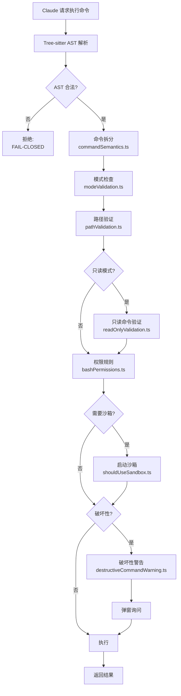

# BashTool — 安全栈

**目录：** `src/tools/BashTool/`（18 个文件）

BashTool 是 Claude Code 里**最危险也最有用的工具**——它让 Claude 直接执行 shell 命令。一旦出错就可能 `rm -rf /`。因此它的实现是**安全工程的典范**。

## 为什么 Bash 这么难做？

Bash 是图灵完备的，且语法诡异：

- `ls; rm -rf /` — 分号分隔的命令
- `ls && rm -rf /` — 短路执行
- `$(rm -rf /)` — 命令替换
- `` `rm -rf /` `` — 反引号（旧式命令替换）
- `echo '$(rm -rf /)'` — 字符串字面量
- `[ -d dir ] && rm -rf dir` — 条件执行

**简单的字符串匹配**无法区分这些情况。需要**真正的解析器**。

## 18 个文件的安全栈



## 核心文件职责

| 文件 | 职责 |
|------|------|
| `BashTool.tsx` | 工具入口，编排其他检查 |
| `bashSecurity.ts` | 安全判断主逻辑 |
| `commandSemantics.ts` | 命令语义拆分（识别分隔符、组合） |
| `bashCommandHelpers.ts` | 命令辅助（提取子命令、参数） |
| `bashPermissions.ts` | 权限规则匹配 |
| `modeValidation.ts` | 权限模式校验（plan/auto/etc.） |
| `pathValidation.ts` | 路径是否在允许的工作目录 |
| `readOnlyValidation.ts` | 只读模式下的命令白名单 |
| `sedEditParser.ts` | 解析 sed 编辑指令 |
| `sedValidation.ts` | sed 写操作的检查 |
| `destructiveCommandWarning.ts` | 破坏性命令特殊提示 |
| `shouldUseSandbox.ts` | 是否启用沙箱 |
| `BashToolResultMessage.tsx` | 结果 UI 渲染 |
| `UI.tsx` | 交互 UI 组件 |

## FAIL-CLOSED 白名单设计

在 `utils/bash/ast.ts` 里：

```typescript
const ALLOWED_AST_NODES = new Set([
  'command',
  'word',
  'string',
  'raw_string',
  'variable_assignment',
  'redirection',
  'pipeline',
  // ... 只允许已审核的节点类型
])

function validateAst(node: SyntaxNode): ValidationResult {
  if (!ALLOWED_AST_NODES.has(node.type)) {
    return {
      ok: false,
      reason: `Unrecognized AST node: ${node.type}`
    }
  }

  // 递归检查子节点
  for (const child of node.children) {
    const result = validateAst(child)
    if (!result.ok) return result
  }

  return { ok: true }
}
```

**FAIL-CLOSED** 意味着：**不认识的语法结构直接拒绝**。

这比"拒绝已知危险"（FAIL-OPEN）安全得多——因为 bash 语法复杂到我们不可能枚举所有危险模式。

## 只读模式验证

当权限模式是 `plan` 或 `default`，BashTool 只允许只读命令：

```typescript
const READ_ONLY_COMMANDS = new Set([
  'ls', 'cat', 'head', 'tail', 'grep', 'find', 'pwd',
  'whoami', 'hostname', 'date', 'which', 'file', 'stat',
  'git status', 'git log', 'git diff', 'git show',
  // ...
])

function validateReadOnly(command: string): boolean {
  const tokens = tokenize(command)
  const mainCmd = tokens[0]
  return READ_ONLY_COMMANDS.has(mainCmd)
}
```

任何写操作（`touch`、`rm`、`git commit`、`npm install`...）在 plan 模式下**都被拦截**。

## 命令拆分

`commandSemantics.ts` 识别复合命令：

```typescript
function splitCommand(cmd: string): SubCommand[] {
  // "ls && rm -rf /" → [
  //   { cmd: "ls", separator: "&&" },
  //   { cmd: "rm -rf /", separator: null }
  // ]
}
```

每个子命令**独立**走安全检查。这意味着 `echo hi && rm -rf /` 也会被拦截——因为第二段是危险的。

## sed 特殊处理

`sed` 可以是读（`sed -n '1p'`）或写（`sed -i`）。`sedEditParser.ts` 解析 sed 指令：

```typescript
function parseSedCommand(args: string[]): SedOperation {
  const inPlace = args.includes('-i') || args.includes('--in-place')
  const scripts = extractScripts(args)

  return {
    isWrite: inPlace,
    targetFiles: extractFiles(args),
    operations: scripts.map(parseScript),
  }
}
```

`-i` 标志的 sed **被当作写操作**处理，需要更高权限。

## 破坏性命令警告

一些命令即使权限允许，也会**强制警告**：

```typescript
const DESTRUCTIVE_PATTERNS = [
  /^rm\s+-rf/,
  /^git\s+reset\s+--hard/,
  /^git\s+push\s+--force/,
  /^drop\s+(table|database)/i,
  // ...
]

function isDestructive(cmd: string): DestructiveReason | null {
  for (const pattern of DESTRUCTIVE_PATTERNS) {
    if (pattern.test(cmd)) {
      return { pattern: pattern.source, severity: 'high' }
    }
  }
  return null
}
```

破坏性命令会**强制弹窗**询问用户，即使有 `--dangerously-skip-permissions`。

## 沙箱集成

`shouldUseSandbox.ts` 决定是否启用沙箱：

```typescript
function shouldUseSandbox(cmd: string, mode: PermissionMode): boolean {
  if (mode === 'bypassPermissions') return false
  if (isReadOnly(cmd)) return false
  if (!isSandboxAvailable()) return false
  return true
}
```

沙箱是 `@anthropic-ai/sandbox-runtime` 包装的 Linux namespace 隔离（或 macOS 的 sandbox-exec）。

## 工作目录限制

`pathValidation.ts` 验证命令中的路径：

```typescript
function validatePaths(cmd: string, allowedDirs: string[]): ValidationResult {
  const paths = extractPaths(cmd)

  for (const path of paths) {
    const absolute = resolvePath(path)
    if (!isSubpath(absolute, allowedDirs)) {
      return {
        ok: false,
        reason: `Path ${absolute} is outside allowed directories`
      }
    }
  }

  return { ok: true }
}
```

用户可以通过 `--add-dir /foo /bar` 声明允许的工作目录。任何试图操作这些目录之外文件的命令**都被拦截**。

## 值得学习的点

1. **AST 级别的解析** — 字符串匹配不够，必须 parse
2. **FAIL-CLOSED 白名单** — 不认识的就拒绝
3. **分层失效** — 任何一层拦截都中断
4. **语义拆分** — 复合命令每段独立检查
5. **特殊命令专属逻辑** — sed 的 `-i` 这种边缘情况
6. **强制性警告** — 即使有 bypass，破坏性命令也警告

## 相关文档

- [utils/bash - AST 解析](../utils/bash-security.md)
- [utils/permissions - 权限系统](../utils/permissions.md)
- [Tool 工具框架](../root-files/tool-framework.md)
