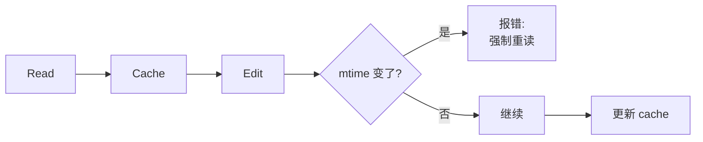

# 文件工具 (FileRead / FileEdit / FileWrite)

**目录：** `src/tools/FileReadTool/`、`src/tools/FileEditTool/`、`src/tools/FileWriteTool/`

文件工具是 Agent 最常用的工具。它们看似简单，实际有很多**工业级细节**。

## FileReadTool

支持多种文件类型：

| 类型 | 处理方式 |
|------|---------|
| 文本文件 | 直接读取 + 行号 |
| 图像（PNG/JPG） | 转 base64 给 Claude（视觉模型） |
| PDF | 提取文本（大 PDF 需分页） |
| Jupyter Notebook | 解析所有 cells + outputs |
| 二进制 | 拒绝，返回错误 |

### 行号前缀

```
   1→import React from 'react'
   2→import { useState } from 'react'
   3→
   4→function App() {
```

**为什么要加行号？**

- Claude 能准确引用 "line 42"
- FileEdit 可以精确定位修改位置
- 用户阅读 diff 时有上下文

### 偏移与限制

```typescript
{
  filePath: '/path/to/big-file.ts',
  offset: 500,    // 从第 500 行开始
  limit: 100      // 最多读 100 行
}
```

大文件不需要一次性读完——Agent 可以**分块阅读**。

### PDF 分页保护

```typescript
if (fileType === 'pdf' && totalPages > 10 && !pageRange) {
  return {
    error: 'PDF has >10 pages, must specify pages parameter'
  }
}
```

防止 Agent 一次性读几百页 PDF 撑爆 context。

## FileEditTool

**核心：基于字符串替换的精确编辑。**

```typescript
{
  filePath: '/path/to/file.ts',
  oldString: 'const x = 1',
  newString: 'const x = 2',
  replaceAll?: false
}
```

### 为什么是字符串替换而非 diff？

- **Claude 擅长生成精确的字符串**，不擅长 diff 格式
- **避免歧义** — 如果 oldString 不唯一，强制报错
- **可验证** — 执行前可以检查 oldString 是否存在

### 唯一性校验

```typescript
const occurrences = countOccurrences(fileContent, oldString)

if (occurrences === 0) {
  return { error: 'oldString not found in file' }
}

if (occurrences > 1 && !replaceAll) {
  return {
    error: `oldString matches ${occurrences} places, provide more context or use replaceAll`
  }
}
```

Claude 被迫**提供足够的上下文**让 oldString 唯一。这在工程上减少了误改。

### 必须先 Read

```typescript
if (!hasReadFile(filePath)) {
  return {
    error: 'Must use Read tool on this file first'
  }
}
```

这防止 Agent **在不了解当前内容的情况下盲目编辑**。

### 文件状态缓存

```typescript
// 文件被读取后记录状态
fileStateCache.set(filePath, {
  content: currentContent,
  mtime: stats.mtime,
  size: stats.size,
})

// 编辑前验证状态未变
if (fs.statSync(filePath).mtime > cached.mtime) {
  return { error: 'File modified externally since last read' }
}
```

如果用户或其他进程修改了文件，Agent **被迫重新读取**——防止覆盖用户的修改。

### 行号前缀自动剥离

Claude 可能会在 oldString 里**错误地包含行号前缀**（因为它从 Read 工具看到的是带行号的）：

```typescript
function stripLineNumberPrefix(s: string): string {
  // 识别 "   3→" 格式的前缀
  return s.split('\n').map(line => {
    return line.replace(/^\s*\d+→/, '')
  }).join('\n')
}
```

Edit 工具**自动剥离**这些前缀，降低 Claude 出错的几率。

## FileWriteTool

**用于创建新文件或完全重写。**

```typescript
{
  filePath: '/path/to/new-file.ts',
  content: '// full file content here'
}
```

### 为什么不用 FileEdit 覆盖？

- FileEdit 需要 oldString——新文件没有原内容
- 完全重写一个文件时，diff 没意义
- 明确的意图：**这是一个全新/全覆盖的写操作**

### 对现有文件的保护

```typescript
if (fs.existsSync(filePath) && !hasReadFile(filePath)) {
  return {
    error: 'Existing file must be read first. If you want to overwrite, read it first.'
  }
}
```

**这是最容易的失误场景**——Agent 用 Write 而非 Edit，误覆盖用户的代码。这个检查强制 Agent 先了解原文件。

## 三者的选择规则

系统提示词里明确指导 Claude：

```
- Use Read before editing unfamiliar files
- Prefer Edit over Write for existing files (sends only the diff)
- Only use Write for creating new files or complete rewrites
- Edit requires unique oldString or replaceAll=true
```

## 文件历史（Undo）

`utils/fileHistory.ts` 记录所有文件修改：

```typescript
type FileHistoryEntry = {
  filePath: string
  operation: 'edit' | 'write'
  before: string    // 修改前内容
  after: string     // 修改后内容
  timestamp: number
  toolUseId: string
}
```

用户可以通过 `/undo` 命令回滚——**重要的安全网**。

## 文件状态缓存的作用



这个缓存：

1. **加速连续 Edit** — 不需要每次都重新读
2. **检测外部修改** — 如果用户修改了文件，Agent 知道
3. **Undo 基础** — 保留原内容用于回滚

## 值得学习的点

1. **行号前缀** — 方便引用和编辑
2. **唯一性校验** — 强制 Claude 提供足够上下文
3. **Read 前置** — 防止盲目写入
4. **mtime 检测** — 防止覆盖外部修改
5. **文件历史** — 可回滚的安全网
6. **PDF 分页** — context 保护
7. **工具职责清晰** — Read/Edit/Write 用途不重叠

## 相关文档

- [utils/fileStateCache](../utils/other-utils.md)
- [Tool 工具框架](../root-files/tool-framework.md)
