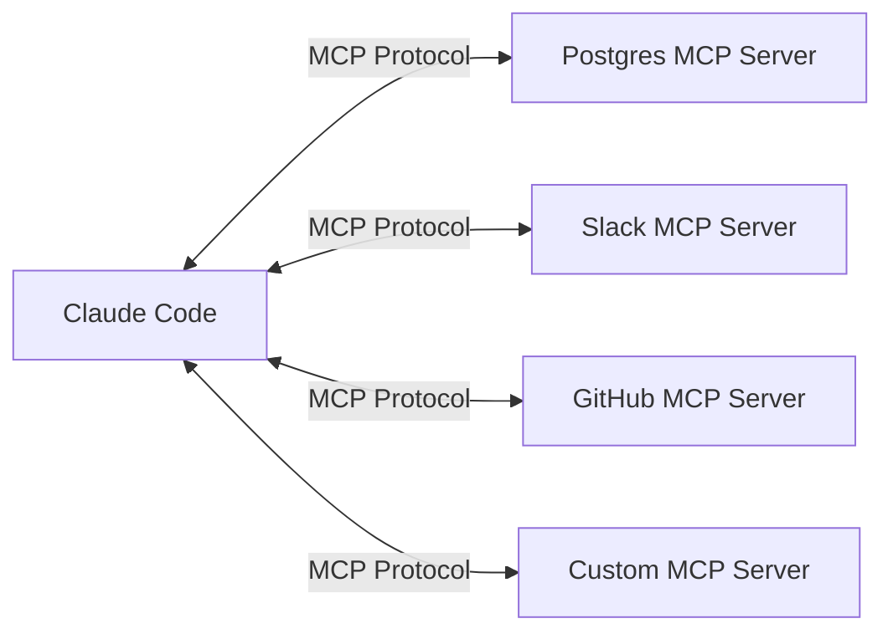
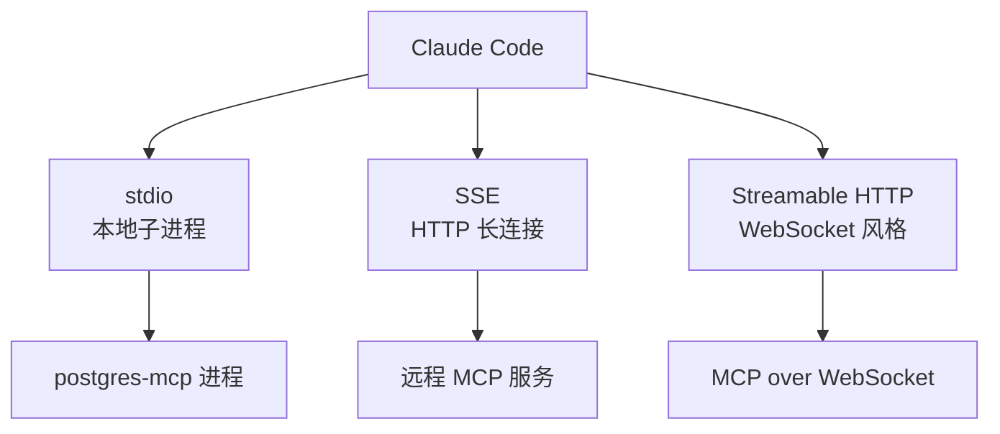

# MCP 工具集成

**目录：** `src/tools/MCPTool/`、`src/tools/ListMcpResourcesTool/`、`src/tools/ReadMcpResourceTool/`、`src/tools/McpAuthTool/`

**MCP** = Model Context Protocol，Anthropic 开放的**第三方工具/资源集成协议**。

## MCP 是什么

MCP 让任何第三方服务（数据库、Slack、GitHub、自定义 API）可以**被 Claude 直接调用**，无需修改 Claude Code 本身。



每个 MCP Server 暴露：

- **Tools** — 可调用的函数
- **Resources** — 可读的数据
- **Prompts** — 预定义的提示模板

## MCPTool — 通用 MCP 工具调用

MCPTool 是一个**元工具**——它调用任意 MCP 服务器的任意工具。

```typescript
// 用户配置了 postgres-mcp
{
  serverName: 'postgres-mcp',
  toolName: 'query',
  arguments: { sql: 'SELECT * FROM users LIMIT 10' }
}
```

### 工具名规范化

MCP 工具在 Claude 看来叫 `mcp__postgres__query`：

```typescript
function normalizeMcpToolName(server: string, tool: string): string {
  return `mcp__${server}__${tool}`
    .replace(/[^a-zA-Z0-9_]/g, '_')
}
```

下划线前缀区分 MCP 工具和内置工具。

### 动态工具注册

启动时连接所有 MCP 服务器，**遍历它们的工具**：

```typescript
for (const server of mcpServers) {
  const tools = await server.listTools()
  for (const tool of tools) {
    registry.register(wrapMcpTool(server, tool))
  }
}
```

用户添加新 MCP 服务器后，**不需要重启 Claude Code**——通过 `/mcp` 命令动态添加。

## ListMcpResourcesTool / ReadMcpResourceTool

MCP Resources 是**只读数据**（文件、记录、API 响应）：

```typescript
// 列出资源
{ serverName: 'postgres-mcp' }
// 返回: [
//   { uri: 'postgres://db/users', name: 'users table', ... },
//   { uri: 'postgres://db/orders', name: 'orders table', ... },
// ]

// 读取资源
{ uri: 'postgres://db/users' }
// 返回: { content: '...schema & sample data...' }
```

## McpAuthTool — OAuth 流

**问题：** MCP 服务器可能需要 OAuth 认证（比如 Slack、GitHub）。

**方案：** `McpAuthTool` 启动 OAuth 流，**Claude 引导用户完成**：

```
Claude: I need to authenticate with Slack.
        Please open: https://slack.com/oauth/authorize?...
        And paste the code here.
User: [pastes code]
Claude: [calls McpAuthTool with code]
        Authenticated! Now I can send messages.
```

这是 **Agent 与 OAuth 结合的范式**——Agent 不能直接打开浏览器，但可以**引导用户**完成授权。

## MCP Elicitation

MCP 允许服务器**反向请求**信息：

```typescript
// 某个 MCP 工具需要额外输入
{
  toolName: 'send_email',
  elicit: {
    fields: [
      { name: 'recipient', type: 'string' },
      { name: 'subject', type: 'string' },
    ]
  }
}
```

Claude Code 收到 elicit 请求后，**让用户填写**，然后把结果返回给 MCP 服务器。这比**在系统提示词里硬编码**更灵活。

## 传输层

MCP 协议支持多种传输：



### stdio 传输

最常见的本地 MCP：

```json
{
  "mcpServers": {
    "postgres-mcp": {
      "command": "npx",
      "args": ["postgres-mcp", "--connection", "postgresql://..."]
    }
  }
}
```

Claude Code 启动子进程，通过 stdin/stdout 通信。

### SSE 传输

远程 MCP 服务：

```json
{
  "mcpServers": {
    "hosted-tools": {
      "url": "https://tools.example.com/mcp/sse"
    }
  }
}
```

### Streamable HTTP

新的 MCP 传输方式，基于 HTTP POST + streaming。

## 错误隔离

MCP 服务器可能崩溃或响应慢。Claude Code 的策略：

```typescript
try {
  const result = await withTimeout(30_000, server.callTool(name, args))
  return result
} catch (e) {
  if (e.code === 'TIMEOUT') {
    return { error: `MCP server ${server.name} timed out` }
  }
  if (e.code === 'DISCONNECTED') {
    scheduleReconnect(server)
    return { error: `MCP server disconnected, reconnecting` }
  }
  throw e
}
```

**一个 MCP 崩溃不影响其他工具**——Agent 继续工作。

## 权限与 MCP

MCP 工具**遵循统一的权限系统**：

```typescript
// 用户可以在 settings.json 里配置
{
  "alwaysDenyRules": {
    "mcp__postgres__*": ["deny"]  // 拒绝所有 postgres 工具
  },
  "alwaysAllowRules": {
    "mcp__github__list_issues": ["allow"]  // 放行特定工具
  }
}
```

## 官方 MCP Registry

`services/mcp/officialRegistry.ts` 维护官方认证的 MCP 服务器列表：

```typescript
const OFFICIAL_MCP_SERVERS = [
  { name: 'postgres', url: 'https://mcp.anthropic.com/postgres', ... },
  { name: 'github', url: 'https://mcp.anthropic.com/github', ... },
  // ...
]
```

用户通过 `/mcp add github` 可以快速添加官方 MCP。

## 值得学习的点

1. **元工具 + 动态注册** — 扩展性的极致
2. **工具名规范化** — `mcp__server__tool` 前缀避免冲突
3. **Elicitation 反向请求** — Agent 和 MCP 的双向协议
4. **传输层抽象** — stdio/SSE/HTTP 三选一
5. **故障隔离** — MCP 崩溃不影响其他
6. **统一权限** — MCP 工具 = 内置工具（从权限视角）

## 相关文档

- [services/mcp - MCP 协议实现](../services/mcp.md)
- [services/oauth - OAuth 流](../services/oauth-and-plugins.md)
- [Tool 工具框架](../root-files/tool-framework.md)
