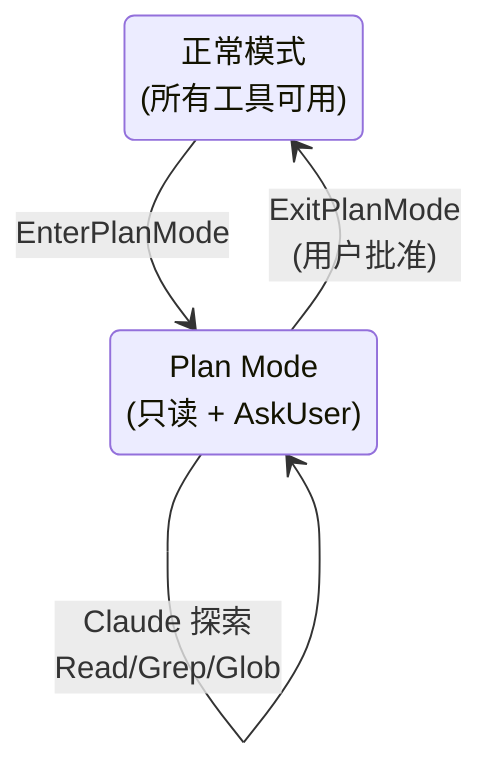
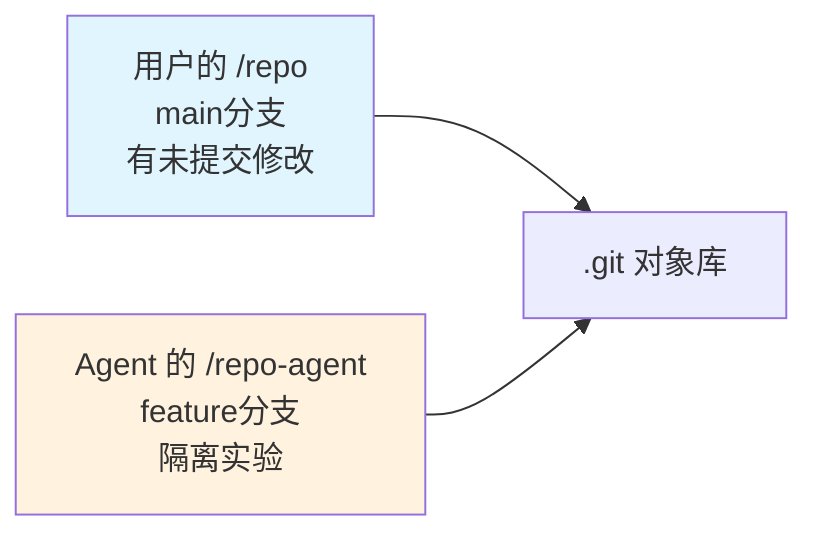
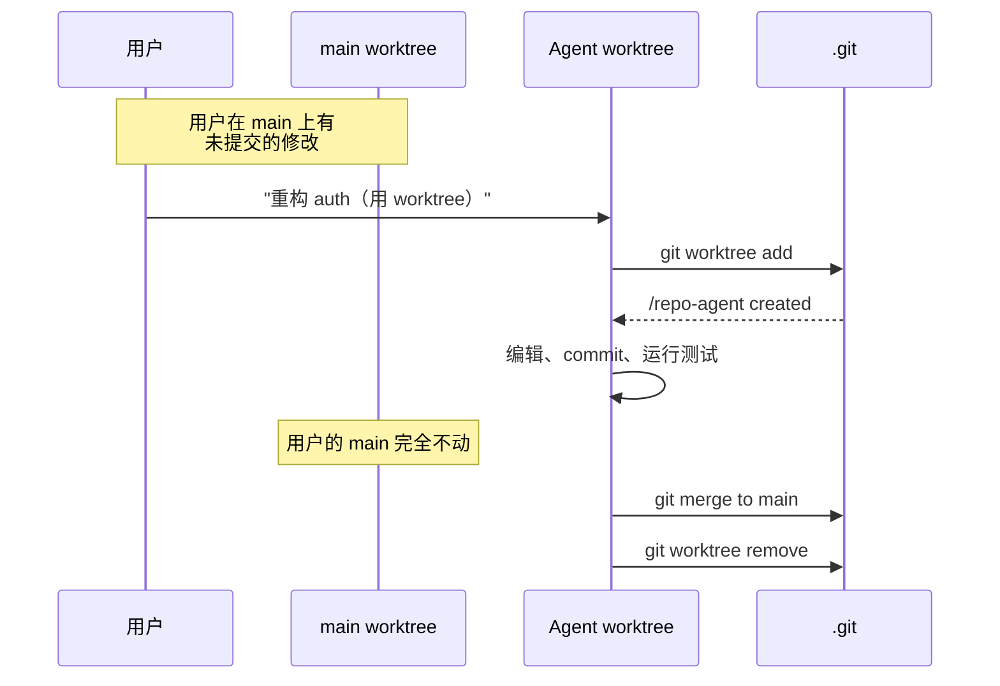

# 规划与 Worktree

**目录：** `src/tools/EnterPlanModeTool/`、`src/tools/ExitPlanModeTool/`、`src/tools/EnterWorktreeTool/`、`src/tools/ExitWorktreeTool/`

这两组工具代表 Agent 的**两种工作模式切换**：

- **Plan Mode** — 只思考不行动
- **Worktree Mode** — 隔离的 Git 工作空间

## Plan Mode（规划模式）

### 问题

Claude 默认**急于行动**——看到任务就开始 Edit、Write、Bash。这在**复杂重构**或**架构决策**时可能造成破坏。

### 解决方案

Plan Mode 临时将 Claude 切换到**只读 + 思考**模式：



### EnterPlanModeTool

```typescript
{ reason: 'Complex refactoring needs planning' }
```

进入 Plan Mode 后：

- **可用工具**：Read、Grep、Glob、ToolSearch、WebFetch、WebSearch、AskUser
- **禁用工具**：Write、Edit、Bash（非只读）、TaskCreate、任何写操作
- **系统提示词追加**：`"You are in plan mode. Research thoroughly before proposing a plan."`

### ExitPlanModeTool

```typescript
{
  plan: `
    ## Steps
    1. Refactor AuthService to use Strategy pattern
    2. Add unit tests for each strategy
    3. Migrate existing callers
  `
}
```

**关键：ExitPlanMode 不直接退出**——它**向用户展示计划并等待批准**：

```typescript
async function exitPlanMode({ plan }: Args) {
  const approved = await askUser({
    type: 'plan_approval',
    plan,
    options: ['approve', 'reject', 'modify']
  })

  if (approved.action === 'approve') {
    setPermissionMode('normal')
    return { status: 'plan_approved', plan }
  }

  return { status: 'rejected', feedback: approved.feedback }
}
```

### Plan Mode 的哲学

**"Think before you act"** 是 Agent 最难学会的技能。Plan Mode 是**工程上的强制机制**：

- 用户可以主动触发（按 `Shift+Tab` 切换）
- Claude 可以在复杂任务时自主触发
- 计划需要**用户签字**才能执行

这是 **Human-in-the-loop** 的具体实现。

## Worktree Mode（隔离工作区）

### Git Worktree 简介

Git worktree 允许**同一个仓库多个工作目录**：

```bash
# 主工作区：main 分支
/repo

# 创建 worktree 工作在新分支
git worktree add /repo-feature feature-branch
```

两个目录是**独立的工作副本**，但共享 `.git` 对象库。

### 为什么 Agent 需要 Worktree？

场景：Agent 要做**危险的大改动**，但又想**不影响用户当前工作**。



Agent 在 worktree 里可以：

- **随便 commit/rollback**——不影响用户的工作区
- **跑破坏性操作**（migrations、format）——容易回滚
- **并行实验**——多个 Agent 多个 worktree

### EnterWorktreeTool

```typescript
{
  branch: 'agent/refactor-auth',
  baseBranch: 'main'  // 默认 current
}
```

执行流程：

```typescript
async function enterWorktree({ branch, baseBranch }: Args) {
  // 1. 创建 worktree
  const worktreeDir = `${cwd}-${branch}`
  await exec(`git worktree add ${worktreeDir} -b ${branch} ${baseBranch}`)

  // 2. 切换 Agent 的 cwd
  agentContext.cwd = worktreeDir

  // 3. 更新 fileCache（因为路径变了）
  agentContext.fileCache.clear()

  // 4. 记录 worktree 以便后续清理
  session.worktrees.push({ dir: worktreeDir, branch })

  return { cwd: worktreeDir }
}
```

### ExitWorktreeTool

```typescript
{
  action: 'merge' | 'delete' | 'keep',
  targetBranch?: 'main'  // 合并时
}
```

三种退出方式：

| action | 行为 |
|--------|------|
| `merge` | 合并到 targetBranch，删除 worktree |
| `delete` | 丢弃，删除 worktree 和分支 |
| `keep` | 保留 worktree，Agent 切回主 cwd |

```typescript
async function exitWorktree({ action, targetBranch }: Args) {
  const wt = session.currentWorktree

  switch (action) {
    case 'merge':
      await exec(`git checkout ${targetBranch}`)
      await exec(`git merge ${wt.branch}`)
      await exec(`git worktree remove ${wt.dir}`)
      await exec(`git branch -d ${wt.branch}`)
      break

    case 'delete':
      await exec(`git worktree remove --force ${wt.dir}`)
      await exec(`git branch -D ${wt.branch}`)
      break

    case 'keep':
      // noop，只切回原 cwd
      break
  }

  agentContext.cwd = session.originalCwd
}
```

## Worktree 的隔离保证



**关键性质：**

1. **用户的修改不被污染** — worktree 是物理隔离的目录
2. **共享 Git 历史** — Agent 的 commit 直接可见
3. **并行工作** — 用户继续在 main 上干活

## 工具调用示例

```typescript
// Claude 决定用 worktree
await tool('EnterWorktree', {
  branch: 'agent/refactor-auth-2024-01',
  baseBranch: 'main'
})

// 做各种修改
await tool('Edit', { ... })
await tool('Bash', { command: 'npm test' })
await tool('Bash', { command: 'git commit -am "refactor auth"' })

// 完成后合并
await tool('ExitWorktree', {
  action: 'merge',
  targetBranch: 'main'
})
```

## 与 Plan Mode 的组合

理想工作流：

```
1. EnterPlanMode        → 研究 codebase
2. ExitPlanMode(plan)   → 用户批准
3. EnterWorktree        → 隔离实验环境
4. ... 大量修改 ...
5. ExitWorktree(merge)  → 合并回 main
```

**双保险**：先思考后行动，行动时隔离。

## 值得学习的点

1. **Mode switch 作为工具** — 让 Agent 自主切换工作模式
2. **计划需要人类签字** — Plan Mode 强制 Human-in-the-loop
3. **Git worktree 的 AI 应用** — 原本是人类的多任务工具，现在给 Agent 用
4. **三态退出** — merge/delete/keep 覆盖所有场景
5. **物理隔离 ≠ 版本隔离** — worktree 比 branch 更安全

## 相关文档

- [BashTool 安全栈](./bash-tool.md)
- [utils/permissions - 权限系统](../utils/permissions.md)
- [Tool 工具框架](../root-files/tool-framework.md)
