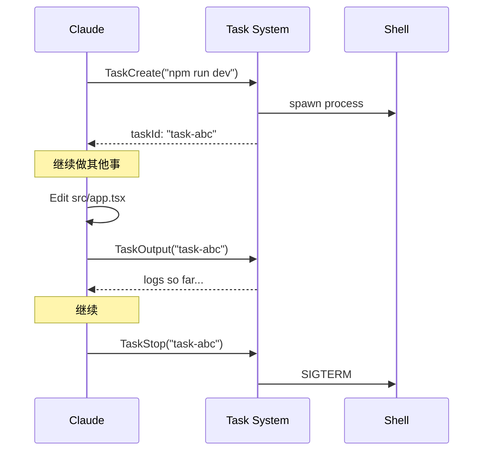
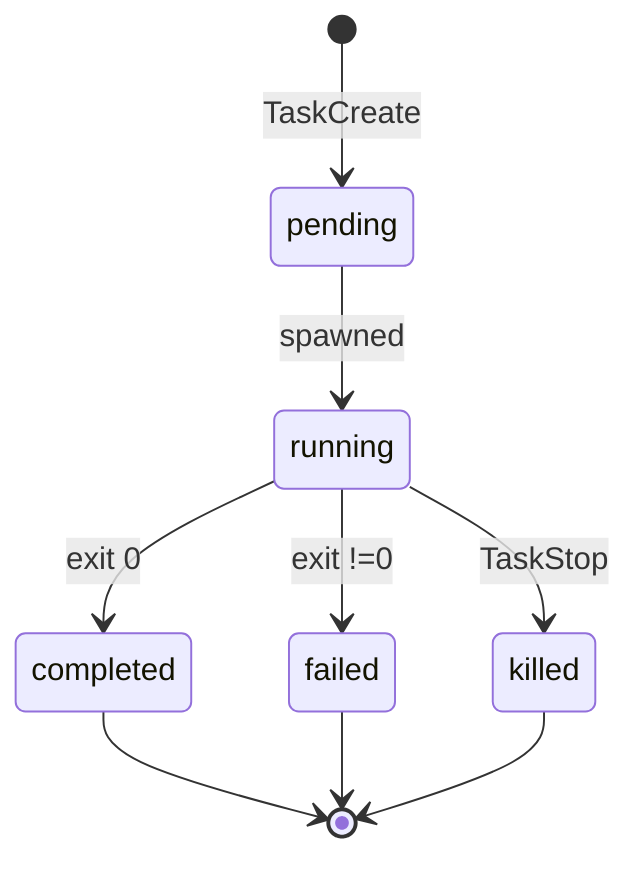
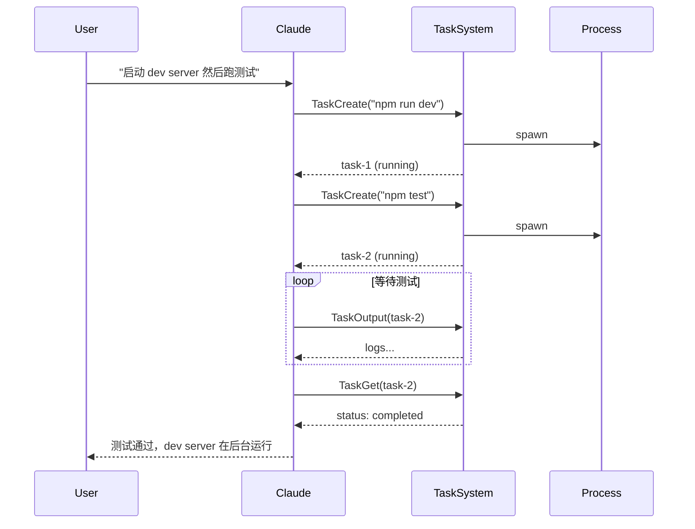

# 任务工具 (Task CRUD)

**目录：** `src/tools/TaskCreateTool/`、`src/tools/TaskListTool/`、`src/tools/TaskGetTool/`、`src/tools/TaskUpdateTool/`、`src/tools/TaskStopTool/`、`src/tools/TaskOutputTool/`

这一组工具让 Agent **管理后台任务**——长期运行的 shell、编译、测试、服务器……不需要一直占用主对话线程。

## 为什么需要后台任务？

常规工具调用是**阻塞**的：

```
Claude → Bash("npm test")  →  (等 60s)  →  结果
```

但有些任务特点是：

- **长时间运行**（编译 30s，测试 5min，dev server 永久）
- **需要观察进度**（tail 日志，等待特定输出）
- **Agent 不必等**（可以并行做其他事）

**后台任务**解耦了**启动**和**观察**：



## TaskCreateTool

启动后台任务：

```typescript
{
  command: 'npm run dev',
  cwd: '/project',
  shell: 'bash',           // 或 'pwsh' / 'cmd'
  description: 'Dev server' // 给用户看的标签
}
```

返回：

```typescript
{
  taskId: 'task-abc123',
  pid: 45678,
  status: 'running'
}
```

### Shell 选择

Windows/Mac/Linux 上的任务系统支持不同 shell：

| shell | 场景 |
|-------|------|
| `bash` | Mac/Linux 默认，Windows 下 WSL |
| `pwsh` | Windows PowerShell |
| `cmd` | Windows CMD |
| `zsh` | Mac 默认 |

`services/tasks/` 里有 shell 适配：

```typescript
function spawnTask(cmd: string, shell: Shell) {
  switch (shell) {
    case 'bash': return spawn('bash', ['-c', cmd])
    case 'pwsh': return spawn('pwsh', ['-Command', cmd])
    case 'cmd': return spawn('cmd', ['/c', cmd])
  }
}
```

## TaskListTool

列出所有任务：

```typescript
{}  // 无参数
```

返回：

```typescript
[
  { id: 'task-abc', command: 'npm run dev', status: 'running', pid: 45678 },
  { id: 'task-def', command: 'npm test', status: 'completed', exitCode: 0 },
  { id: 'task-xyz', command: 'cargo build', status: 'failed', exitCode: 101 },
]
```

### 任务状态



## TaskGetTool

获取单个任务的详情：

```typescript
{ taskId: 'task-abc' }
```

返回：

```typescript
{
  id: 'task-abc',
  command: 'npm run dev',
  status: 'running',
  startedAt: 1700000000000,
  pid: 45678,
  cwd: '/project',
  outputBytes: 12345,      // 总输出大小
  lastOutputAt: 1700000060000,
}
```

## TaskUpdateTool

修改任务的元数据（**不改命令，只改描述/tag**）：

```typescript
{
  taskId: 'task-abc',
  description: 'Dev server (port 3000)',
  tags: ['long-running', 'service']
}
```

**这个工具反映了 UI 感知**——Agent 给任务打标签，用户在 UI 里更容易识别。

## TaskStopTool

终止任务：

```typescript
{ taskId: 'task-abc', signal: 'SIGTERM' }
```

### 优雅终止

```typescript
async function stopTask(taskId: string, signal: string) {
  const task = getTask(taskId)
  if (!task) return { error: 'Not found' }

  process.kill(task.pid, signal)

  // 等待 5 秒，还没死就 SIGKILL
  await sleep(5000)
  if (isAlive(task.pid)) {
    process.kill(task.pid, 'SIGKILL')
  }

  return { status: 'killed' }
}
```

**先温和后强硬**——让进程有机会清理资源（写日志、关闭连接）。

## TaskOutputTool

读取任务的输出：

```typescript
{
  taskId: 'task-abc',
  from: 10000,      // 从第 10000 字节开始
  limit: 50000      // 最多 50KB
}
```

返回：

```typescript
{
  output: '... log content ...',
  truncated: false,
  nextOffset: 60000,
  isComplete: false
}
```

### 流式读取

任务输出被**持续写入文件**（不是保存在内存）：

```
~/.claude/tasks/
├── task-abc/
│   ├── stdout.log    # 持续追加
│   ├── stderr.log
│   └── metadata.json
```

TaskOutput 从文件**按 offset 读取**——Agent 可以反复调用，增量获取新输出。

### 输出限制

```typescript
if (limit > MAX_OUTPUT_PER_CALL) {
  limit = MAX_OUTPUT_PER_CALL  // 默认 100KB
}
```

防止 Agent 一次性拉取几十 MB 的日志撑爆 context。

## 任务生命周期与 Agent 协作



## 错误场景

### 任务 ID 无效

```typescript
if (!taskMap.has(taskId)) {
  return { error: `Task ${taskId} not found` }
}
```

### 任务已死

```typescript
if (task.status !== 'running') {
  return { error: `Task ${taskId} is ${task.status}` }
}
```

### 输出文件过大

```typescript
if (task.outputBytes > MAX_TASK_OUTPUT_SIZE) {
  // 截断老的内容，保留最新
  rotateOutput(task)
}
```

`MAX_TASK_OUTPUT_SIZE` 典型值 100MB——防止磁盘耗尽。

## 并发与隔离

每个任务**独立进程**：

```typescript
const child = spawn(command, {
  cwd: task.cwd,
  env: { ...process.env, ...task.env },
  detached: false,  // 绑定到父进程
  stdio: ['ignore', 'pipe', 'pipe']
})
```

多个任务并发运行，互不影响。

## UI 集成

主 REPL 显示任务列表（`components/TaskListRenderer.tsx`）：

```
Running tasks:
  [●] task-abc  npm run dev       (2m 15s)
  [●] task-def  npm test          (12s)
  [✓] task-xyz  tsc --watch       (completed)
```

用户按 `Ctrl+T` 切到任务视图，能看 stdout/stderr。

## 值得学习的点

1. **Create/Get/Update/Stop 的 CRUD 分离** — Agent 和 UI 都能操作
2. **文件式输出存储** — 不占内存，offset 读取
3. **优雅终止** — SIGTERM → (5s) → SIGKILL
4. **状态机清晰** — pending/running/completed/failed/killed
5. **跨 shell 抽象** — bash/pwsh/cmd 统一接口
6. **解耦启动和观察** — Agent 可以并行做其他事

## 相关文档

- [tasks/ - Agent 任务系统](../tasks/index.md)
- [Tool 工具框架](../root-files/tool-framework.md)
- [BashTool 安全栈](./bash-tool.md)
