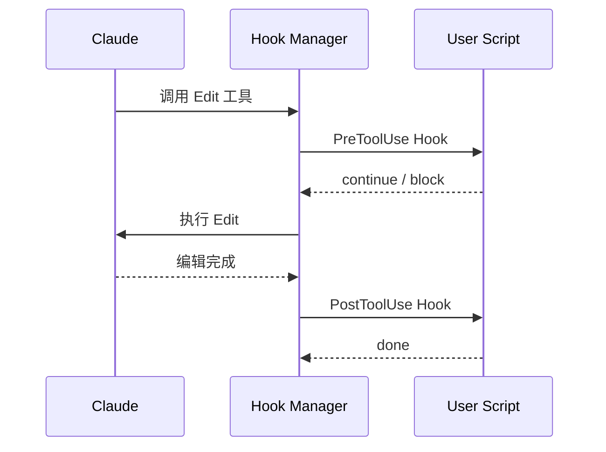

# Hooks 工具 — 生命周期钩子

**目录：** `src/utils/hooks/`

Hooks 是 Claude Code **最强的扩展机制**——用户可以在任何关键事件**插入自定义逻辑**。

## Hook 概念



Hook 是**shell 脚本**，在特定事件被触发。

## 支持的事件

| 事件 | 触发时机 |
|------|---------|
| `SessionStart` | 会话开始 |
| `SessionEnd` | 会话结束 |
| `UserPromptSubmit` | 用户发消息前 |
| `PreToolUse` | 工具调用前 |
| `PostToolUse` | 工具调用后 |
| `Notification` | 系统通知时 |
| `Stop` | 任务中止时 |
| `SubagentStop` | 子 Agent 结束 |

## 配置方式

### settings.json

```json
{
  "hooks": {
    "PostToolUse": [
      {
        "matcher": { "tool": "Edit" },
        "hooks": [{
          "type": "command",
          "command": "eslint \"$CLAUDE_FILE_PATH\" --fix"
        }]
      }
    ],
    "UserPromptSubmit": [
      {
        "hooks": [{
          "type": "command",
          "command": "~/.claude/hooks/log-prompt.sh"
        }]
      }
    ]
  }
}
```

### 文件式

`~/.claude/hooks/<event>.sh` 自动注册：

```bash
# ~/.claude/hooks/post-edit.sh
#!/bin/bash
eslint "$CLAUDE_FILE_PATH" --fix 2>/dev/null
```

## 环境变量注入

Hook 脚本运行时能拿到丰富的上下文：

```bash
CLAUDE_SESSION_ID=sess-abc
CLAUDE_EVENT=PostToolUse
CLAUDE_TOOL=Edit
CLAUDE_FILE_PATH=/project/src/app.ts
CLAUDE_USER_MESSAGE="fix the bug"
CLAUDE_WORKING_DIR=/project
CLAUDE_TOOL_ARGS=<json>
CLAUDE_TOOL_RESULT=<json>
```

不同事件有不同的变量。

## Hook 类型

### Command Hook（最常见）

```json
{ "type": "command", "command": "lint.sh" }
```

执行 shell 命令。

### Inline Hook

```json
{
  "type": "inline",
  "script": "if [ -f package.json ]; then npm run lint; fi"
}
```

嵌入式 shell 脚本。

### Prompt Injection Hook

```json
{
  "type": "prompt",
  "event": "UserPromptSubmit",
  "addition": "Always follow the coding guidelines in .cursorrules"
}
```

**在用户消息前自动追加内容**——强制行为规则。

## Hook 的输入/输出

### 输入：stdin

Hook 可以读 JSON：

```bash
#!/bin/bash
# 读 tool 调用信息
INPUT=$(cat)
echo "Editing: $(echo $INPUT | jq -r .args.file_path)"
```

### 输出：控制 Claude

Hook 可以**影响主流程**：

```bash
#!/bin/bash
# Block the tool call
echo '{"decision": "block", "reason": "File is protected"}' >&2
exit 2
```

```typescript
// Hook Manager 解析
if (stderr.includes('"decision": "block"')) {
  cancelToolCall()
}
```

**退出码约定：**

- `0` — 成功，继续
- `1` — 失败（非阻塞）
- `2` — **阻塞**，给用户错误消息

## 执行流程

```typescript
// utils/hooks/executor.ts
async function runHooks(event: string, ctx: Context) {
  const hooks = findMatchingHooks(event, ctx)
  const results = []

  for (const hook of hooks) {
    const result = await executeHook(hook, ctx)
    results.push(result)

    if (result.decision === 'block') {
      throw new HookBlockedError(result.reason)
    }
  }

  return results
}
```

### 超时保护

```typescript
async function executeHook(hook: Hook, ctx: Context) {
  return Promise.race([
    runShellCommand(hook.command, ctx),
    timeout(30_000)  // 30s 超时
  ])
}
```

Hook 卡死不能拖累主流程。

### 隔离执行

每个 hook 独立子进程：

```typescript
const child = spawn(shell, ['-c', hook.command], {
  env: { ...process.env, ...hookEnv },
  cwd: ctx.cwd,
  stdio: ['pipe', 'pipe', 'pipe']
})
```

## Matcher 系统

决定哪个 hook 该跑：

```typescript
interface Matcher {
  tool?: string | RegExp
  path?: string | RegExp
  prompt?: string | RegExp
}

function matches(hook: Hook, ctx: Context): boolean {
  const m = hook.matcher
  if (!m) return true

  if (m.tool && !matchPattern(ctx.tool, m.tool)) return false
  if (m.path && !matchPattern(ctx.path, m.path)) return false
  if (m.prompt && !matchPattern(ctx.prompt, m.prompt)) return false

  return true
}
```

### 示例 matcher

```json
// 只在 Edit/Write 后跑
{ "matcher": { "tool": "Edit|Write" } }

// 只在 src/ 下的 .ts 文件
{ "matcher": { "path": "src/.*\\.ts$" } }

// 只在 prompt 含 "deploy"
{ "matcher": { "prompt": "deploy" } }
```

## 组合 Hook

多个 hook 匹配同一事件时**串行执行**：

```json
{
  "PostToolUse": [
    { "matcher": {...}, "hooks": [h1, h2] },
    { "matcher": {...}, "hooks": [h3] }
  ]
}
```

**执行顺序：** h1 → h2 → h3（按声明顺序）。

如果任一 block，后续都不执行。

## 调试

```bash
claude --debug hooks
```

输出：

```
[hook] PreToolUse matched: eslint-check
[hook] Running: eslint $CLAUDE_FILE_PATH
[hook] Exit 0 in 234ms
[hook] Continuing...
```

## 实用案例

### 1. 自动格式化

```bash
# ~/.claude/hooks/post-edit.sh
#!/bin/bash
case "${CLAUDE_FILE_PATH##*.}" in
  ts|tsx|js|jsx) prettier --write "$CLAUDE_FILE_PATH" ;;
  py) black "$CLAUDE_FILE_PATH" ;;
  go) gofmt -w "$CLAUDE_FILE_PATH" ;;
  rs) rustfmt "$CLAUDE_FILE_PATH" ;;
esac
```

### 2. 阻止误修改

```bash
# ~/.claude/hooks/pre-edit.sh
#!/bin/bash
if [[ "$CLAUDE_FILE_PATH" == *".env" ]]; then
  echo '{"decision":"block","reason":"Never edit .env files"}' >&2
  exit 2
fi
```

### 3. 会话记录

```bash
# ~/.claude/hooks/session-start.sh
#!/bin/bash
echo "$(date) Session started in $CLAUDE_WORKING_DIR" >> ~/.claude/history.log
```

### 4. Prompt 追加

```json
{
  "UserPromptSubmit": [{
    "hooks": [{
      "type": "prompt",
      "addition": "\n\n[System] You are in production mode. Be extra careful."
    }]
  }]
}
```

## Hook 风险

Hooks 是**任意代码执行**——Claude Code 信任用户自己配的 hook。

**风险：**

- 恶意 hook 可以泄露数据
- Shared hooks（团队共享）可能被篡改
- 第三方插件注入 hook

**缓解：**

- Hook 文件需要 **user-only 权限**
- 第一次运行前**显示给用户确认**
- 可以**禁用 hooks**：`claude --no-hooks`

## 值得学习的点

1. **Hook 是 Agent 扩展的关键** — 不改代码就能增强能力
2. **丰富的环境变量** — 让脚本拿到全部上下文
3. **退出码约定** — 0/1/2 分别是成功/失败/阻塞
4. **Matcher 精准过滤** — 减少噪音
5. **超时保护** — 防止 hook 卡死
6. **Prompt Injection Hook** — 强制规则的优雅方式
7. **风险意识** — 任意代码执行需要保护

## 相关文档

- [utils/permissions](./permissions.md)
- [utils/bash-security](./bash-security.md)
- [services/oauth-and-plugins](../services/oauth-and-plugins.md)
