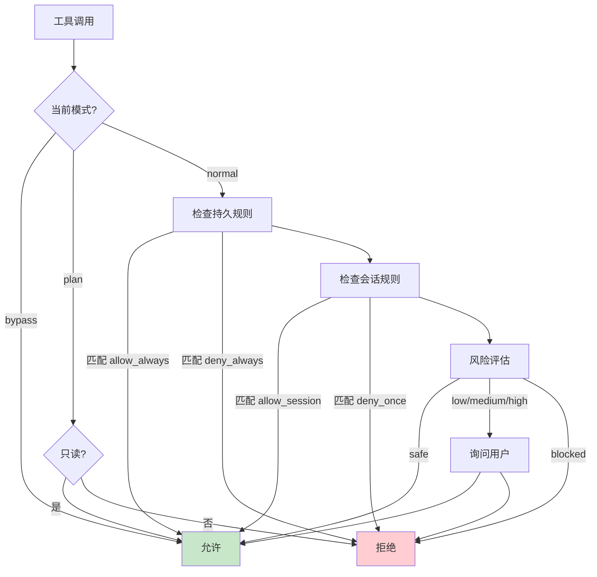
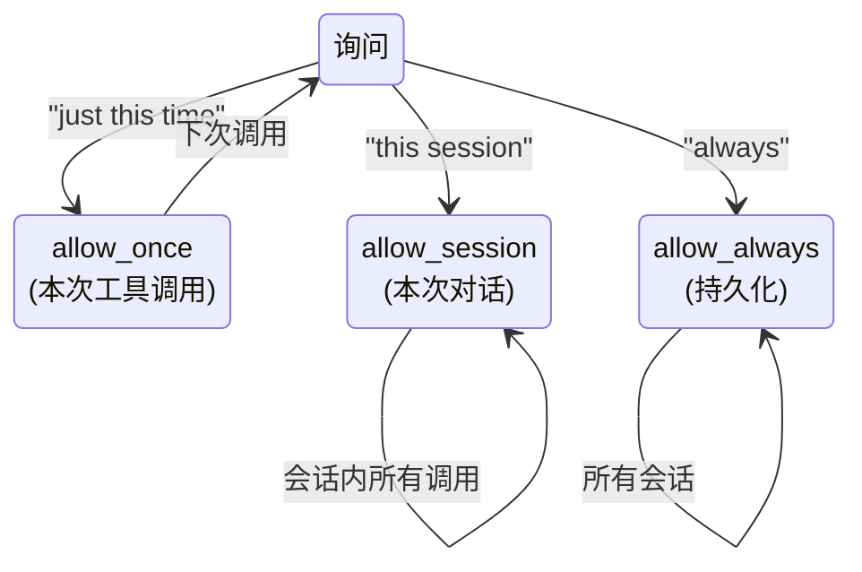

# 权限系统

**目录：** `src/utils/permissions/`

每个工具调用都要经过权限检查。这套系统是 Claude Code 的**信任边界**。

## 设计目标

1. **默认拒绝** — 未明确允许 = 拒绝
2. **用户知情** — 清楚告诉用户发生了什么
3. **一次批准、多次使用** — 不打扰
4. **会话隔离** — 批准不跨会话泄漏
5. **可回收** — 随时撤销

## 权限模型

```typescript
type PermissionDecision =
  | { type: 'allow_once' }          // 仅本次
  | { type: 'allow_session' }       // 本次会话
  | { type: 'allow_always' }        // 永久
  | { type: 'deny_once' }
  | { type: 'deny_always' }
```

## 权限粒度

**工具级：**

```typescript
type ToolPermission = {
  tool: 'Bash' | 'Edit' | 'Write' | ...
  decision: PermissionDecision
}
```

**参数级：**

```typescript
type DetailedPermission = {
  tool: 'Bash'
  pattern: 'git push*'           // 命令模式
  decision: 'allow_always'
}

type PathPermission = {
  tool: 'Edit'
  pathPattern: '/project/src/**'
  decision: 'allow_always'
}
```

参数级允许**细化控制**——"允许在 src/ 下编辑，但不允许编辑 config/"。

## 决策管道



## 权限模式

Claude Code 支持几种模式：

| 模式 | 行为 |
|------|------|
| `normal` | 默认，按规则询问 |
| `plan` | 只允许只读工具 |
| `bypass` | **开发者模式**，全部允许 |
| `safe` | 所有写操作都询问 |

```bash
# 切换模式
claude --mode plan
claude --mode bypass  # 需要 --dangerous-bypass 确认
```

`bypass` 模式**需要明确的开关**——防止误用。

## 存储

### 持久规则

`~/.claude/permissions.json`：

```json
{
  "rules": [
    { "tool": "Bash", "pattern": "git status", "decision": "allow_always" },
    { "tool": "Edit", "pathPattern": "/project/**", "decision": "allow_always" },
    { "tool": "Write", "decision": "deny_always" }
  ]
}
```

### 项目规则

`.claude/permissions.json`（项目级，覆盖全局）：

```json
{
  "rules": [
    { "tool": "Bash", "pattern": "npm test", "decision": "allow_always" }
  ]
}
```

**项目规则优先级更高**——可以在特定项目里放松或收紧。

### 会话规则

内存中，**会话结束即丢弃**。

## 询问用户

```typescript
async function promptPermission(tool: string, args: any): Promise<Decision> {
  const renderer = getToolArgsRenderer(tool)
  const preview = renderer(args)

  return await askUser({
    type: 'permission',
    title: `Allow ${tool}?`,
    preview,                          // 工具会做什么
    risks: riskAssessment(tool, args),// 风险说明
    options: [
      'Allow once',
      'Allow in this session',
      'Allow always',
      'Deny',
      'Deny and cancel'
    ]
  })
}
```

### 预览

每个工具有**专用 preview**：

```typescript
// Edit 工具
function renderEditArgs(args: EditArgs): string {
  return `
Edit ${args.file_path}

${diff(args.old_string, args.new_string)}
  `
}

// Bash 工具
function renderBashArgs(args: BashArgs): string {
  return `
Execute: ${args.command}
Cwd: ${args.cwd}
Risk: ${classifyCommand(args.command)}
  `
}
```

**预览就是决策依据**——用户看到的是真实将要发生的事。

## 一次批准 vs 永久批准



### 智能模式匹配

用户批准 `git status`，下次问 `git log` 时 Claude Code **智能合并**：

```
You previously allowed: git status
Now requesting: git log

Extend to "git log"? [Y/n]
Or broaden to "git <read-only>"? [y/N]
```

让用户**逐步放宽规则**，但保持控制感。

## 撤销权限

```bash
claude permissions list
# 列出所有规则

claude permissions remove "Bash: git push*"
# 撤销特定规则

claude permissions reset
# 清空所有规则
```

## 权限审计日志

所有决策都被记录：

```jsonl
{"ts":1700000000,"tool":"Bash","args":"npm test","decision":"allow_always","source":"rule"}
{"ts":1700000010,"tool":"Edit","args":"/etc/hosts","decision":"deny","source":"user"}
```

**`claude permissions audit`** 查看历史。

## Agent 的权限子集

当 Claude 启动 sub-agent：

```typescript
subAgent.permissions = {
  ...parentPermissions,
  // 收紧：不继承 bypass 模式
  mode: 'normal',
  // 可以显式移除某些工具
  disabledTools: ['Bash', 'Write'],
}
```

**子 Agent 权限必须 ≤ 父 Agent**——防止权限提升。

## 危险操作的二次确认

某些操作**即使批准过仍要确认**：

```typescript
const ALWAYS_CONFIRM = [
  'rm -rf',
  'git push --force',
  'kubectl delete',
  'DROP TABLE',
]

function needsReconfirmation(args: any): boolean {
  const text = JSON.stringify(args)
  return ALWAYS_CONFIRM.some(p => text.includes(p))
}
```

## 权限继承（session → project → global）

```
1. 检查 session rules（内存）
   ↓ 没匹配
2. 检查 project rules（.claude/permissions.json）
   ↓ 没匹配
3. 检查 global rules（~/.claude/permissions.json）
   ↓ 没匹配
4. 询问用户
```

## 默认规则

Claude Code 自带的默认规则（`defaultRules.ts`）：

```typescript
const DEFAULTS: PermissionRule[] = [
  // 只读工具自动允许
  { tool: 'Read', decision: 'allow_always' },
  { tool: 'Grep', decision: 'allow_always' },
  { tool: 'Glob', decision: 'allow_always' },

  // 高危操作默认拒绝
  { tool: 'Bash', pattern: 'rm -rf /', decision: 'deny_always' },
  { tool: 'Bash', pattern: 'dd of=/dev/*', decision: 'deny_always' },
]
```

## 值得学习的点

1. **FAIL-CLOSED** — 不确定就拒绝
2. **分层规则** — session → project → global
3. **模式粒度** — 命令模式、路径模式
4. **预览驱动决策** — 用户看到的是将要发生的事
5. **权限可审计** — 所有决策记录
6. **Agent 权限收窄** — 子 Agent 不能越权
7. **高危二次确认** — 即使批准过
8. **智能合并** — 减少反复询问

## 相关文档

- [BashTool 安全栈](../tools/bash-tool.md)
- [utils/bash-security](./bash-security.md)
- [utils/hooks-utils](./hooks-utils.md)
